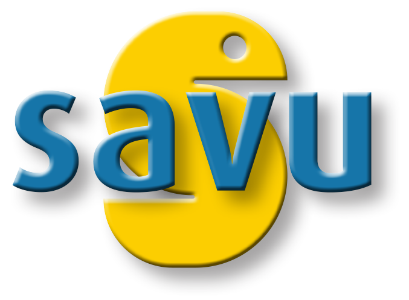

.. image:: https://badges.gitter.im/Join%20Chat.svg
   :alt: Join the chat at https://gitter.im/DiamondLightSource/Savu
   :target: https://gitter.im/DiamondLightSource/Savu?utm_source=badge&utm_medium=badge&utm_campaign=pr-badge&utm_content=badge

.. image:: https://readthedocs.org/projects/savu/badge/?version=latest
   :target: https://readthedocs.org/projects/savu/?badge=latest
   :alt: Documentation Status

.. image:: https://travis-ci.org/DiamondLightSource/Savu.svg?branch=master
    :target: https://travis-ci.org/DiamondLightSource/Savu

.. image:: https://zenodo.org/badge/doi/10.5281/zenodo.32840.svg
    :target: https://doi.org/10.5281/zenodo.32840

.. image:: https://coveralls.io/repos/DiamondLightSource/Savu/badge.svg?branch=master
    :target: https://coveralls.io/r/DiamondLightSource/Savu?branch=master

.. image:: https://badge.waffle.io/diamondlightsource/savu.png?label=ready&title=Ready
    :target: https://waffle.io/diamondlightsource/savu
    :alt: 'Stories in Ready'

.. image:: https://scrutinizer-ci.com/g/DiamondLightSource/Savu/badges/quality-score.png?b=master
    :target: https://scrutinizer-ci.com/g/DiamondLightSource/Savu/?branch=master

.. image:: https://badge.fury.io/py/savu.svg
    :target: http://badge.fury.io/py/savu

.. image:: https://landscape.io/github/DiamondLightSource/Savu/master/landscape.svg?style=flat
    :target: https://landscape.io/github/DiamondLightSource/Savu/master
    :alt: Code Health

:Date: 2014-11-14
:Version: 0.1
:Authors: Mark Basham - *Diamond Light Source*
:Authors: Nicola Wadeson - *Diamond Light Source*

This documentation in full is available at https://savu.readthedocs.org/en/latest/

.. start_of_main_text

Tomography Reconstruction and Processing Pipeline
=================================================

Savu is a Python package to assist with the processing and reconstruction of parallel-beam tomography data.  The project originated in the Data Analysis Group at the Diamond Light Source (UK synchrotron) to address the growing, and increasingly complex, needs of the tomography community.

Designed to allow greater flexibility in tomography data processing, Savu is capable of processing N-dimensional full-field tomography and mapping tomography data, along with concurrent processing of multiple datasets such as those collected as part of a multi-modal setup.  Savu process lists, tailored to a specific experiment and passed to the framework at runtime along with the data, detail the processing steps that are required.

A Savu process list is created using the Savu configurator tool, which stacks together plugins chosen from a repository. Each plugin performs a specific independent task, such as correction, filtering, reconstruction. For a list of available plugins see plugin API.

Savu is currently in use across the tomography beamlines at Diamond to reconstruct both full-field tomography data and multi-modal, mapping tomography data.

.. _[1]: https://doi.org/10.1098/rsta.2014.0398

Features
========

- Full-field and mapping tomography data processing
- multi-modal data processing
- Absorption, fluorescence, diffraction and ptychography data processing
- Handles N-dimensional data and multiple datasets
- Supports multiple data formats
- Runs in serial or parallel on your local machine
- Runs in parallel across a cluster
- Supports very large data processing with parallel HDF5 (not limited by RAM)
- Allows flexible data slicing (e.g. alternate between projection and sinogram processing)
- Plugin architecture with CPU and GPU plugins
- Processing tailored to a specific experimental setup
- Easy integration of new functionality

.. image:: https://codescene.io/projects/3730/status.svg
    :target: https://codescene.io/projects/3730/jobs/latest-successful/results
    :alt: Get more details at **codescene.io**

