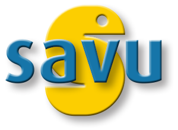
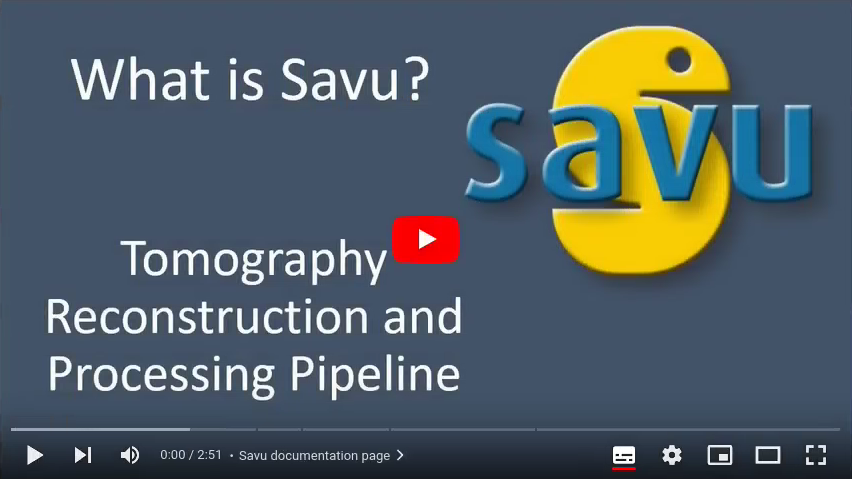

|savu_full_tests| |savu_install| |coverage| |codefactor| |scrutinizer| |zenodo|

|savu-lite-v| |savu-lite-latest| |platform| |downloads|

.. start_of_main_text

Tomography Reconstruction and Processing Pipeline
=================================================

Savu is a Python package to assist with the processing and reconstruction of parallel-beam tomography data.  The project originated in the Data Analysis Group at the `Diamond Light Source <https://www.diamond.ac.uk/>`_ (UK synchrotron) to address the growing, and increasingly complex, needs of the tomography community.

Designed to allow greater flexibility in tomography data processing, Savu is capable of processing N-dimensional full-field tomography and mapping tomography data, along with concurrent processing of multiple datasets such as those collected as part of a multi-modal setup.  Savu process lists, tailored to a specific experiment and passed to the framework at runtime along with the data, detail the processing steps that are required.

A Savu process list is created using the Savu configurator tool, which stacks together plugins chosen from a repository. Each plugin performs a specific independent task, such as correction, filtering, reconstruction. For a list of available plugins see plugin API.

Savu is currently in use across the tomography beamlines at Diamond to reconstruct both full-field tomography data and multi-modal, mapping tomography data.

.. _[1]: https://doi.org/10.1098/rsta.2014.0398

|video|

Features
========
- Full-field and mapping tomography data processing
- multi-modal data processing
- Absorption, fluorescence, diffraction and ptychography data processing
- Handles N-dimensional data and multiple datasets
- Supports multiple data formats
- Runs in serial or parallel on your local machine
- Runs in parallel across a cluster
- Supports very large data processing with parallel HDF5 (not limited by RAM)
- Allows flexible data slicing (e.g. alternate between projection and sinogram processing)
- Plugin architecture with CPU and GPU plugins
- Processing tailored to a specific experimental setup
- Easy integration of new functionality

Documentation
==============
The full documentation is available at https://savu.readthedocs.org/en/latest/

Installation (Unix only)
================================
| See all installation instructions `here <https://savu.readthedocs.io/en/latest/howto/installation.html>`_

License
========
| The project is licensed under the Apache License, Version 2.0.
| Copyright 2014 Diamond Light Source Ltd.

Contacts
========
Any questions regarding software can be addressed to scientificsoftware@diamond.ac.uk.

|codescene|

.. |savu_full_tests| image:: https://github.com/DiamondLightSource/Savu/workflows/savu_full_tests/badge.svg
    :target: https://github.com/DiamondLightSource/Savu/actions

.. |savu_install| image:: https://github.com/DiamondLightSource/Savu/workflows/savu_install/badge.svg
    :target: https://github.com/DiamondLightSource/Savu/actions

.. |coverage| image:: https://coveralls.io/repos/DiamondLightSource/Savu/badge.svg?branch=master
    :target: https://coveralls.io/r/DiamondLightSource/Savu?branch=master

.. |codefactor| image:: https://www.codefactor.io/repository/github/diamondlightsource/savu/badge
    :target: https://www.codefactor.io/repository/github/diamondlightsource/savu

.. |scrutinizer| image:: https://scrutinizer-ci.com/g/DiamondLightSource/Savu/badges/quality-score.png?b=master
    :target: https://scrutinizer-ci.com/g/DiamondLightSource/Savu/?branch=master

.. |docs| image:: https://readthedocs.org/projects/savu/badge/?version=latest
    :target: https://readthedocs.org/projects/savu/?badge=latest
    :alt: Documentation Status

.. |zenodo| image:: https://zenodo.org/badge/26539525.svg
    :target: https://zenodo.org/badge/latestdoi/26539525

.. |savu-lite-v| image:: https://anaconda.org/savu-dep/savu-lite/badges/version.svg
    :target: https://anaconda.org/savu-dep/savu-lite

.. |savu-lite-latest| image:: https://anaconda.org/savu-dep/savu-lite/badges/latest_release_date.svg
    :target: https://anaconda.org/savu-dep/savu-lite

.. |platform| image:: https://anaconda.org/savu-dep/savu-lite/badges/platforms.svg
    :target: https://anaconda.org/savu-dep/savu-lite

.. |downloads| image:: https://anaconda.org/savu-dep/savu-lite/badges/downloads.svg
    :target: https://anaconda.org/savu-dep/savu-lite

.. |codescene| image:: https://codescene.io/projects/3730/status.svg
    :target: https://codescene.io/projects/3730/jobs/latest-successful/results
    :alt: Get more details at **codescene.io**
