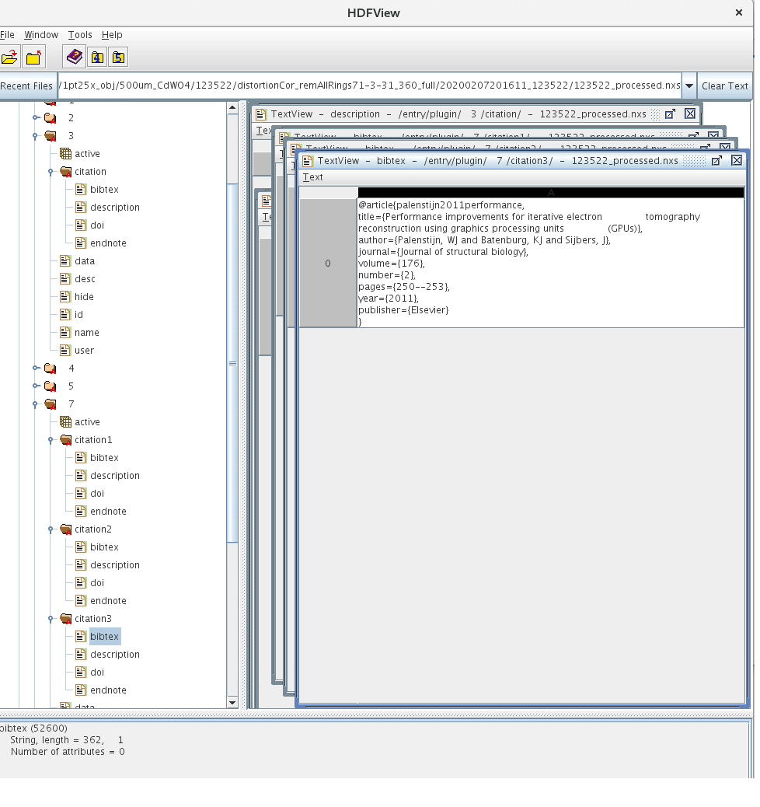

I12 JEEP Savu
-------------------

.. raw:: html

    <!DOCTYPE html>
    <html>
        <head>
            <title>I12 JEEP : SAVU Tomography Reconstruction</title>
            <link rel="stylesheet" href="styles/site.css" type="text/css" />
            <META http-equiv="Content-Type" content="text/html; charset=UTF-8">
        </head>

        <body class="theme-default aui-theme-default">
            

                

                    

                        

                Created by  Thomas Connolley
                        

                        
Link to Savu Diamond User Guide (copied 02 March 2017):

                        <a class="external-link" href="file:///dls/science/groups/das/SavuTraining/doc/build/user_guides/user_training.html" rel="nofollow">file:///dls/science/groups/das/SavuTraining/doc/build/user_guides/user_training.html</a>

<strong>Update 02/04/2019:</strong>

I12 data were migrated to the new cluster (named Hamilton). To process data on this new cluster using the following commands

module load savu

To use the latest plugins:

module load savu/pre-release

To check the status, manage the jobs submit to this new cluster using the following commands:

module load hamilton 

Do <strong>not</strong> run &quot;module load hamilton&quot; in the same Terminal window in which you run &quot;module load savu/i12&quot;! - you may not be able to run the reconstruction with savu correctly.

qstat  → Check the status of the job

watch qstat → Check the live status of the job, quit by Ctrl +C

qdel &lt;jobID&gt; → Kill a job

qdel -u &lt;FedID&gt; → Kill all jobs submitted by users with the &lt;FedID&gt;

Using the known commands (e.g module load global/cluster, module load savu) will run computing on the old cluster but access data from the new cluster. This impacts the Savu's performance and raise bugs.

<strong style="color: rgb(0,0,0);font-size: 24.0px;letter-spacing: 0.0px;">I-Quick guide</strong>

<strong>1-Create a processing list:</strong>

   Processing list: List of processing steps which users use to process their data. Example: load data, apply flat-field correction, apply zinger removal method, apply ring removal method, then do reconstruction. 

   -  Open terminal, type:

  -&gt; module load savu

  -&gt; savu_config 

   - To list available plugins, use the command &quot;list &lt;key-word&gt;&quot;. Example:

  -&gt; list loader              : will return a list of plugins having name * loader *. Example: NxtomoLoader, ImageLoader, ...

  -&gt; list ring                  : return: RingRemovalWaveletfft, RingRemovalNormalization, ...

  -&gt; list correction        : return: DarkFlatFieldCorrection, DistortionCorrection, ...

   - To add a plugin to the processing list, use the command &quot;add &lt;plugin&gt; &lt;position&gt;&quot;. Example:

  -&gt; add NxtomoLoader 1                        : add NxtomoLoader plugin to position 1 of the list.

  -&gt; add DarkFlatFieldCorrection 2          : add DarkFlatFieldCorrection plugin to position 2 of the list.

  -&gt; add DezingerSinogram 3                  : add DezingerSinogram plugin to position 3 of the list.

  -&gt; add VoCentering 4                            : add VoCentering plugin to position 4 of the list.

  - To change the position of a plugin, use the command &quot;move &lt;current-position&gt; &lt;new-position&gt;&quot;. Example:

  -&gt; move 4 3            : move plugin at position 4 to position 3.  

 - To remove a plugin, use the command &quot;rem &lt;position&gt;&quot;. Example:

  -&gt; rem 3                 : remove a plugin at position 3, positions of other plugins will be updated.

 - To turn on/off a plugin, use the command &quot;set &lt;position&gt; on/off&quot;. Example:

  -&gt; set 3 off           : not use plugin 3

  -&gt; set 3 on           : use plugin 3

 - To display the current list of plugin, use the command  &quot;disp&quot; with options: &quot;-a&quot;, &quot;-v&quot;, or &quot;-vv&quot;. Example:

  -&gt; disp                 : Show the current list of plugin.

  -&gt; disp -a             : Show the list of plugin with detail parameters of each plugin.

  -&gt; disp -a -v        : Show the list of plugin with detail parameters of each plugin + description of each parameter. 

  -&gt; disp -a -vv        : Show the list of plugin with detail parameters of each plugin + description of each parameter + description of the plugins. 

- To display the content of a plugin, use the command  &quot;disp &lt;position&gt;&quot; with options: &quot;-a&quot;, &quot;-v&quot;, or &quot;-vv&quot;. Example:

 -&gt; disp 2 -a -v

- To save the processing list (as nxs format), use the command &quot;save &lt;file-path&gt;&quot;. Example:

 -&gt; save /dls/i12/data/2018/processing/savu_list.nxs

- To open an existing processing list, use the command &quot;open &lt;file-path&gt;&quot;. Example:

 -&gt; open /dls/i12/data/2018/processing/savu_list.nxs 

- To save the current status of an opened processing list: 

-&gt; save -i

- End editing a processing list: 

-&gt; exit
<blockquote>
<strong><em>Note: You need to exit processing list editor to use other commands in a Linux terminal.</em></strong>
</blockquote>
<strong>2- Change parameters of each plugin</strong>

  Each plugin has its own parameters which users may need to edit to get the best results (there're default parameters when users add a plugin).

- To modify a parameter, use the command &quot;mod &lt;plugin-position&gt;.&lt;parameter-position&gt; &lt;new-value&gt;&quot;. Example:

 -&gt; mod 2.1 0.002               : Change parameter 1 of plugin 2 from the current value to 0.002  

- To do parameter tuning, use the command &quot;mod &lt;plugin-position&gt;.&lt;parameter-position&gt; &lt;start:stop:step;&gt;&quot;. Example:

 -&gt; mod 2.1 31:71:2;           : Apply parameter tuning in the range of 31-71 with the step of 2. Note there's semi-colon at the end.

- To use a list of distinct values, use the command &quot;mod &lt;plugin-position&gt;.&lt;parameter-position&gt; &lt;value_1; value_2; ...; value_N&gt;&quot;. Example:

 -&gt; mod 2.1 31;35;71          : Use 3 distinct values: 31, 35,71 

<strong>3- Process a data set using the created processing list</strong>

- To process a data-set running on local machine (e.g there's plugin doesn't use GPU can run locally) , use the following commands:

 -&gt; savu &lt;full-path-input&gt; &lt;processing-list&gt; &lt;full-path-output&gt;

- To process a data-set running on cluster (com10) , use the command:

 -&gt; savu_mpi_preview &lt;full-path-input&gt; &lt;processing-list&gt; &lt;full-path-output&gt;    : For quick reconstruction few slices 

 -&gt; savu_mpi &lt;full-path-input&gt; &lt;processing-list&gt; &lt;full-path-output&gt; 

- To process a data-set running on new cluster (com14) , use the command:

 -&gt; savu_mpi_big &lt;full-path-input&gt; &lt;processing-list&gt; &lt;full-path-output&gt;          : No more valid for I12, I13, but may still valid for other beamlines (B16, I23...)

- To show options of the command: 

 -&gt; savu -help

<strong>4- Managing jobs running on cluster:</strong>

   For jobs running on cluster, use the following commands to manage them:

   - Open a terminal:

 -&gt; module load hamilton          : For i12, i13 data. 

 -&gt; module load global/cluster  : No more valid for i12, i13, but still valid for other beamlines.

 -&gt; qstat

 -&gt; watch qstat       :live update job status. To exit use Ctrl+C

 -To kill a job:

 -&gt; qdel &lt;job-ID&gt;
<h1 id="SAVUTomographyReconstruction-II-Detailingguide"><strong>II-Detailing guide</strong></h1>
<strong>1- Use the latest plugins or local developing plugins:</strong>

   There are two versions of savu available across Diamond: stable version (called by &quot;module load savu&quot;) and pre-released version (called by &quot;module load savu/pre-release&quot;). 

   There're number of developing plugins which are not available in these twos but available on github: <a class="external-link" href="https://github.com/DiamondLightSource/Savu" rel="nofollow">https://github.com/DiamondLightSource/Savu</a>

   There're also plugins developed by beamline staffs which they may want to use locally. 

   1.1- To use latest developing plugins:

       Easy way: 

             module load savu/pre-release

      Manual way:      

       + Open new terminal, navigate to a folder you would like to clone Savu codes:

       -&gt; cd /dls/i12/data/2018/cm19662-5/processing/

       -&gt; git clone  <a class="external-link" href="https://github.com/DiamondLightSource/Savu.git" rel="nofollow">https://github.com/DiamondLightSource/Savu.git</a>    : Create sub-folder named Savu and download all the codes to that.

       + Set Savu path to the new location (you need to do that again if you open a new terminal):

       -&gt; export SAVUHOME='/dls/i12/data/2018/cm19662-5/processing/Savu'

       + Then you can use the latest plugins by methods in Quick Guide section.

   1.2- To use local plugins: do the same above steps; copy plugins into one of the sub-folder .../Savu/savu/plugins/&lt;sub-folder&gt;

<strong>2- Standard processing list for I12:</strong>

In general case:

 -------------------------------------------------------------------------------------

1) NxtomoLoader  ------------------------------------------------------------------------------------- 2) DarkFlatFieldCorrection  ------------------------------------------------------------------------------------- 3) DezingerSinogram  ------------------------------------------------------------------------------------- 4) RemoveAllRings ------------------------------------------------------------------------------------- 5) VoCentering   ------------------------------------------------------------------------------------- 6) AstraReconGpu  -------------------------------------------------------------------------------------

Note that DezingerSinogram should be used after DarkFlatFieldCorrection (If use Dezinger plugin as a replacement, it should be used before DarkFlatFieldCorrection)

If the sample is inside the field of view and the number of projection is standard (~ width of the image), users can use the &quot;gridrec&quot; method which can run locally on a machine without GPU

 

------------------------------------------------------------------------------------- 1) NxtomoLoader  ------------------------------------------------------------------------------------- 2) DarkFlatFieldCorrection  ------------------------------------------------------------------------------------- 3) DezingerSinogram  ------------------------------------------------------------------------------------- 4) RemoveAllRings ------------------------------------------------------------------------------------- 5) VoCentering 

------------------------------------------------------------------------------------- 6) TomopyRecon  -------------------------------------------------------------------------------------

If there's distortion:

 

------------------------------------------------------------------------------------- 1) NxtomoLoader  ------------------------------------------------------------------------------------- 2) DarkFlatFieldCorrection  ------------------------------------------------------------------------------------- 3) DistortionCorrection  ------------------------------------------------------------------------------------- 4) DezingerSinogram  ------------------------------------------------------------------------------------- 5) RemoveAllRings  ------------------------------------------------------------------------------------- 6) VoCentering  ------------------------------------------------------------------------------------- 7) AstraReconGpu  -------------------------------------------------------------------------------------

<strong>3- Previewing few slices:</strong>

Users may want to reconstruct few slices for previewing. Open the processing list (or config-file) and edit the loader plugin:

-&gt; mod 1.1 [:,mid,:]                        : Reconstruct the middle slice of a 3D dataset.

-&gt; mod 1.1 [:,end,:]                        : Reconstruct the last slice of a 3D dataset.

-&gt; mod 1.1 [:,start:stop:step,:]        : Reconstruct slices in the range of (start, stop, step). Note as the python tradition, stop index isn't included.

<strong>4-Use few sinograms for calculating center of rotations:</strong>

In VoCentering plugin, for I12 (which is well aligned), users only need to use fews middle slices for calculating center of rotation: 

-&gt; mod 5.1 [:,mid-3:mid+4,:]

-&gt; disp 5 -a -v

----

5) VoCentering(savu.plugins.centering.vo_centering)  A plugin to find the center of rotation per frame.  1) preview : [:,mid-3:mid+4,:] A slice list of required frames (sinograms) to use in the calulation of the  centre of rotation (this will not reduce the data size for subsequent plugins). 2) start_pixel : None The estimated centre of rotation. If value is None, use the horizontal centre of  the image. 3) search_area : [-50, 50] Search area around the estimated centre of rotation . 4) ratio : 0.5 The ratio between the size of object and FOV of the camera. 5) in_datasets : [] Create a list of the dataset(s) to process. 6) row_drop : 20 Drop lines around vertical center of the mask. 7) broadcast_method : median Method of broadcasting centre values calculated from preview slices to full  dataset. Available option: 'median', 'mean', 'nearest', 'linear_fit'. 8) out_datasets : [cor_preview, cor_broadcast] The default names . 9) datasets_to_populate : [] A list of datasets which require this information. 10) search_radius : 6 Use for fine searching. 11) step : 0.5 Step of fine searching. 12) average_radius : 0 Averaging sinograms around a required sinogram to improve signal-to-noise ratio.

----

There're a lot of parameters, but only twos need to be changed often:

 - If the center of rotation is out of the searching range, users may need to increase the range of parameter 3. 

 - If sample is very small, users may need to reduce value of parameter 6.

VoCentering should be used:

- After the ring removal step.

- Before doing parameter turning of a plugin (otherwise, center is calculated again for each parameter).

- Before Paganin filter (which blurs sinograms → affect the quality performance of VoCentering).

-&gt; Note that preview in VoCentering has to be consistent with NxTomoloader. 

For example, if NxtomoLoader only gives one slice [:,mid,:] to the next plugin, you have to do the same with Vocentering preview -&gt; [:,mid,:] or simply just use &quot;[]&quot;

<strong>5-Use low-pass filters for improving the contrast of reconstructed images:</strong>

There are two options: Paganin Filter and Fresnel Filter (available using module load savu/master).

PaganinFilter works on projection space with a number of parameters based on the experiment conditions: X-ray energy, Camera-Sample distance, pixel size; and a tuning parameter &quot;Ratio&quot;.

Users need to set the &quot;log&quot; option in the reconstruction plugin (AstraReconGpu, TomopyRecon..) to False

FresnelFilter works on sinogram space with a single tunable parameter.

Users don't have to set the &quot;log&quot; option to False. 

<strong>6-Use the 360-scanning technique to double the field-of-view:</strong>

-&gt;Add the plugin Convert360180Sinogram (available using module load savu/master) 

1) Convert360180Sinogram(savu.plugins.corrections.convert_360_180_sinogram) 

A plugin working in sinogram space to convert 0-360 degree\.  1) in_datasets : [] Create a list of the dataset(s) to process. 2) out_datasets : [in_datasets[0], cor] Create a list of the dataset(s) to create. 3) center : 1270 Center of rotation.

-&gt; Change the parameter &quot;centre of rotation&quot; in the reconstruction plugin (TomopyRecon) to<strong> </strong><strong>cor</strong>

-&gt; Change the parameter &quot;in_datasets&quot; of whatever plugin goes right after it to<strong> </strong><strong>[tomo]</strong> :  The reason is that this plugin passes two datasets down to the pipeline, so for the next plugin we need to specify which dataset is tomographic data.

 

The plugin of automatically finding center of rotation (CoR) is developing and not available yet. In the mean time, users have to do parameter tuning and do visual inspection to find the best center of rotation.

For example, modify parameter 3 for coarse search

3) center : 1270:1320:5;

then fine search (after visual inspection):

3) center : 1275:1280:1;

 

Example of the processing list:

------------------------------------------------------------------------------------- 1) NxtomoLoader  ------------------------------------------------------------------------------------- 2) DarkFlatFieldCorrection  ------------------------------------------------------------------------------------- 3) DezingerSinogram  ------------------------------------------------------------------------------------- 4) RemoveAllRings  ------------------------------------------------------------------------------------- 5) Convert360180Sinogram  ------------------------------------------------------------------------------------- 6) TomopyRecon  -------------------------------------------------------------------------------------

<strong>7-Process time-series tomographic data (4D):</strong>

For 4D data we need to modify the preview parameter of NxtomoLoader. Example:

1)NxtomoLoader     1) preview : [:, mid:mid+1, :, 1]    

         → The last index indicates the order of a 3D frame. Change to [:, mid:mid+1, :, :] for all frames       ...    4) 3d_to_4d : 600   

         → Number of projections per 180-degree scanning    5) flat : [/dls/i12/data/2019/mg22627-1/tmp/raw/scan_00003/flats_00000.hdf, entry/data/data, 1] 

         → Format [&lt;path_to_file&gt;, &lt;hdf_key&gt;, &lt;multiple_factor&gt;]. Default key of a hdf file generated by i12 detectors is entry/data/data    ...    7) dark : [/dls/i12/data/2019/mg22627-1/tmp/raw/scan_00003/darks_00000.hdf, entry/data/data, 1]

 We need to change the preview parameter of the Vocentering as well.

3) VoCentering        1) preview : [:, mid, :, 0] 

→ Index 0 is used because the above NxtomoLoader passes only 1 tomo-frame to this plugin. Depend on the loaded data this index can be changed to process different tomo-frame.

 

Full processing list:

------------------------------------------------------------------------------------ 1) NxtomoLoader      1) preview : [:, mid:mid+1, :, 1]     2) image_key_path : entry1/tomo_entry/instrument/detector/image_key     3) name : tomo     4) 3d_to_4d : 600     5) flat : [/dls/i12/data/2019/mg22627-1/tmp/raw/scan_00003/flats_00000.hdf, entry/data/data, 1]     6) data_path : entry1/tomo_entry/data/data     7) dark : [/dls/i12/data/2019/mg22627-1/tmp/raw/scan_00003/darks_00000.hdf, entry/data/data, 1]     8) angles : None     9) ignore_flats : None ------------------------------------------------------------------------------------- 2) DarkFlatFieldCorrection  ------------------------------------------------------------------------------------- 3) VoCentering      1) preview : [:, mid, :, 0] ... ------------------------------------------------------------------------------------- 4) RemoveAllRings  ------------------------------------------------------------------------------------- 5) AstraReconGpu  -------------------------------------------------------------------------------------
<h1 id="SAVUTomographyReconstruction-Acknowledgement"><strong>Acknowledgement</strong></h1>
<strong>Please credit by not only citing Savu paper but also methods used in the plugins</strong>

- For using Savu: 

        Wadeson and M. Basham, “Savu: a Python-based, MPI framework for simultaneous processing of multiple, N-dimensional, large tomography datasets,” (2016) <a class="external-link" href="https://arxiv.org/abs/1610.08015" rel="nofollow">https://arxiv.org/abs/1610.08015</a>.

- For using plugins in the Savu:

      Information for citing methods in the plugin can be found on Savu github:

                <a class="external-link" href="https://github.com/DiamondLightSource/Savu/blob/master/savu/plugins/ring_removal/remove_all_rings.py" rel="nofollow">https://github.com/DiamondLightSource/Savu/blob/master/savu/plugins</a>

      For example, citation for ring removal methods :

               <a class="external-link" href="https://github.com/DiamondLightSource/Savu/blob/master/savu/plugins/ring_removal/remove_all_rings.py" rel="nofollow">https://github.com/DiamondLightSource/Savu/blob/master/savu/plugins/ring_removal/remove_all_rings.py</a>

     The citation information in the section  &quot;def get_citation_information(self)&quot;.

     Another way of getting citation information:  from the output file &quot;..._processed.nxs&quot; of the Savu results (using hdfview: module load hdfview -&gt; hdfview):

                                                        

.. raw:: html

                        

                        
                        -  For methods in the reconstruction plugins (using Tomopy or Astra) please cite the software and the reconstruction methods as well:

If use <em>gridrec</em> (i.e direct Fourier inversion method) in Tomopy:

      [1] O'Sullivan JD. &quot;A fast sinc function gridding algorithm for Fourier inversion in computer tomography&quot;, IEEE T Med Imaging 1985; 4: 200–207.

      [2] Gürsoy D, De Carlo F, Xiao X, and Jacobsen C. &quot;Tomopy: a framework for the analysis of synchrotron tomographic data&quot;. Journal of Synchrotron Radiation, 21(5):1188–1193, 2014   

If use other methods implemented in Astra toolbox:

      [1] W. van Aarle, W. J. Palenstijn, J. Cant, E. Janssens, F. Bleichrodt, A. Dabravolski, J. De Beenhouwer, K. J. Batenburg, and J. Sijbers, “Fast and Flexible X-ray Tomography Using the ASTRA Toolbox”, <em>Optics Express</em>, 24(22), 25129-25147, (2016), 

     + If use FBP:

            [2] G. N. Ramachandran and A. V. Lakshminarayanan, “Three dimensional reconstructions from radiographs and electron micrographs: Application of convolution instead of Fourier transforms,” Proc. Nat. Acad. Sci., vol. 68, pp. 2236-2240, 1971.

     + If use SIRT:

           [3] P. Gilbert, “Iterative methods for the reconstruction of three dimensional objects from their projections,” J. Theor. Biol., vol. 36, pp. 105-117, 1972.

     + If use SART:

           [4] A. H. Andersen and A. C. Kak “Simultaneous algebraic reconstruction technique (SART): A superior implementation of the art algorithm,” Ultrason. Imaging,  vol 6,  81-94, 1984.

     + If use CGLS:

           [5] M. R. Hestenes and E. Stiefel. Methods of conjugate gradients for solving linear systems. Journal cf Research of the National Bureau of Standards, 49(6):409 – 436, 1952.

 

 

 

                        

                                                            

                    
             

            
     </body>
    </html>
