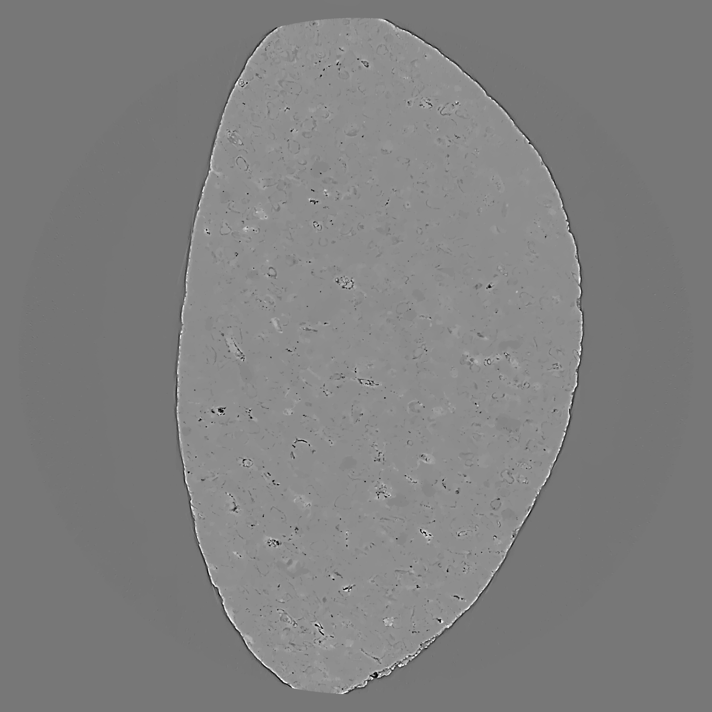

I12 JEEP SAVU tips
----------------------------------------------------------------------------------------------------------------------

.. raw:: html

    <!DOCTYPE html>
    <html>
        <head>
            <title>I12 JEEP : Savu tips</title>
            <link rel="stylesheet" href="styles/site.css" type="text/css" />
            <META http-equiv="Content-Type" content="text/html; charset=UTF-8">
        </head>

        <body class="theme-default aui-theme-default">
            

                

                    

                        

                Created by  Nghia Vo
                            

                        

                        
<strong>1.  Using zinger removal plugins:</strong>
<ol><li>If use the Dezinger plugin, it should be used before the DarkFlatFieldCorrection plugin.</li><li>If use the DezingerSinogram, it should be used after the DarkFlatFieldCorrection plugin.</li></ol>
<strong>2.  Using the plugin of converting 360-degree sinogram to 180-degree sinogram:</strong>
<ol><li>Change the parameter &quot;centre_of_rotation&quot; of the reconstruction plugin (TomopyRecon, AstraReconGpu...) to &quot;cor&quot;</li><li>Change the parameter &quot;in_datasets&quot; of a plugin (such as a ring removal plugin or the Fresnel filter) going right after this plugin from &quot;[]&quot; to &quot;[tomo]&quot;</li></ol>
<strong>3.  Using distortion correction plugins:</strong>
<ol><li>For correcting the distortion, these plugins use few adjacent slices (&gt;10 depending on how strong the distortion is), so users need to add more slices in &quot;preview&quot; of the NXtomoLoader plugin such as [:, mid-10:mid+10,:]</li><li>It's normal that few slices on top and bottom are non-reconstructable (output black or nan images) due to the distortion effect.</li><li>As these plugins slightly blur the image which may affect the cleaning performance of ring removal plugins, it should be used after ring removal plugins. This is, however, not a strict requirement with latest ring removal plugins. </li><li>Since version 2.4 users can set the &quot;file_path&quot; to a txt file containing the distortion coefficients. This is more convenient than inputting manually coefficients.</li><li>Center of distortions are referred to the original size of the projections (assuming that it has the same size as the dot pattern). This means that users don't have to worry about offsetting the values of center of distortions in the case of data cropped.</li></ol>
<strong>4. Using VoCentering:</strong>
<ol><li>It must be used after the DarkFlatFieldCorrection plugin.</li><li>It must be used after the distortion correction plugins.</li><li>It must be used before any plugin may blur the image (PaganinFilter, FresnelFilter,..). </li><li>It should be used after ring removal plugins, but not strictly. </li><li>By default the &quot;preview&quot; is set at &quot;[]&quot;. This means that the center of rotation will be calculated for every slice passed to this plugin. This is time consuming. In most of the case we can calculate the CoR using the middle slice only by changing the &quot;preview&quot; to [:,mid,:] (for 3D data) or [:,mid,:,0] (for 4D data).</li><li>If the images (sinograms) are at very low contrast and VoCentering doesn't work well:<ul><li>Increase the &quot;average_radius&quot; to ~ 10. This means that the &quot;preview&quot; in the NxtomoLoader need to be increased correspondingly  (~ +/- 10).</li></ul></li><li>If the results of Vocentering are unstable between scans or slices:<ul><li>Increase the &quot;preview&quot; slices of the VoCentering. Note that users have to increase the &quot;preview&quot; in the NxtomoLoader equivalently. By doing these, VoCentering will calculate center of rotation (CoR) of every previewing slices. Then the final CoR will be the median, mean, or fitted value of those calculated which users can specify in the &quot;broadcast_method&quot;.</li></ul></li><li>If the sample is too big compared with the field of view of the camera and VoCentering doesn't work well:<ul><li>Increase the &quot;ratio&quot; to something ~ larger 2.</li><li>Use the tip of increase the &quot;preview&quot;  in 4.6. If this doesn't work, combine with the tip 4.5.</li></ul></li><li>If the data was collected using 360-degree scanning (but not off-setting CoR for doubling the field of view):<ul><li>Change the &quot;preview&quot; to [0:mid, &lt;user-choice&gt;,:]. Because the VoCentering only works on 180-degree sinogram, by doing that we make sure the plugin only get data in the range of 180 degree.</li></ul></li><li>If none of the above tips work:</li></ol><ul><li>make sure that:<ul><li>There's no motion artifacts.</li><li>Data was collected in the range of [0;180] degree (not limited-angle tomography).</li><li>The sample is inside the field of view the previewing slices.</li><li>Dark and flat are collected properly: shutter was completely closed when collecting dark; there's no sample in the flat image.</li><li>There's no non-rotating part in the image, e.g the image of some experiment components such as window of a furnace.</li></ul></li><li>otherwise:<ul><li>Users have to find CoR manually by doing parameter turning in the reconstruction plugins.</li><li>Send e-mail and a sinogram (or location of the data) to Nghia (nghia.vo@diamond.ac.uk).</li></ul></li></ul>
<strong>5. Using DarkFlatFieldCorrection:</strong>
<ol><li>If dark and flat are collected separately, in the NxtomoLoader, users need to change these parameters:<ul><li>Change &quot;flat&quot; from [None, None, 1] to [&lt;path-to-the-flat&gt;,&lt;hdf-key-path&gt;, ratio]</li><li>Do the same with &quot;dark&quot;.</li><li>If flats are collected using different exposure time compared with projections → Change the &quot;ratio&quot; above to the ratio of &lt;projection-exposure-time&gt;/&lt;flat-exposure-time&gt;</li></ul></li></ol>
<strong>6. Using Paganin filter:</strong>
<ol><li>There are many parameters in the Paganin filter. This causes confusion and it is time wasting to play around all of them while only the &quot;Ratio&quot; parameter is most significant. Users can use FresnelFilter as a replacement.</li></ol>
<strong>7. Using NXTomoLoader:</strong>
<ol><li>Specify angles:<ul><li>User can pass a list of angles (in degree) to the parameter of &quot;angles&quot; using python and numpy commands (use np as an alias pointing to numpy). For example:<ul><li>np.linspace(0.0, 180, 1801)            :   This command generates 1801 number of angles evenly distributed in the range of [0;180 degree] </li><li>30 + np.linspace(0.0, 180, 1801)    : Same as above but angles are offset 30 degree. This is useful if users want to rotate reconstructed images.</li><li>np.arange(1801)*180.0/1800         : Different way of doing the same as the first example. </li><li>np.ndarray.flatten(np.asarray([np.linspace(0.0, 180.0, 1801) if i%2==0 else np.linspace(180.0, 0.0, 1801) for i in range(10)])) : A one-line command used for 4D time-series tomography in which the rotation stage was moved backward and forward between 0 and 180 degree ten times.</li></ul></li></ul></li></ol>
<strong>8. Save output data as 8-bit or 16-bit tiff images:</strong>

      Very often users would like to convert reconstructed images from 32-bit data to 8-bit or 16-bit tiff images. To do that users need to add two plugins: MinAndMax and ImageSaver, right after the reconstruction plugins (AstraReconGpu...).

      The MinAndMax plugin returns global min and global max of a 3D dataset which will be used to rescale the 3D dataset before saving them to lower-bit images.

      ImageSaver allows users to input global min and global max manually. This is useful for post-processing where users can do segmentation using a global threshold across multiple datasets.

      ImageSaver also allows to slice a 3D data at different orientations such as VOLUME_XZ, VOLUME_YZ, or VOLUME_XY; or to save data at various formats such as jpg, png,...

      ImageSaver can be used to save results of a plugin (Dezinger, DarkFlatCorrection, RemoveAllRings...) to imaging format. Users need to change the &quot;pattern&quot; to PROJECTION or SINOGRAM depending on the output pattern of the plugin.

      The latest version of ImageSaver is available in Savu pre-release &quot;module load savu/pre-release&quot;

<strong>9. Denoising using CCPi lib:</strong>

     CCPi-regularisation toolkit has been added to Savu, this is very useful for smoothing reconstructed images from small number-of-projection data. Example of use:

1) NxtomoLoader

-------------------------------------------------------------------------------------

2) DarkFlatFieldCorrection

-------------------------------------------------------------------------------------

3) VoCentering

-------------------------------------------------------------------------------------

4) RingRemovalFiltering

-------------------------------------------------------------------------------------

5) TomopyRecon

-------------------------------------------------------------------------------------

6) CcpiDenoisingGpu

-------------------------------------------------------------------------------------

7) MinAndMax

-------------------------------------------------------------------------------------

8) ImageSaver

With parameters for CcpiDenoisingGpu:

6) CcpiDenoisingGpu

           1) in_datasets : []

           2) reg_par : 0.0005

           3) alpha0 : 2.0

           4) alpha1 : 1.0

           5) out_datasets : []

           6) pattern : VOLUME_XZ

           7) edge_par : 0.01

           8) penalty_type : huber

           9) lipshitz_constant : 12

          10) time_step : 0.001

          11) reg_parLLT : 0.05

          12) method : FGP_TV

          13) tolerance_constant : 0.0

          14) max_iterations : 300

 

Example:

Reconstructed image using tomopy with 600 number of projections:

                        

.. image:: ../../../files_and_images/confluence/I12/105551128/no_tomo_68067_00000.png

.. raw:: html

    </a>

and after using above denoising plugin:

.. raw:: html

    </a>

Contact Daniil if you would like to know more about how to use these tools.

    
 

 

    

    

    

    
             

    
     </body>
    </html>
