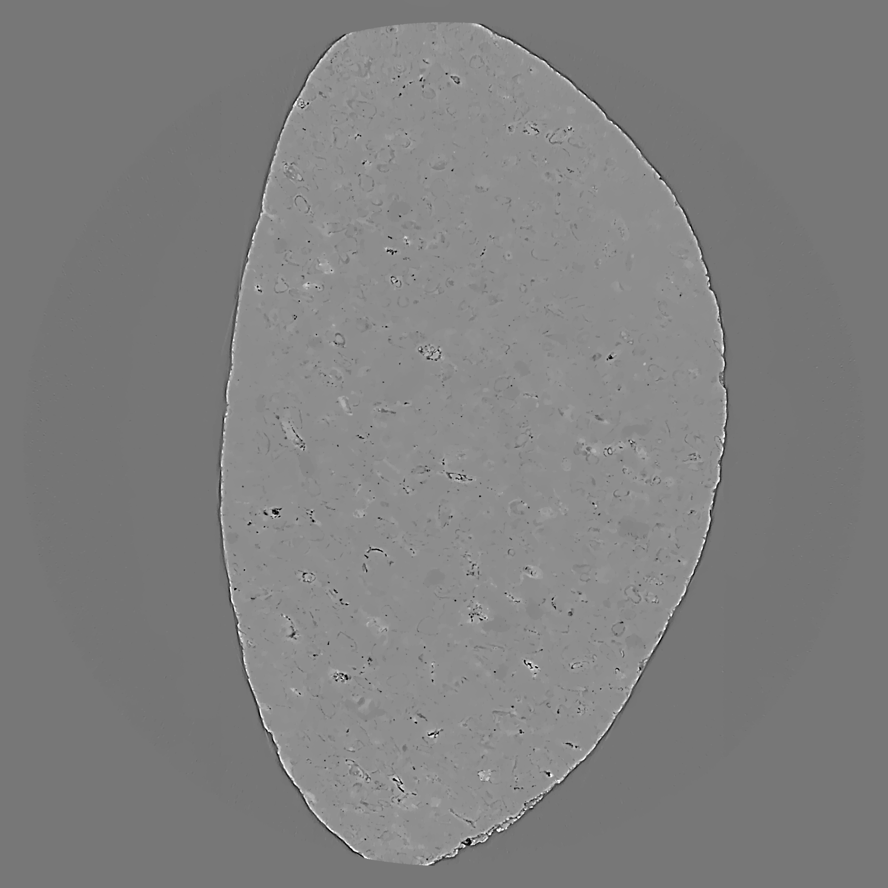

:orphan:

.. ::process_list:: test_data/process_lists/vo_centering_process.nxs

The Plugin Module
###################

A text description including different steps to follow when using the plugin.

* Item 1
* Item 2
* Item 3

This is an example image:

Equations can be included as:

.. math::

    \frac{1}{2}\pi

A section heading
===================

Section content.

Example piece of code
=======================

>>> add plugin_module
>>> mod 1.1 'New value'
>>> mod 1.5 4.5
>>> mod 1.8 True

Process List
=============

If you would like to load and use a process list within your example
code, you can specify the file path at the start of this rst file.

The included process list file will be checked for every sphinx documentation
build when the directive '.. ::process_list:: <file_path>' is included at
the top of your rst file.

For example '.. ::process_list:: test_data/process_lists/vo_centering_process.nxs'
