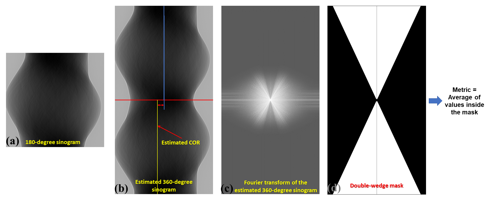

:orphan:

Vo Centering Documentation
#################################################################

How it works
------------

1. Input is a 180-degree sinogram.
2. An estimated 360-degree sinogram is generated by: flipping the 180-degree sinogram, shifting
   horizontally the sinogram to an estimated center-of-rotation (COR) position, and appending
   the resulting image to the original 180-degree sinogram.
3. Metric of the estimated 360-degree sinogram, which is the mean of values in the double-wedge
   region in the Fourier space, is calculated.

-> The estimated COR corresponding to the minimum of the measured metrics is the best COR.

  Figure 1. Explanation of how VoCentering works.

Parameters explanation
----------------------

1) *preview : []* -> To select which sinograms are used to calculate the COR. Users **have to
   change this parameter**, otherwise the plugin will calculate COR for every sinogram which is
   computationally expensive. Examples:

   - *preview : [:,mid,:]* -> Calculate the COR of a tomographic dataset using the middle sinogram.

   - *preview : [:,50:end:100,:]* -> Calculate the COR using sinograms having indices from 50 to the last with the step of 100.

   - *preview : [:,mid-10:mid+10,:]* -> Calculate the COR using 20 sinograms around the middle sinogram.

2) *search_area : [-50, 50]* -> Shifting range (in pixel) of the bottom sinogram (Fig. 1(b)) to search for the best COR.
   Example:

   - *search_area : [-150, 150]* : Shifting the bottom sinogram from left (-150) to right (+150) with
     respect to the horizontal centre of the sinogram image.

3) *start_pixel : None* -> Starting point for the search in parameter 2). If the value is None, the horizontal
   centre of the image is used. Example:

   - *start_pixel : 1100*

4) *ratio : 0.5* -> To define the wedge angle of the mask (Fig. 1d). The value can be adjusted
   using the ratio between the size of a sample and the horizontal field-of-view of a detector.
   However, it's insensitive. The value of 0.5 works in most of cases. Examples:

   - *ratio : 0.2* : If a sample is very small with respect to the detector field-of-view.

   - *ratio : 2.0* : If a sample is bigger than the detector field-of-view.

5) *search_radius : 6* -> Searching range (in pixel) from the left (-6) to the right (6) of the coarse estimated COR to
   find the best COR with sub-pixel accuracy.

6) *step : 0.5* -> Sub-pixel shifting step of the bottom sinogram (Fig. 1(b)). This corresponds to the accuracy of the
   estimated COR of 0.25 pixel (= 0.5 / 2).

8) *broadcast_method : median* -> Method for broadcasting the calculated COR to the whole dataset. For example, in the
   example above, a user choose to calculate the COR using 20 sinograms around the middle sinogram, then use the median
   value of the results to assign to all sinograms (e.g. 2000 sinograms). Example:

   - *broadcast_method : linear_fit* -> Apply a linear fit to the calculated CORs, then broadcast to all sinograms.

9) *row_drop : 20* -> To ignore the values around the middle row of the Fourier of the sinogram (Fig. 1(d)).

10) *average_radius : 5* -> To improve the signal-to-noise ratio of low-contrast sinograms. The plugin averages
    neighbouring sinograms (+/- 5) around the current sinogram and uses the result for calculating the COR. This
    requires that the preview parameter (1) needs to be changed to provide these neighboring sinograms.

How to use
----------

1. Users often just need to adjust parameter 1) and 2). Default values of other parameters works in most of cases (~98%).
2. About the order of the plugin in the data processing pipeline:

   - Vocentering should be used before any plugin which blurs sinograms such as PaganinFilter, FresnelFilter,
     MedianFilter, or RavenFilter. Blurred sinograms affect the accuracy of the Vocentering plugin.
   - The plugin must be used after the DistortionCorrection plugin, because the distortion alters the CORs from the top
     sinogram to the bottom sinogram in a nonlinear way.

3. If a sample is too small compared to the width of the image, adjust the ratio (4) to something ~0.1 -> 0.3.
4. If a sample is much bigger than the width of the image, adjust the ratio (4) to something ~ 2.0 -> 5.0.
5. If projection images are slightly tilted, use 'linear_fit' for parameter (8).
6. If images are at very low-contrast, increase parameter (10) and parameter (1) correspondingly.
