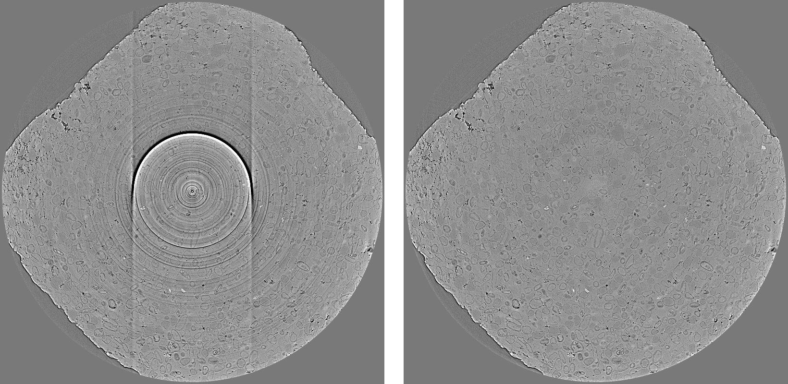

:orphan:

.. ::process_list:: test_data/test_process_lists/filters/ring_removal/remove_all_rings_test.nxs

Remove All Rings Documentation
#################################################################

This plugin is a combination of four methods to tackle most types of ring artifacts: full rings, partial rings,
fluctuating rings, and dead rings.

   Figure 1. Reconstructed images before and after the plugin is applied.

Explanation about the methods and how to use is `here <https://sarepy.readthedocs.io/toc/section3_1/section3_1_6.html>`_
(note that ring artifacts in a reconstructed image corresponding to stripe artifacts in the sinogram image).

**Important note:**

RemoveAllRings should *not* be used after a plugin which blurs an image such as PaganinFilter or FresnelFilter. Methods in
RemoveAllRings rely on the sharp change of gray-scales of stripe artifacts to detect and remove them. Smoothing filters
like PaganinFilter or FresnelFilter will hamper the cleaning capability of RemoveAllRings.
