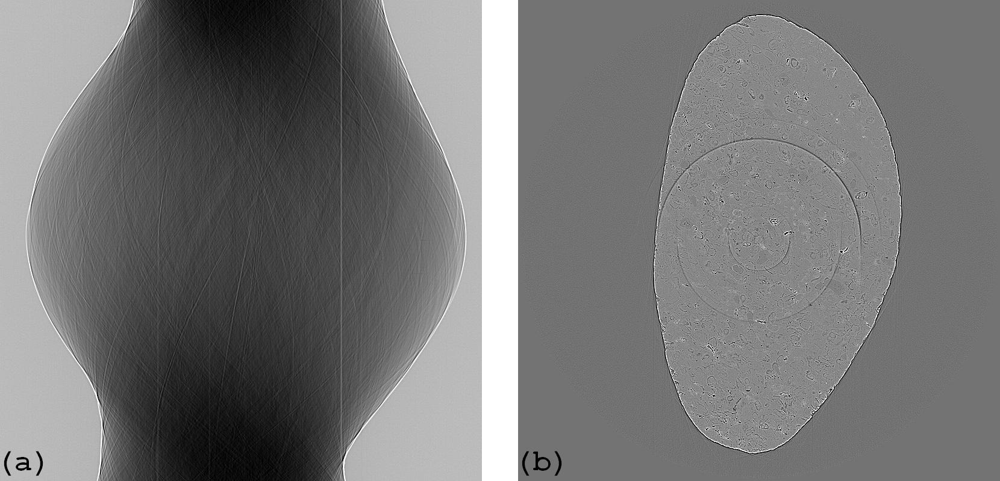
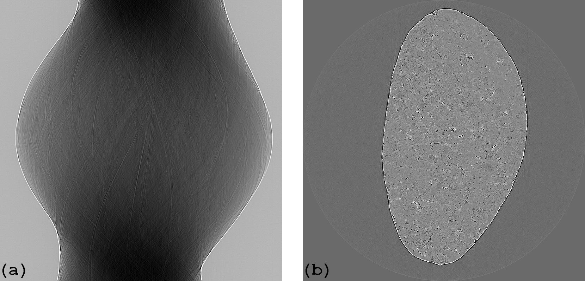

:orphan:

Remove Large Rings Documentation
#################################################################

This plugin is used to remove large ring artifacts.

   Figure 1. Sinogram (a) and reconstructed image (b) before the plugin is applied.

   Figure 2. Sinogram (a) and reconstructed image (b) after the plugin is applied.

Explanation about the method and how to use is `here <https://sarepy.readthedocs.io/toc/section3_1/section3_1_4.html>`_
(note that ring artifacts in a reconstructed image corresponding to stripe artifacts in the sinogram image).

**Important note:**

RemoveLargeRings should *not* be used after a plugin which blurs an image such as PaganinFilter or FresnelFilter. Methods in
RemoveLargeRings rely on the sharp change of gray-scales of stripe artifacts to detect and remove them. Smoothing filters
like PaganinFilter or FresnelFilter will hamper the cleaning capability of RemoveLargeRings.
