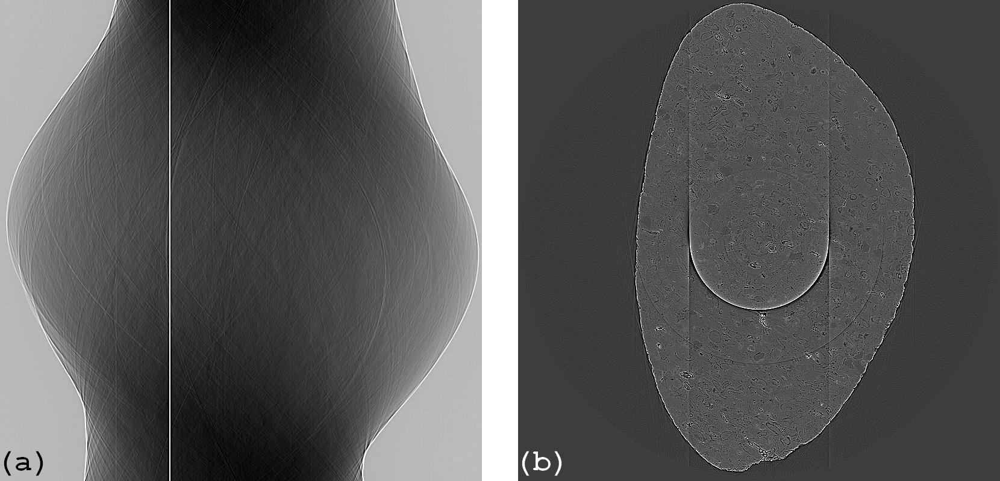
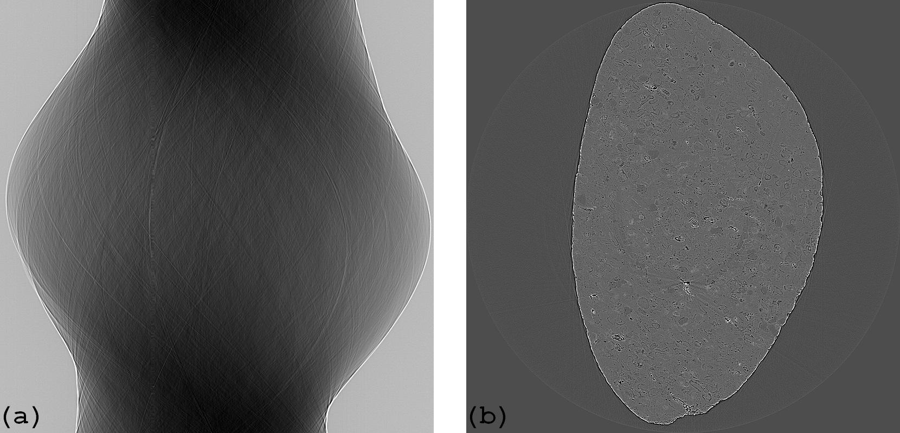

:orphan:

Remove Unresponsive And Fluctuating Rings Documentation
#################################################################

This plugin is used to remove ring artifacts caused by dead pixels or hot pixels in a detecting system.

   Figure 1. Sinogram (a) and reconstructed image (b) before the plugin is applied.

   Figure 2. Sinogram (a) and reconstructed image (b) after the plugin is applied.

Explanation about the method and how to use is `here <https://sarepy.readthedocs.io/toc/section3_1/section3_1_5.html>`_
(note that ring artifacts in a reconstructed image corresponding to stripe artifacts in the sinogram image).

**Important note:**

This plugin should *not* be used after a plugin which blurs an image such as PaganinFilter or FresnelFilter.