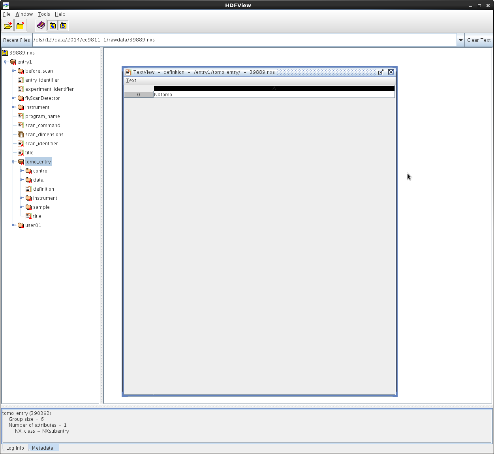
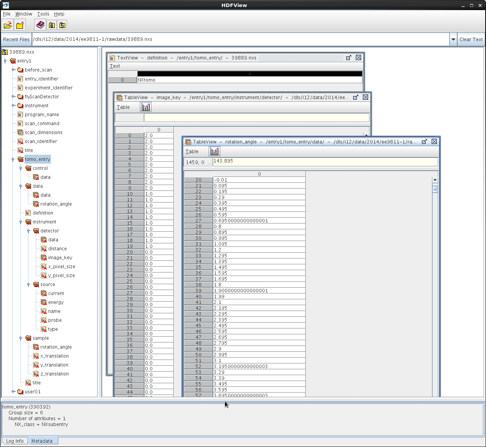

Image data in the HDF5 format
-----------------------------

.. raw:: html

    <!DOCTYPE html>
    <html>
        <head>
            <title>Tomography Reconstruction : Image data in the HDF format</title>
            <link rel="stylesheet" href="styles/site.css" type="text/css" />
            <META http-equiv="Content-Type" content="text/html; charset=UTF-8">
        </head>

        <body class="theme-default aui-theme-default">
            

                

                    

                        

                Created by  Kaz Wanelik
                            

                        

                        

For more information about the HDF file format, please go to <a class="external-link" href="http://www.hdfgroup.org/" rel="nofollow">http://www.hdfgroup.org/</a>.

For more information about the NeXus file format, please go to <a class="external-link" href="http://www.nexusformat.org/" rel="nofollow">http://www.nexusformat.org/</a>.

The Tomography Nexus format (which is stored in HDF5) is described as follows from the Pandata Europe Deliverable 5.3

5.3 Tomography Raw Data

This is again a scan around the sample rotation axis. However, in tomography it is common to collect dark field and bright field images before, during and after the actual sample scan in order to be able to correct the data for detector effects. For data reduction the order in which those images have been collected is important.
<ul><li>entry:NXentry<ul><li>title</li><li>start_time</li><li>end_time</li><li>definition</li><li>instrument:NXinstrument<ul><li>NXsource<ul><li>type</li><li>name</li><li>probe</li></ul></li><li>detector:NXdetector<ul><li>data[nFrames,xsize,ysize]<ul><li>@signal=1</li></ul></li><li>image_key[nFrames]</li><li>x_pixel_size</li><li>y_pixel_size</li><li>distance</li></ul></li></ul></li><li>sample:NXsample<ul><li>name</li><li>rotation_angle[nFrames]<ul><li>@axis=1</li></ul></li><li>x_translation[nFrames]</li><li>y_translation[nFrames]</li><li>z_translation[nFrames]</li></ul></li><li>control:NXmonitor<ul><li>data[nFrames]</li></ul></li><li>data:NXdata<ul><li>data --&gt; /NXentry/NXinstrument/data:NXdetector/data</li><li>rotation_angle --&gt; /NXentry/NXsample/rotation_angle</li></ul></li></ul></li></ul>
Where image_key is an array which holds for each image either 0,1 or 2 depending if it is a sample, bright field or dark field image.

 

 
<h2 id="ImagedataintheHDFformat-TomoEntry"><strong>Tomo Entry</strong></h2>
See <a class="external-link" href="http://www.nexusformat.org/" rel="nofollow">http://www.nexusformat.org/</a><a class="external-link" href="http://download.nexusformat.org/sphinx/classes/applications/NXtomo.html" rel="nofollow">http://download.nexusformat.org/sphinx/classes/applications/NXtomo.html</a>.

An example NeXus scan file, viewed in <em>hdfview</em>, is presented below:

 

.. raw:: html

    

.. raw:: html

    

    

Please note that the following items are currently <strong>essential</strong> for running tomography reconstruction with the help of <em>Tomo Recon GUI</em> in Dawn:
<ol><li>tomo_entry/data/data</li><li>tomo_entry/data/rotation_angle</li><li>tomo_entry/instrument/detector/image_key</li></ol>
The above Nexus paths are also used as default locations in the <em>tomo-centre</em> &amp; <em>tomo-recon</em> commands and in <em>Savu</em> Reconstruction Pipeline. For more information about tomography reconstruction in DLS, see <a href="Reconstruction-from-image-data-in-the-HDF-format_76392055.html">Reconstruction from image data in the HDF format</a>. 

    

                        

    

                    
             

            
     </body>
    </html>

