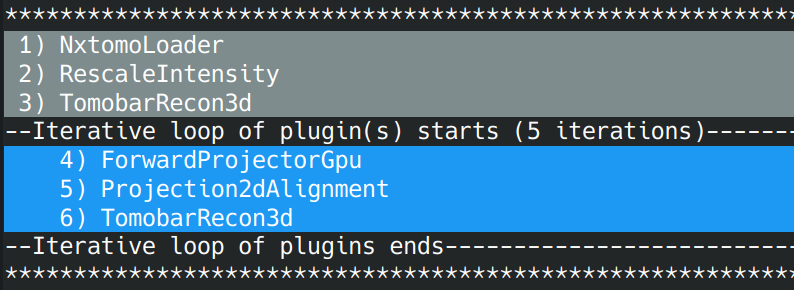

Iterative plugins API
*********************

TODO: a general description and the purpose of IP

Setting iterative plugins
=========================

TODO: An info how to set things up for iterative plugins: set, remove commands

Examples:
=========

Here we provide two examples how iterative plugins can be used in Savu.

Emulating 3D denoising
--------------------------------------------------------------------------------------------------------------------------

One can build a case where 2D denoising methods changing slicing patterns alternatingly in iterations thus enabling a much smoother recovery from noise. In image bellow we demonstrate how plugins no. 3 and 4 can be converted to be iterative. Using command `iterate --set 3 4 10`, plugins no. 3 and 4 have different slicing patterns and
locked in an iterative loop of 10 (global) iterations. The result of denoising in this case is more consistent in every spatial
direction than using one dimension. This filtering, although 2D, emulates 3D denoising.

Iterative alignment reconstruction algorithm
-------------------------------------------------------

This approach to reconstruct misaligned data is based on an iterative refinement with re-projection in order to perform a simultaneous reconstruction and alignment, see the paper: `Rapid alignment of nanotomography data using joint iterative reconstruction and reprojection <https://www.nature.com/articles/s41598-017-12141-9>`_.

With iterative plugins API it is possible to build the following iterative pipeline which will enable the iterative alignment algorithm. Plugin no. 3 performs re-projection of the reconstructed image,
no.4 initialises a registration method to perform alignment of the re-projected data with the original raw data in projection space and no.5  reconstructs the corrected projection data.
Note that different reconstruction algorithms can be used to reconstruct the corrected data, e.g. it could be the FBP algorithm of the `AstraReconGpu` plugin or a regulairised iterative reconstruction of
the `ToMoBAR` package (`TomobarRecon3d` plugin). Notably the latter converges significantly faster and delivers a superior reconstruction, hence recommended if the computation time is not the essence (see the images).

