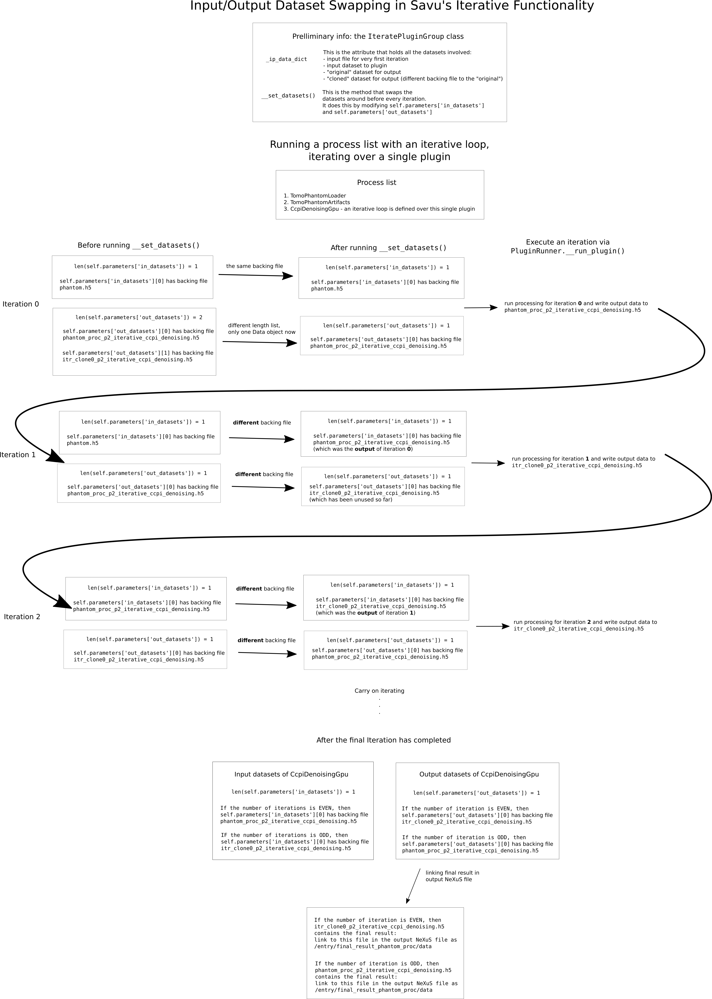

Iterative functionality - developer documentation
*************************************************

How it works - high level overview
==================================

A few different ideas form the basis of the implemention of iterative
functionality:

* using a class that is *separate* from plugin classes to represent a loop (to provide greater flexibility/generality in defining iterative loops of plugins)

* re-using plugin objects for subsequent iterations (to re-use the plugin's configuration, as well as overwrite the output of intermediate files instead of creating new intermediate files on every iteration)

* swapping the input/output datasets of plugins (for passing the output of the previous iteration to the input of the following iteration)

A class that is separate from plugin classes: :code:`IteratePluginGroup`
========================================================================

The original approach to implementing iterative plugins involved a base class
:code:`IterativeDriver` which a plugin would inherit from to create an iterative
version of that plugin. This has a few limitations:

* loops containing more than 1 plugin cannot easily be defined

* it involves having iterative and non-iterative versions of plugins; to create an iterative version of an existing plugin, the bulk of the existing plugin class code would need to be copied into a class representing the new iterative-version of that plugin; this code duplication is undesirable

As an alternative, the current implementation was chosen because it addresses
these two issues. By providing plugins the ability to be iterative through
a mechanism other than inheritance, it means that:

* iterative loops are defined "outside" of a plugin class or plugin base class, so it becomes simpler to define loops containing more than 1 plugin
* plugins can be ran iteratively without needing to create iterative versions of the non-iterative plugin classes, and thus the code duplication issue does not arise

Re-using plugin objects for subsequent iterations
=================================================

There are two reasons for wanting to re-use plugin objects for subsequent
iterations.

Due to the nature of processing pipelines that are represented as iterative
loops, a plugin in an iterative loop should have the same configuration for
each iteration, except that the input dataset contains different data (ie, the
data from the previous iteration). Plugin objects contain a lot of the
configuration for how they run, so using the same plugin *object* to represent
the associated plugin for every iteration naturally makes some sense.

Another reason is that Savu creates an intermediate hdf5 file for every plugin
object in a process list, which correspond to the output of a plugin. If each
iteration were to create a separate plugin object for each plugin, then there
would be many different intermediate files and could potentially take up a very
large amount of storage space. Re-using the plugin objects works well in
conjunction with re-using the same intermediate files to write the output of
plugins to. This is done by simply overwriting the contents of the intermediate
file associated to a plugin upon the execution in the next iteration.

Swapping the input/output datasets of plugins
==============================================

Why is an extra dataset needed for iterative functionality?
-----------------------------------------------------------

A crucial part of running an iterative loop is that the output of the previous
iteration needs to be used as the input of the next iteration. Savu plugins
have parameters that define their input and output datasets. Therefore, in the
context of Savu, using the output of the previous iteration as the input of the
next iteration involves defining the output dataset of the end plugin in the
previous iteration to be the input dataset of the start plugin in the next
iteration.

Using a *single* :code:`Data` object to contain the output of the end plugin
for iteration :code:`n`, to then pass as the input to the start plugin for
iteration :code:`n+1`, is not possible due to constraints of the framework.

TODO: include Nicola's explanation of the above, from
:code:`examples/plugin_examples/plugin_templates/iterative/testing_iterative_plugin.py`?

.. code-block:: console

    Since each dataset in Savu has its own backing hdf5 file, a dataset
    cannot be used for input and output at the same time.  So, in the
    case of iterative plugins, if a dataset is used as output and then
    as input on the next iteration, the subsequent output must be a
    different file.

A solution to this would be to use two :code:`Data` objects, and to have a
mechanism of

* writing the output of the end plugin on iteration :code:`n` to :code:`Data` object 1

* passing :code:`Data` object 1 as the input of the start plugin on iteration :code:`n+1`

* using :code:`Data` object 2 to write the output of the end plugin on iteration :code:`n+1`

and from there, continually swapping around these two :code:`Data` objects so
that there is always

* one containing the output of the previous iteration, ready to be inputted at the start of the current iteration

* one being used to write the output of the current iteration

Diagram of input/output dataset swapping
----------------------------------------

How is the second dataset created in Savu for iterative functionality?
----------------------------------------------------------------------

Prior to the idea of iterative functionality in Savu, there already existed the
concept of "clone datasets" (TODO: read more about them in Nicola's code
comment). Cloning a dataset involves copying the information in a :code:`Data`
object to a new :code:`Data` object, but the copy/clone has a different
"backing file" compared to the original (basically, a different hdf5 file on the
filesystem). Creating a clone :code:`Data` object was the chosen method to get a
second :code:`Data` object to use for this idea of dataset-swapping.

A pro of using a second dataset only (ie, not more than 2)
----------------------------------------------------------

In a similar way that output files for every plugin were desired to be re-used
on subsequent iterations (rather than creating extra datasets for every
iteration), it is useful to make the extra effort of swapping these two datasets
upon every iteration in terms of saving storage space.

By swapping the two datasets and always

* using one as the input for iteration :code:`n`

* overwriting one with the output of iteration :code:`n`

there is no need to create more datasets on every subsequent iteration.

High-level flowchart of execution order of things when an iterative loop is in a process list
=============================================================================================

How are iterative loops defined in process lists?
=================================================

The :code:`PluginList` class has methods that take care of

* saving information to process list files: (TODO: link to `PluginList._save_plugin_list()`)

* loading information from process list files: (TODO: link to `PluginList._populate_plugin_list()`)

An iterative loop defined in the configurator is represented as a dict, and all
such dicts are kept in a list :code:`PluginList.iterate_plugin_groups`.

When a process list has been defined in the configurator that has at least one
loop in it, the save process involves:

* creating a group :code:`/entry/iterate_plugin_groups` in the NeXuS file to hold the info if it doesn't already exist

* writing the information in all the dicts that represent iterative loops to that group in the NeXuS file

When a process list is opened in the configurator, the load process involves:

* reading information from the :code:`/entry/iterate_plugin_groups` group in the NeXuS (if it exists)

* creating dicts from that information, that are then appended to :code:`PluginList.iterate_plugin_groups`

When Savu is run with a process list that has one or more iterative loops, how are the dicts in :code:`PluginList.iterate_plugin_groups` used to initiate the iterative behaviour?
==================================================================================================================================================================================

When the :code:`Experiment` object is first setup at the beginning of the job,
prior to any plugins running, the list of dicts that represent iterative loops
that were loaded into the `PluginList` object are read. An instance of
:code:`IteratePluginGroup` is created from each dict, appended to a list, and
this list is then saved in the metadata of the :code:`Experiment` object.

The experimental metadata is available as :code:`self.exp.meta_data` throughout
the Savu job from that point onwards, so when Savu moves onto the execution of
plugins in the process list, the information about the iterative loops is read
when needed by accessing that value.

Why has the information about iterative loops been put in the experimental metadata?
====================================================================================

The :code:`Experiment` object is widely accessible in most parts of the Savu
code. Iterative loops have been implemented explicitly with the intention
(among others) that they are at a level "higher than plugins" (TODO: link to
"Separate class, IteratePluginGroup" section), and the layer directly above
plugin objects is :code:`PluginRunner`. Therefore, the implementation of
iterative functionality has placed the iterative functionality as being at least
in the layer that :code:`PluginRunner` occupies (or in a layer higher above).

Since :code:`PluginRunner` has access to the :code:`Experiment` object, and that
the information about what iterative loops were defined in the process list can
be reasonably regarded as "global information", it made some sense that
iterative loop information could be placed in the experimental metadata.
