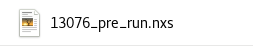
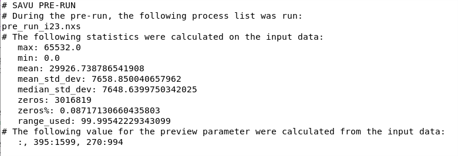
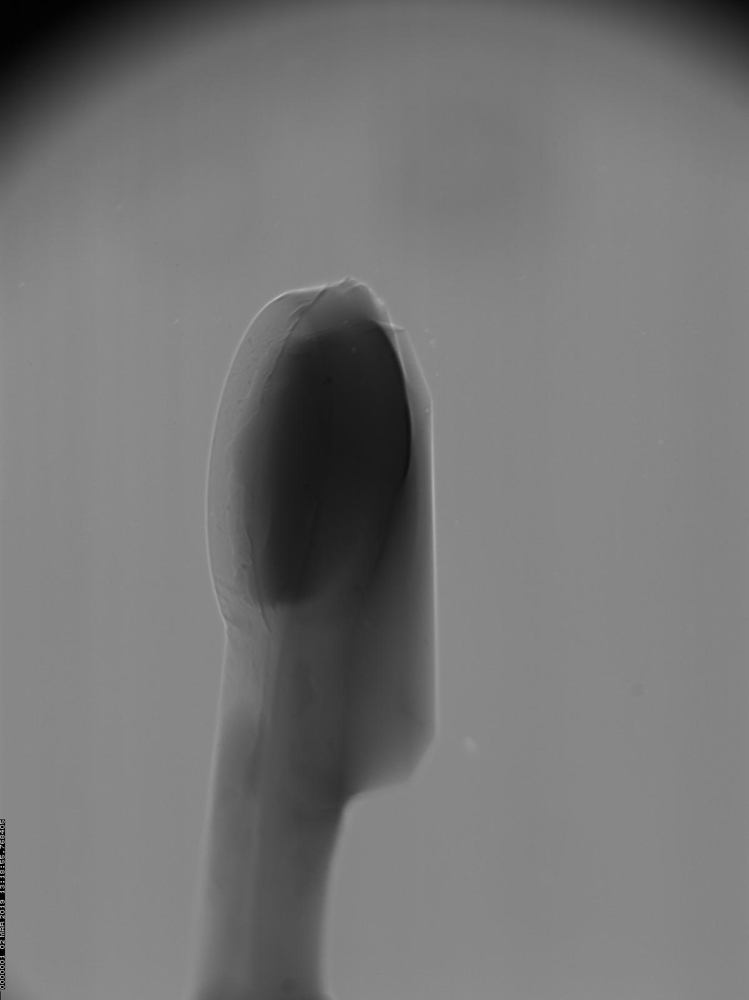
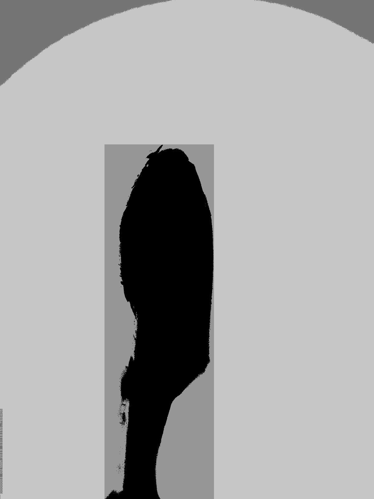

Savu pre-run
************

The Savu pre-run is a short run of Savu that performs basic processes to set up data for a full Savu run. Unlike a regular run, there are only 2 arguments, input file and output folder. There is no process list, as Savu automatically runs the appropriate plugins based on characteristics of the data, and the beamline it’s from. Key features of the pre-run include gathering statistics and cropping information on the raw data.

Usage
=====

To run the Savu pre-run, use the command **savu_pre_run**, followed by the arguments **input file** and **output folder**. No process list should be specified - Savu automatically decides what plugins to run. The pre-run produces a NeXuS file with the name of the input file plus a “_pre_run” suffix. 

This file is a copy of the input file, containing the raw data as well as additional meta-data relating to things like statistics and cropping. The data may also have gone through some basic processing such as rotation, where needed. After a pre-run, this file should be used as the input file on a full Savu run.

Here are some reasons you may want to use the Savu pre-run before a full Savu run:

 - You want to quickly gain some statistical information about your data.
 - The first plugin (after the loader) in the process list for your full run benefits from volume-wide statistics.
 - You want your data to be automatically cropped.

Statistics
==========

Statistics such as min, max, mean and standard deviation are calculated during the pre-run. These are inserted into the pre-run file to be used in a subsequent run. Certain plugins such as Dezinger benefit from having access to volume-wide statistics of the raw data, which otherwise wouldn’t be present, meaning slice-wide statistics would have to be calculated within the plugin. Whilst Savu does calculate volume-wide statistics during a normal run, this happens alongside the running of plugins, meaning the first plugin in a process list won’t have access to any statistics unless they are present in the input file already, as the pre-run ensures.

Another use of calculating statistics is to gain some insight into the quality of the data before starting a full run. The pre-run produces a log file that contains all the statistics calculated. In particular, the number of 0s, and the range used (given as a percentage of the possible range accommodated by the data type) may be useful metrics of the data’s quality. The pre-run log file can be found in the run_log folder inside the output folder.

   Example of the pre-run log file

Cropping
========

The preview parameter in NxtomoLoader defines coordinates to crop the input data. The pre-run has the ability to automatically calculate appropriate values for this parameter, and insert them into the pre-run file. As with statistics, when this file is used as the input file in a full Savu run, the preview value will be read by the loader and used to populate the parameter. A user input value for the preview parameter, if present, will be combined with the one produced in the pre-run in non-clashing dimensions (for example, pre-run doesn’t produce any cropping coordinates in the slice dimension). If both have cropping coordinates in a certain dimension, the user input ones will be used.

The cropping coordinates are produced by thresholding the data, and applying a cropping algorithm on the result.

   Demonstration of algorithm on one slice

   Cropped vs uncropped slice

This happens slice by slice, with each slice producing a set of coordinates that crop out the unused space in that slice. These coordinates are combined to produce the widest cross-section, ensuring none of the object is cut out from any slice. The particular algorithm used was created with specific data in mind, and may not be appropriate for different data. Additionally, different data may respond differently to the thresholding algorithm used. It’s important all of the object is successfully segmented from the background.

.. figure:: uncropped.gif
   :figwidth: 55%
   :align: left

   Volume before cropping

.. figure:: cropped.gif
   :figwidth: 33%
   :align: left

   Volume after cropping

.. raw:: html

    

Beamline-specific functions
===========================

The pre-run can also carry out specific functions based on characteristics of the data, or the beamline the data comes from. Keys in the data indicate which beamline collected it, and can be used to inform which plugins are used in the pre-run. For example, i23 data needs to be rotated 90 degrees before processing begins. This can be done in the pre-run by identifying the data is from i23, and consequently running the Rotate90 plugin. If a beamline has specific functions they would like carried out in the pre-run, they should get in touch with the tomography team.
