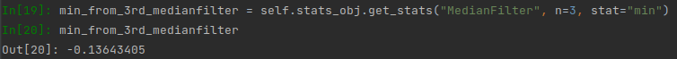
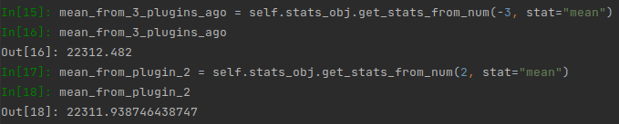
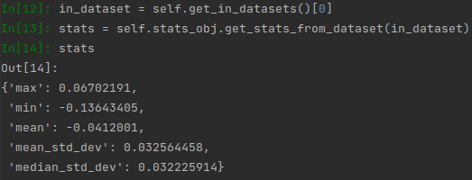
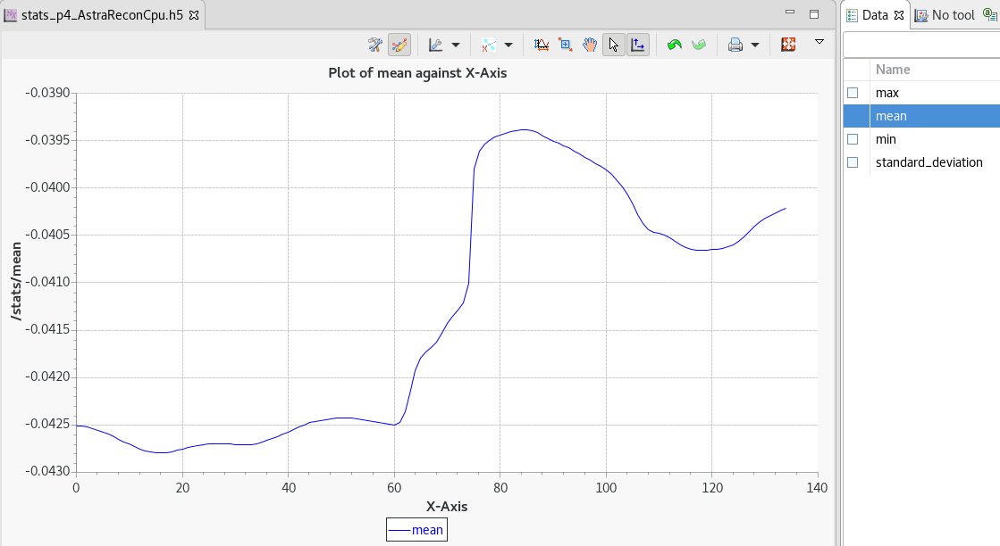

Statistics API
**************

.. autoclass:: savu.plugins.stats.statistics.Statistics
   :undoc-members:
   :noindex:

Statistics relating to the data in each plugin are calculated automatically by the statistics class. The maximum, minimum, mean and standard deviation are calculated per slice, and are combined at the end of the plugin to give volume-wide statistics of **max**, **min**, **mean**, **mean_std_dev** and **median_std_dev**.

Every plugin object contains a statistics object called **stats_obj**. This object contains the per-slice stats for that plugin, as well as the volume-wide stats for that plugin, and every plugin that came before it. 

Accessing statistics
====================

The volume-wide stats for a plugin can be accessed either with the name of the plugin, or the plugin number, using the following methods:

.. automethod:: savu.plugins.stats.statistics.Statistics.get_stats

.. automethod:: savu.plugins.stats.statistics.Statistics.get_stats_from_num

Volume-wide stats are also added to the metadata of the output dataset for each plugin. This means stats are visible in Dawn, as metadata associated with each dataset. If you have a dataset object, for example by using the **plugin.get_datasets()** method, stats can be accessed using the following method:

.. automethod:: savu.plugins.stats.statistics.Statistics.get_stats_from_dataset

Here are examples of how to use these methods:

The arrays containing stats for every slice are written to file at the end of each plugin. These files can be found in the **stats** folder in the output directory, and can be viewed in Dawn.

Setting statistics
==================

Volume-wide stats are automatically calculated and set directly *after* the **post_process()** method in each plugin. Attempting to access the stats of the current plugin before this point, for example from its **out dataset**, will result in an error. If stats are needed before this point, call the method **set_volume_stats()** first to populate the relevant dictionaries and datsets. This should happen after all data processing has occurred.

.. automethod:: savu.plugins.stats.statistics.Statistics.set_volume_stats

Turning statistics off
======================

 Some plugins don't have statistics calculated for them, such as plugins which exclusively produce metadata instead of processed data. To turn stats **off** for your plugin you can add your plugin to the **no_stats_plugins** list in **statistics.py**.

.. autoattribute:: savu.plugins.stats.statistics.Statistics.no_stats_plugins

Alternatively, you can set **self.stats_obj.calc_stats** to **False** in the **Setup()** method of your plugin.

.. autoattribute:: savu.plugins.stats.statistics.Statistics.calc_stats

Attempting to access stats for plugins where stats is turned off will result in errors.
