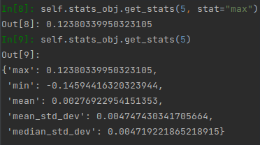
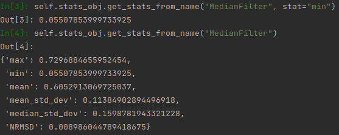
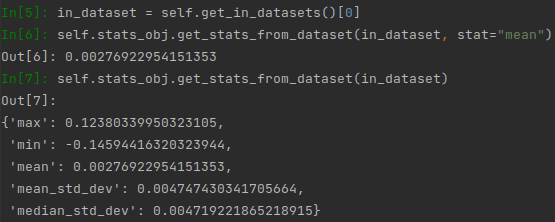
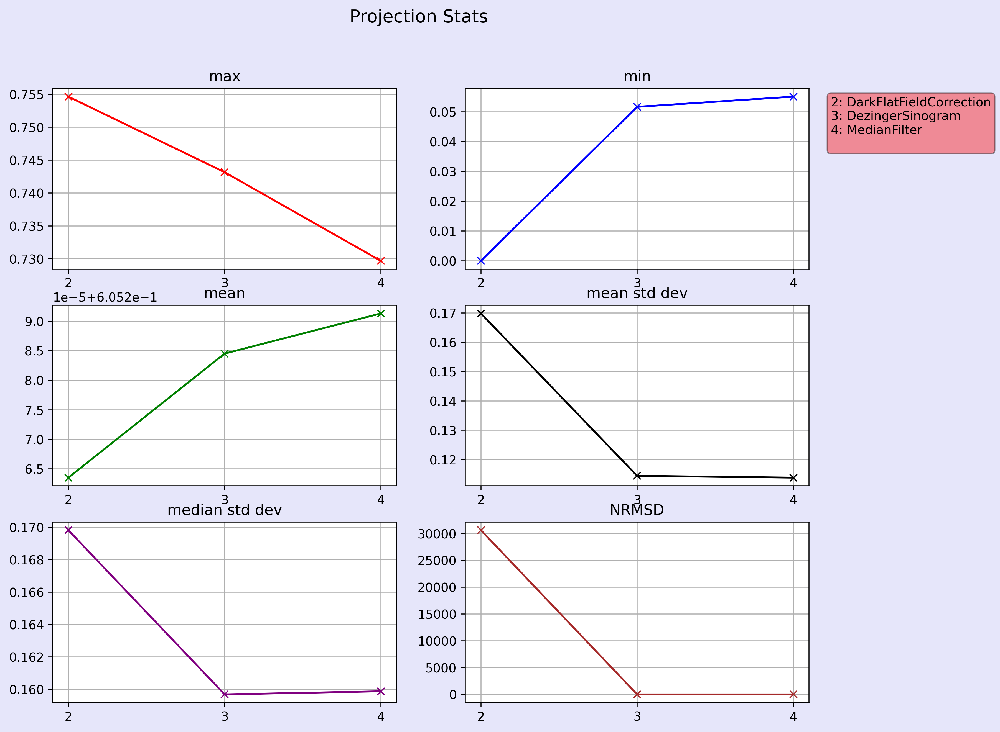
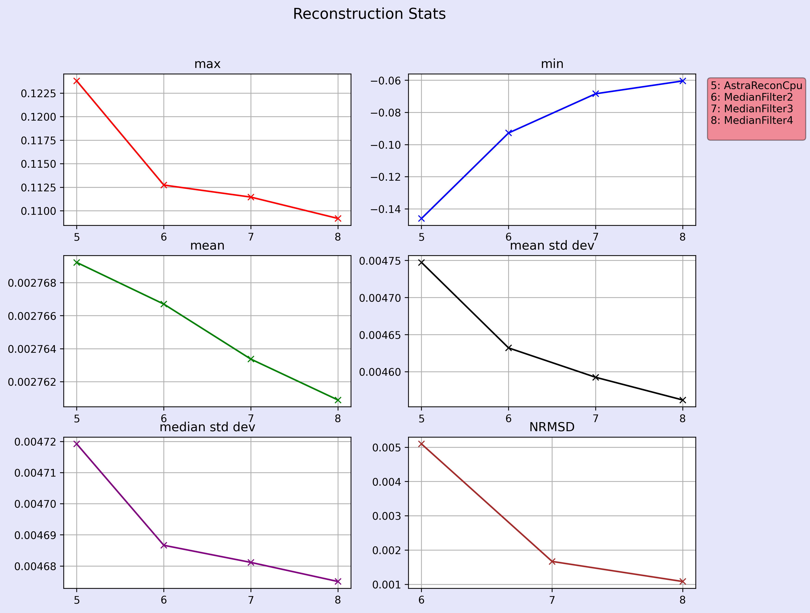
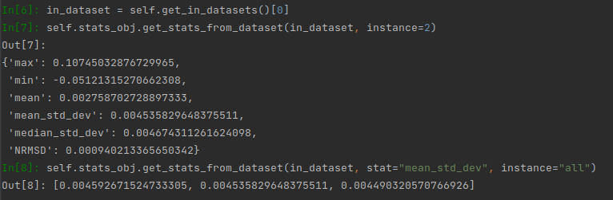
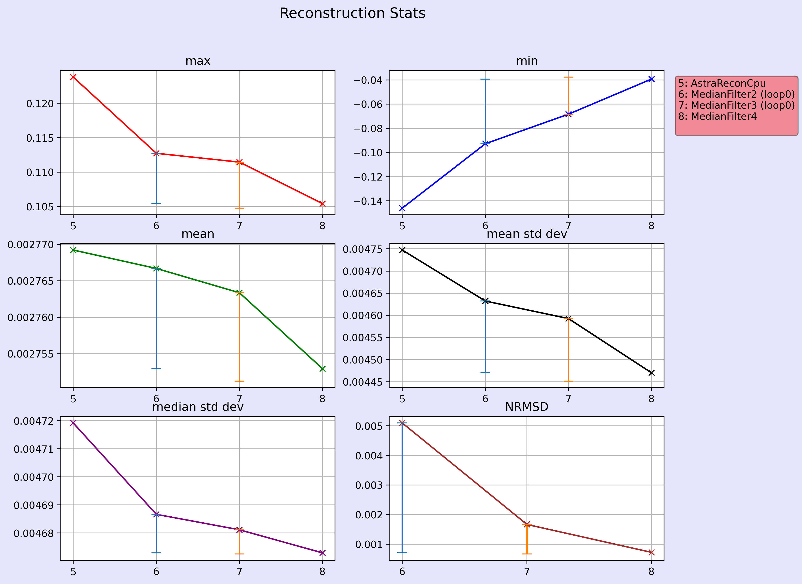
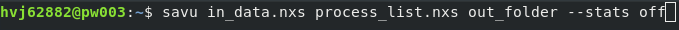

Statistics Documentation
************************

.. autoclass:: savu.plugins.stats.statistics.Statistics
   :undoc-members:
   :noindex:

Statistics relating to the data in each plugin are calculated automatically by the statistics class. The maximum, minimum, mean and standard deviation are calculated per slice, and are combined at the end of the plugin to give volume-wide statistics of **max**, **min**, **mean**, **mean_std_dev** and **median_std_dev**. Additionally, residuals are calculated between the data slices pre and post processing. These are used to calculated the **RMSD** (root mean square deviation) between the data before and after processing, and this is normalised by dividing by the mean to produce the **NRMSD**. This is a measure of how much a plugin is changing the data.

Every plugin object contains a statistics object called **stats_obj**. This object contains the per-slice stats for that plugin, as well as the volume-wide stats for that plugin, and every plugin that came before it. 

|

Accessing statistics in Savu
============================

The volume-wide stats for a plugin can be accessed in Savu either with the plugin number, or the name of the plugin, using the following methods:

.. automethod:: savu.plugins.stats.statistics.Statistics.get_stats

.. automethod:: savu.plugins.stats.statistics.Statistics.get_stats_from_name

Volume-wide stats are also added to the metadata of the output dataset for each plugin. If you have a dataset object, for example by using the **plugin.get_datasets()** method, stats can be accessed using the following method:

.. automethod:: savu.plugins.stats.statistics.Statistics.get_stats_from_dataset

Here are examples of how to use these methods:

Accessing statistics outside of Savu
====================================

After a Savu run has completed, the statistics for that run are contained in the **stats** folder in the output directory. In that folder you'll find a table containing the stats for every plugin, as well as graphs showing how each statistical measure changes from plugin to plugin, in projection and reconstruction space. 

.. raw:: html
   :file: stats_table.html

|

All these figures are generated by looking at a hdf5 file called **stats.h5**, which is populated over the course of the run, and can be found in the same folder as the figures. It can be viewed in DAWN, or could provide the statistics data for scripts doing further processing.

Since statistics are also attached to the output datasets of plugins, they can also be viewed in DAWN by opening the output nexus file and looking at the meta header table.

Stats in iterative loops
========================

Stats are calculated for every iteration of an iterative loop. You can use the **instance** parameter of the get methods above to specify which iteration you want the stats for.

In the table found in /stats, the stats values for every iteration will be displayed one after each other for each plugin in the loop. In the graphs, the minimum and maximum value for each stat will be displayed as an error bar for each plugin in the loop.

.. raw:: html
   :file: stats_table_iterate.html

|

Setting statistics
==================

Volume-wide stats are automatically calculated and set directly *after* the **post_process()** method in each plugin. Attempting to access the stats of the current plugin before this point, for example from its **out dataset**, will result in an error. If stats are needed before this point, call the method **set_volume_stats()** first to populate the relevant dictionaries and datasets. This should happen after all data processing has occurred.

.. automethod:: savu.plugins.stats.statistics.Statistics.set_volume_stats

Turning statistics off
======================

To stop statistics being calculated on a run of Savu, use the **--stats** option and pass **off** to it.

Some plugins don't have statistics calculated for them, such as plugins which exclusively produce metadata instead of processed data. To turn stats **off** for a single plugin you can set **self.stats_obj.calc_stats** to **False** in the **Setup()** method of that plugin.

.. autoattribute:: savu.plugins.stats.statistics.Statistics.calc_stats

Attempting to access stats for plugins where stats is turned off will result in errors.
