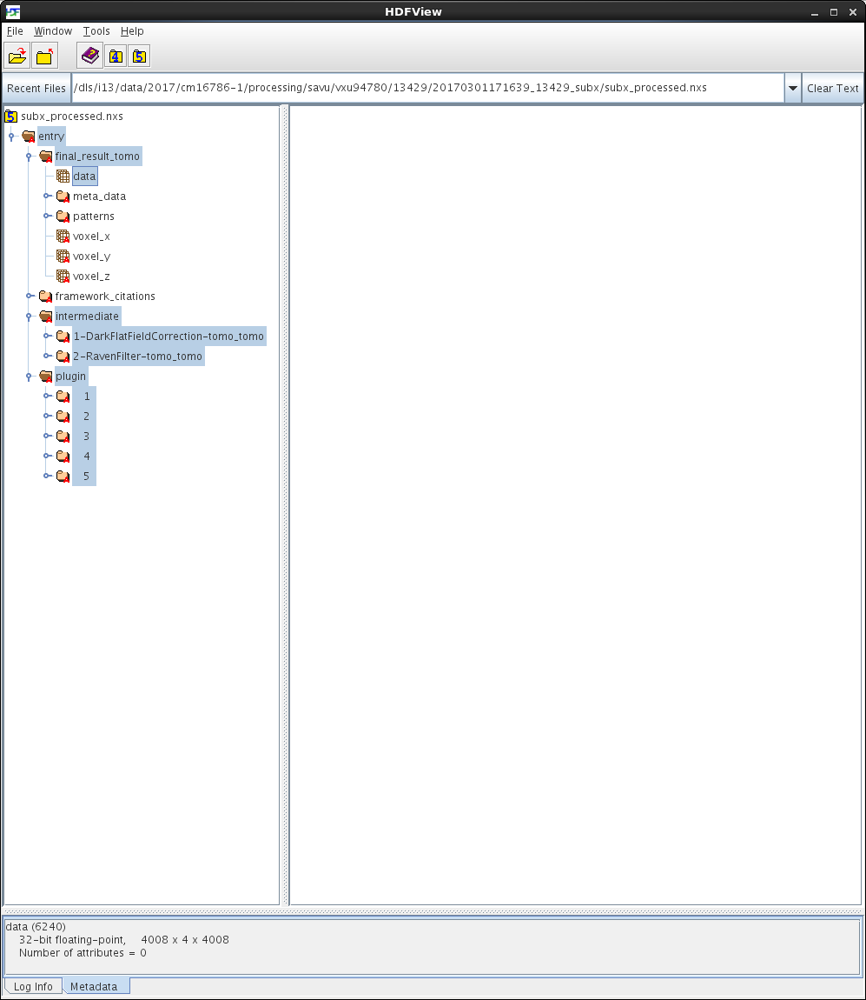
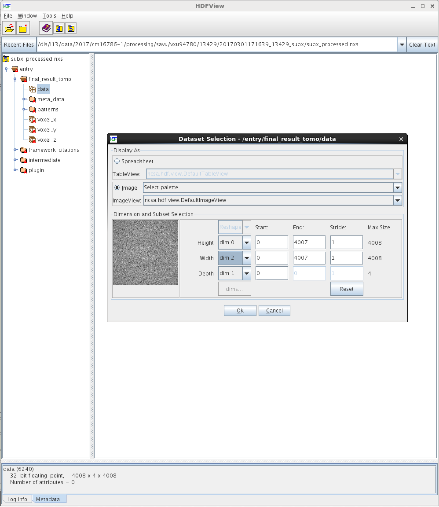
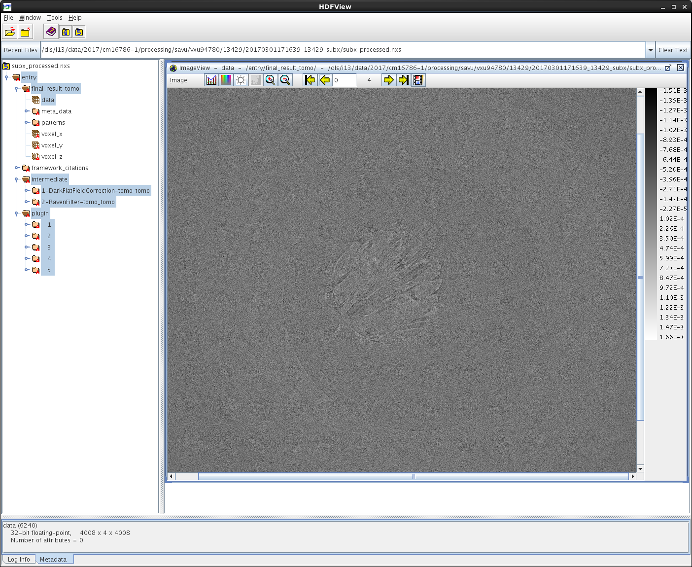
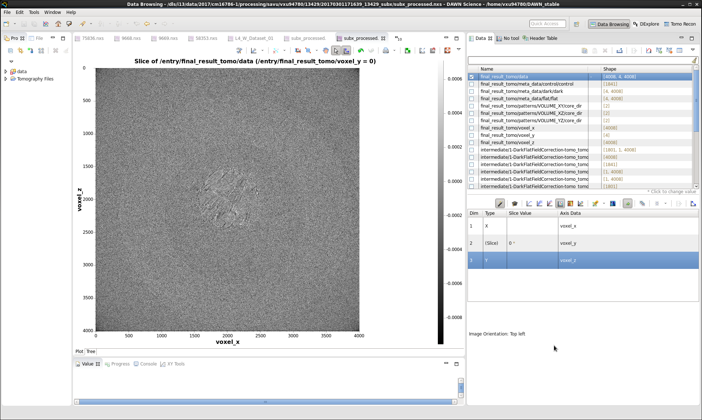
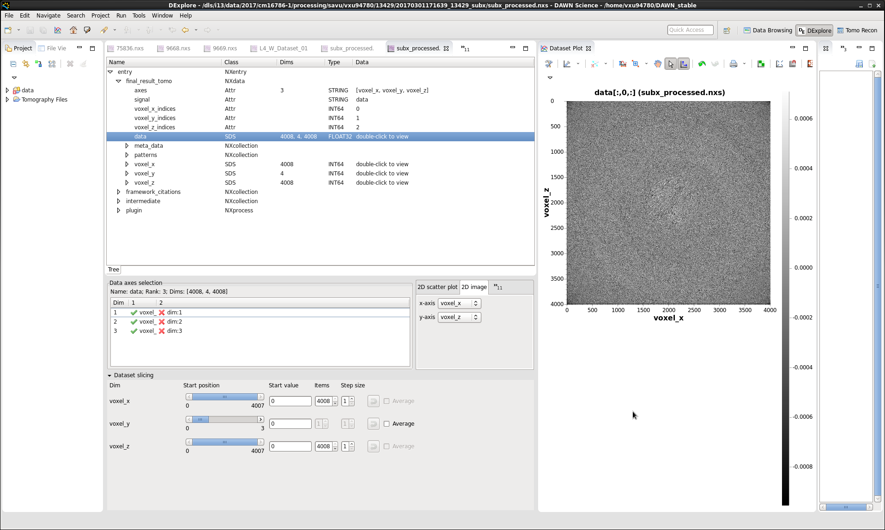
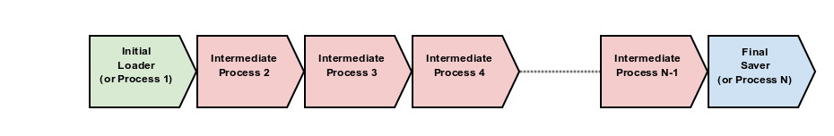

:orphan:

.. _savu_tutorial:

Savu - tutorial on basic use
-----------------------------

**Note**: The following tutorial for I13 users is out-of-date.

.. raw:: html

    <!DOCTYPE html>
    <html>

        <body class="theme-default aui-theme-default">
            

                

                    

                        

                Created by  Kaz Wanelik
                            

                        

                        

    <ul class='toc-indentation'>
    <li><a href='#ReconstructionfromimagedataintheHDFformat:Savu-tutorialonbasicuse-HowtoreplicateinSavuthefunctionalityofthetomo-centre&amp;tomo-reconcommands?'>How to replicate in Savu the functionality of the tomo-centre &amp; tomo-recon commands?</a></li>
    <li><a href='#ReconstructionfromimagedataintheHDFformat:Savu-tutorialonbasicuse-Howtocreateaprocess-listfileinSavu?'>How to create a process-list file in Savu?</a>
    <ul class='toc-indentation'>
    <li><a href='#ReconstructionfromimagedataintheHDFformat:Savu-tutorialonbasicuse-AddProcess1:LOADER'>Add Process 1: LOADER</a></li>
    <li><a href='#ReconstructionfromimagedataintheHDFformat:Savu-tutorialonbasicuse-AddProcess2:DARK-FLAT-FIELDCORRECTION'>Add Process 2: DARK-FLAT-FIELD CORRECTION</a></li>
    <li><a href='#ReconstructionfromimagedataintheHDFformat:Savu-tutorialonbasicuse-AddProcess3:RAVENFILTER'>Add Process 3: RAVEN FILTER</a></li>
    <li><a href='#ReconstructionfromimagedataintheHDFformat:Savu-tutorialonbasicuse-AddProcess4:ASTRARECONGPU'>Add Process 4: ASTRA RECON GPU</a></li>
    <li><a href='#ReconstructionfromimagedataintheHDFformat:Savu-tutorialonbasicuse-AddProcess5:SAVER'>Add Process 5: SAVER</a></li>
    <li><a href='#ReconstructionfromimagedataintheHDFformat:Savu-tutorialonbasicuse-SaveProcessChaintofile'>Save Process Chain to file</a></li>
    </ul>
    </li>
    <li><a href='#ReconstructionfromimagedataintheHDFformat:Savu-tutorialonbasicuse-HowtofindoptimalvalueofCoRinSavu?'>How to find optimal value of CoR in Savu?</a>
    <ul class='toc-indentation'>
    <li><a href='#ReconstructionfromimagedataintheHDFformat:Savu-tutorialonbasicuse-Thesavu_mpicommandforCoRoptimisation'>The savu_mpi command for CoR optimisation</a></li>
    </ul>
    </li>
    <li><a href='#ReconstructionfromimagedataintheHDFformat:Savu-tutorialonbasicuse-HowtoreconstructasubsetofslicesortheentiredatasetinSavu?'>How to reconstruct a subset of slices or the entire dataset in Savu?</a>
    <ul class='toc-indentation'>
    <li><a href='#ReconstructionfromimagedataintheHDFformat:Savu-tutorialonbasicuse-Thesavu_mpicommandforrunningfull(orpartial)reconstruction'>The savu_mpi command for running full (or partial) reconstruction</a></li>
    </ul>
    </li>
    <li><a href='#ReconstructionfromimagedataintheHDFformat:Savu-tutorialonbasicuse-Additionalremarks'>Additional remarks</a>
    <ul class='toc-indentation'>
    <li><a href='#ReconstructionfromimagedataintheHDFformat:Savu-tutorialonbasicuse-TipsformoreadvanceduseofSavu'>Tips for more advanced use of Savu</a></li>
    <li><a href='#ReconstructionfromimagedataintheHDFformat:Savu-tutorialonbasicuse-ExtractionofTIFFimagesandtheirbit-depthreduction'>Extraction of TIFF images and their bit-depth reduction</a></li>
    </ul>
    </li>
    <li><a href='#ReconstructionfromimagedataintheHDFformat:Savu-tutorialonbasicuse-Appendices'>Appendices</a>
    <ul class='toc-indentation'>
    <li><a href='#ReconstructionfromimagedataintheHDFformat:Savu-tutorialonbasicuse-AppendixA:ViewingofthecontentsofSavuconfigurationfiles'>Appendix A: Viewing of the contents of Savu configuration files</a></li>
    <li><a href='#ReconstructionfromimagedataintheHDFformat:Savu-tutorialonbasicuse-AppendixB:Datalayout(rotation_angle,detector_y,detector_x)'>Appendix B: Data layout (rotation_angle, detector_y, detector_x)</a></li>
    <li><a href='#ReconstructionfromimagedataintheHDFformat:Savu-tutorialonbasicuse-AppendixC:ViewingoftheactivationstatusofSavuprocesses'>Appendix C: Viewing of the activation status of Savu processes</a></li>
    <li><a href='#ReconstructionfromimagedataintheHDFformat:Savu-tutorialonbasicuse-AppendixD:ViewingofSavuoutputfilesproducedforcentring'>Appendix D: Viewing of Savu output files produced for centring</a></li>
    <li><a href='#ReconstructionfromimagedataintheHDFformat:Savu-tutorialonbasicuse-AppendixE:HandlingofexternalflatsanddarksinSavu'>Appendix E: Handling of external flats and darks in Savu</a></li>
    <li><a href='#ReconstructionfromimagedataintheHDFformat:Savu-tutorialonbasicuse-AppendixF:ViewingofSavuoutputfilescontainingfinal-reconstructionslices'>Appendix F: Viewing of Savu output files containing final-reconstruction slices</a></li>
    <li><a href='#ReconstructionfromimagedataintheHDFformat:Savu-tutorialonbasicuse-AppendixG:OtherfrequentlyusedSavu-Configuratorcommands'>Appendix G: Other frequently used Savu-Configurator commands</a>
    <ul class='toc-indentation'>
    <li><a href='#ReconstructionfromimagedataintheHDFformat:Savu-tutorialonbasicuse-list&lt;plug-in-category&gt;'>list &lt;plug-in-category&gt;</a></li>
    <li><a href='#ReconstructionfromimagedataintheHDFformat:Savu-tutorialonbasicuse-list&lt;any-characters&gt;*'>list &lt;any-characters&gt;*</a></li>
    <li><a href='#ReconstructionfromimagedataintheHDFformat:Savu-tutorialonbasicuse-disp-q'>disp -q</a></li>
    <li><a href='#ReconstructionfromimagedataintheHDFformat:Savu-tutorialonbasicuse-history'>history</a></li>
    <li><a href='#ReconstructionfromimagedataintheHDFformat:Savu-tutorialonbasicuse-move&lt;from-process-index&gt;&lt;to-process-index&gt;'>move &lt;from-process-index&gt; &lt;to-process-index&gt;</a></li>
    </ul>
    </li>
    <li><a href='#ReconstructionfromimagedataintheHDFformat:Savu-tutorialonbasicuse-AppendixH:SavuTips&amp;Tricks'>Appendix H: Savu Tips &amp; Tricks</a></li>
    </ul>
    </li>
    </ul>
    

 

<strong>This tutorial applies to Savu version 1.2 (the current default version is 2.1). </strong>

<strong>If you require Savu version 1.2, please execute: 'module add savu/1.2' (instead of 'module add savu'). </strong>
<h2 id="ReconstructionfromimagedataintheHDFformat:Savu-tutorialonbasicuse-"><strong> </strong></h2>
<table class="wrapped confluenceTable"><colgroup><col/></colgroup><tbody><tr><th class="highlight-yellow confluenceTh" data-highlight-colour="yellow"><h2 id="ReconstructionfromimagedataintheHDFformat:Savu-tutorialonbasicuse-HowtoreplicateinSavuthefunctionalityofthetomo-centre&amp;tomo-reconcommands?"><strong>How to replicate in Savu the functionality of the tomo-centre &amp; tomo-recon commands?</strong></h2></th></tr></tbody></table>

<strong> </strong>

This page describes the basic use of <strong>Savu Tomography Reconstruction Pipeline</strong> for reconstructing image data in the HDF5 format. More precisely, it aims at providing some details on how to use <strong>Savu</strong> to deliver a functionality similar to that provided by the <em><strong>tomo-centre</strong></em> &amp; the <em><strong>tomo-recon</strong></em> commands (c.f. <a href="17827244.html">Reconstruction from image data in the HDF format: the tomo-centre and tomo-recon commands</a>). In particular, a brief discussion of the following typical tomography-reconstruction tasks is presented below:
<ul><li>applying dark- and flat-field correction</li><li>finding optimal centre of rotation (CoR)</li><li>suppressing ring artefacts</li><li>reconstructing a subset of slices or the entire dataset    </li></ul>
For more information about <strong>Savu</strong> <strong>Pipeline</strong> and its diverse capabilities, please peruse <a href="https://confluence.diamond.ac.uk/display/SCI/Savu">Savu</a>. 

 

The conversion between the <em><strong>tomo-centre</strong></em> &amp; the <em><strong>tomo-recon</strong></em> commands and <strong>Savu</strong> <strong>Pipeline</strong> is relatively straightforward:

<table class="wrapped confluenceTable"><colgroup><col/><col/><col/><col/></colgroup><tbody><tr><th colspan="1" class="confluenceTh">Item</th><th style="text-align: center;" class="confluenceTh">tomo-centre &amp; tomo-recon</th><th style="text-align: center;" class="confluenceTh">Savu</th><th style="text-align: center;" colspan="1" class="confluenceTh">Comment(s)</th></tr><tr><td colspan="1" class="confluenceTd">1</td><td colspan="1" class="confluenceTd"><em>module add tomography</em></td><td colspan="1" class="confluenceTd"><em>module add savu</em></td><td colspan="1" class="confluenceTd">Linux command for loading an appropriate module.</td></tr><tr><td colspan="1" class="confluenceTd">2</td><td class="confluenceTd"><em>tomo-centre</em> or <em>tomo-recon</em></td><td class="confluenceTd"><em>savu_mpi</em></td><td colspan="1" class="confluenceTd">Linux command for executing an appropriate code on the compute cluster.</td></tr><tr><td colspan="1" class="confluenceTd">3</td><td class="highlight-green confluenceTd" colspan="1" data-highlight-colour="green">&lt;nexus_file&gt;</td><td class="highlight-green confluenceTd" colspan="1" data-highlight-colour="green">&lt;nexus_file&gt;</td><td colspan="1" class="confluenceTd">Path to input Nexus scan file containing tomography dataset.</td></tr><tr><td colspan="1" class="confluenceTd">4</td><td class="highlight-red confluenceTd" data-highlight-colour="red">[options]</td><td class="highlight-red confluenceTd" data-highlight-colour="red"><strong>Savu</strong> process-list file</td><td colspan="1" class="confluenceTd">Optional arguments for executing commands in item 2.</td></tr><tr><td colspan="1" class="confluenceTd">5</td><td class="highlight-blue confluenceTd" colspan="1" data-highlight-colour="blue">&lt;output_directory&gt;</td><td class="highlight-blue confluenceTd" colspan="1" data-highlight-colour="blue">&lt;output_directory&gt;</td><td colspan="1" class="confluenceTd">Path to output directory.</td></tr></tbody></table>

 

Similarly to the<em><strong> tomo-centre</strong></em> &amp; <em><strong>tomo-recon</strong></em> commands, tomography reconstruction in <strong>Savu </strong>requires <strong>3</strong> objects: <strong>2</strong> <strong>input </strong>objects and<strong> 1 </strong><strong>output</strong> object:

 

<table class="wrapped confluenceTable"><colgroup><col/><col/><col/></colgroup><tbody><tr><th style="text-align: center;" class="confluenceTh">Object type</th><th style="text-align: center;" class="confluenceTh">Object description</th><th style="text-align: center;" class="confluenceTh">Comment(s)</th></tr><tr><td class="highlight-green confluenceTd" data-highlight-colour="green">INPUT</td><td class="highlight-green confluenceTd" data-highlight-colour="green">tomography-data file</td><td class="confluenceTd">This object is provided by a path to <strong>Nexus</strong> <strong>scan file</strong>.</td></tr><tr><td class="highlight-red confluenceTd" data-highlight-colour="red">INPUT</td><td class="highlight-red confluenceTd" data-highlight-colour="red">
<strong>Savu</strong> process-list (or process-configuration) file

(also known as plug-in list file)
</td><td class="confluenceTd">
This object is provided by a path to a special<strong> Nexus file</strong> containing a list of <strong>Savu</strong> processes (also known as plug-ins) that the user intends to apply to tomography dataset in the specified order.

The user can build this file from scratch or modify an existing template file to suit particular reconstruction needs.
</td></tr><tr><th class="confluenceTh"> </th><th class="confluenceTh"> </th><th class="confluenceTh"> </th></tr><tr><td class="highlight-blue confluenceTd" colspan="1" data-highlight-colour="blue">OUTPUT</td><td class="highlight-blue confluenceTd" colspan="1" data-highlight-colour="blue">output directory</td><td colspan="1" class="confluenceTd">This object is provided by a path to a directory in which <strong>Savu</strong> can create a special <strong>Nexus</strong> output file with reconstructed slices being stored as a 3d (or possibly higher-rank) dataset.</td></tr></tbody></table>

 

<strong>Savu process list</strong> is an ordered list of data-manipulation processes selected from <strong>Savu</strong>'s repertoire of plug-ins to form a chain of sequential steps. Every <strong>process list</strong> in <strong>Savu</strong> requires a <em><strong>loader</strong></em> process as the initial processing step, a <em><strong>saver</strong></em> process as the final processing step, and any combination of intermediate <em><strong>correction,</strong> <strong>filter</strong></em> or <em><strong>reconstruction</strong></em> processes chained to each other and, of course, to the <em><strong>loader</strong></em> and the <em><strong>saver</strong>:</em>

 

.. raw:: html

    

 

For example, a very basic <strong>Savu process list</strong> for standard tomography reconstruction in DLS might contain the following sequence of processes:

<table class="wrapped relative-table confluenceTable" style="width: 99.9436%;"><colgroup><col style="width: 8.17514%;"/><col style="width: 7.23164%;"/><col style="width: 30.0132%;"/><col style="width: 10.3955%;"/><col style="width: 44.1846%;"/></colgroup><tbody><tr><th style="text-align: center;" colspan="1" class="confluenceTh">Item type</th><th style="text-align: center;" class="confluenceTh">Process category</th><th style="text-align: center;" class="confluenceTh">Process description</th><th colspan="1" class="confluenceTh">Example in Savu</th><th style="text-align: center;" class="confluenceTh">Comment(s)</th></tr><tr><td class="highlight-green confluenceTd" colspan="1" data-highlight-colour="green">INITIAL</td><td class="highlight-green confluenceTd" data-highlight-colour="green">loader</td><td class="confluenceTd">To read in raw tomography dataset from an input file.</td><td colspan="1" class="confluenceTd"><strong>NxtomoLoader</strong></td><td class="confluenceTd"><strong>NxtomoLoader</strong>: this <em>loader</em> <em>process</em> reads in raw tomography dataset from standard Nexus scan files, generated in GDA.</td></tr><tr><td class="highlight-red confluenceTd" colspan="1" data-highlight-colour="red">INTERMEDIARY</td><td class="highlight-red confluenceTd" data-highlight-colour="red">correction(s)</td><td class="confluenceTd">To improve image quality of raw projection images with sample.</td><td colspan="1" class="confluenceTd"><strong>DarkFlatFieldCorrection</strong></td><td class="confluenceTd"><strong>DarkFlatFieldCorrection</strong>: this <em>correction</em> <em>process</em> applies the classic adjustment described by equation: (projection - dark)/(flat - dark).</td></tr><tr><td class="highlight-red confluenceTd" colspan="1" data-highlight-colour="red">INTERMEDIARY</td><td class="highlight-red confluenceTd" colspan="1" data-highlight-colour="red">filter(s)</td><td colspan="1" class="confluenceTd">To suppress any tomography reconstruction artefacts (which would otherwise adversely affect reconstructed slices).</td><td colspan="1" class="confluenceTd"><strong>RavenFilter</strong></td><td colspan="1" class="confluenceTd">
<strong>RavenFilter</strong> (or <strong>RingRemovalWaveletfft</strong>): this <em>filter</em> <em>process</em> suppresses ring artefacts. Note that it<em> </em>operates on sinograms. For more details, please read <a class="external-link" href="http://qmxmt.com/scans/dave/other/papers/xmt%2520artefacts/numerical%2520removal%2520of%2520ring%2520artifacts%2520in%2520microtomography.pdf" rel="nofollow">Raven's paper</a>.
</td></tr><tr><td class="highlight-red confluenceTd" colspan="1" data-highlight-colour="red">INTERMEDIARY</td><td class="highlight-red confluenceTd" colspan="1" data-highlight-colour="red">reconstruction(s)</td><td colspan="1" class="confluenceTd">To apply a desired reconstruction algorithm, or a selection of them, to the corrected-and-filtered dataset.</td><td colspan="1" class="confluenceTd"><strong>AstraReconGpu</strong></td><td colspan="1" class="confluenceTd">
<strong>AstraReconGpu</strong>: this <em>reconstruction</em> <em>process</em> makes it possible to apply reconstruction algorithms provided by <a class="external-link" href="http://www.astra-toolbox.com/" rel="nofollow">The Astra Toolbox</a>.
</td></tr><tr><td class="highlight-blue confluenceTd" colspan="1" data-highlight-colour="blue">FINAL</td><td class="highlight-blue confluenceTd" data-highlight-colour="blue">saver</td><td class="confluenceTd">To save final reconstructed images to an output file (or files).</td><td colspan="1" class="confluenceTd"><strong>Hdf5TomoSaver</strong></td><td class="confluenceTd"><strong>Hdf5TomoSaver</strong>: this <em>saver</em> <em>process</em> saves reconstructed slices as a 3d (or possibly a higher-rank) dataset in Nexus output file.</td></tr></tbody></table>

 

 

<table class="wrapped confluenceTable"><colgroup><col/></colgroup><tbody><tr><th class="highlight-yellow confluenceTh" data-highlight-colour="yellow"><h2 id="ReconstructionfromimagedataintheHDFformat:Savu-tutorialonbasicuse-Howtocreateaprocess-listfileinSavu?"><strong>How to create a process-list file in Savu?</strong></h2></th></tr></tbody></table>

 

First, a <strong>process list</strong> itself needs to be built in <strong>Savu</strong>, and then it can be saved to a <strong>Nexus</strong> file. <strong>Savu</strong> facilitates this task by providing a dedicated tool called <strong>Savu Configurator</strong>. Prior to launching <strong>Savu Configurator</strong>, the <strong><em>savu</em></strong> module needs to be made available in Linux terminal:

     

      <b class="code-title">Linux command: module add savu</b>
      &nbsp;Expand source
      
     

     

      <pre class="syntaxhighlighter-pre" data-syntaxhighlighter-params="brush: java; gutter: false; theme: Confluence; collapse: true" data-theme="Confluence">~&gt;module add savu
        Loading 64-bit Anaconda Python, version 4.2.13
    Loading 64-bit FFTW, version 3.3.3

         OpenMPI (1.6.5) environment set up (64 bit version)

    (savu_v1.2) ~&gt;
    </pre>
     

    

 

Then, the<strong> <strong><em>savu_config</em></strong> </strong>command can be executed to launch <strong>Savu Configurator</strong>:

     

      <b class="code-title">Savu command: savu_config</b>
      &nbsp;Expand source
      
     

     

      <pre class="syntaxhighlighter-pre" data-syntaxhighlighter-params="brush: java; gutter: false; theme: Confluence; collapse: true" data-theme="Confluence">(savu_v1.2) ~&gt;savu_config
    Starting Savu Config tool (please wait for prompt)
    WARNING:pyFAI.opencl:Unable to import pyOpenCl. Please install it from: http://pypi.python.org/pypi/pyopencl
    &gt;&gt;&gt;
    </pre>
     

    

The <strong>&gt;&gt;&gt;</strong> prompt indicates that the above Linux session is in the <strong>Savu Configurator</strong> mode. If desired, use the <em><strong>help</strong></em> command to view a brief description of <strong>Savu Configurator</strong>'s commands:  

     

      <b class="code-title">Savu Configurator command: help</b>
      &nbsp;Expand source
      
     

     

      <pre class="syntaxhighlighter-pre" data-syntaxhighlighter-params="brush: java; gutter: false; theme: Confluence; collapse: true" data-theme="Confluence">&gt;&gt;&gt; help
    disp : Displays the process in the current list.
           Optional arguments:
                i(int): Display the ith item in the list.
                i(int) j(int): Display list items i to j.
                -q: Quiet mode. Only process names are listed.
                -v: Verbose mode. Displays parameter details.
                -vv: Extra verbose. Displays additional information and warnings.

    help : Display the help information
    move :  Moves the plugin from position a to b: 'move a b'. e.g 'move 1 2'.
    open : Opens or creates a new configuration file with the given filename
     mod : Modifies the target value e.g. 'mod 1.value 27' and turns the plugins on
        and off e.g 'mod 1.on' or 'mod 1.off'

    list : List the plugins which have been registered for use.
           Optional arguments:
                type(str): Display 'type' plugins. Where type can be 'loaders',
                'corrections', 'filters', 'reconstructions', 'savers' or the start
                of a plugin name followed by an asterisk, e.g. a*.
                -q: Quiet mode. Only process names are listed.
                -v: Verbose mode. Process names, synopsis and parameters.

     add : Adds the named plugin before the specified location 'MedianFilter 2'
    params : Displays the parameters of the specified plugin.

     rem : Remove the numbered item from the list
    exit : Close the program
    save : Save the current list to disk with the filename given
     ref : Refreshes the plugin, replacing it with itself (updating any changes).
           Optional arguments:
                -r: Keep parameter values (if the parameter still exists).
                    Without this flag the parameters revert to default values.

    history : None
    &gt;&gt;&gt; </pre>
     

    

 

To build a basic <strong>process list</strong> for tomography reconstruction in <strong>Savu,</strong> follow the steps described below:

 

<table class="wrapped confluenceTable"><colgroup><col/></colgroup><tbody><tr><th class="highlight-green confluenceTh" data-highlight-colour="green"><h3 id="ReconstructionfromimagedataintheHDFformat:Savu-tutorialonbasicuse-AddProcess1:LOADER"><strong>Add Process 1: LOADER</strong></h3></th></tr></tbody></table>

<strong> </strong>

Use the <strong><em>add</em></strong> command to include <strong>NxtomoLoader</strong> in the currently active, empty <strong>Savu</strong> <strong>process list</strong> as the <strong>initial</strong>,<strong> 1st</strong> process in the list:

<b>Savu Configurator command: add NxtomoLoader</b>

    <pre class="syntaxhighlighter-pre" data-syntaxhighlighter-params="brush: java; gutter: false; theme: Confluence" data-theme="Confluence">&gt;&gt;&gt; add NxtomoLoader

      1) NxtomoLoader
        1)                   flat : [None, None, 1]
        2)               3d_to_4d : False
        3)              data_path : entry1/tomo_entry/data/data
        4)                   dark : [None, None, 1]
        5)                 angles : None
        6)                preview : []
        7)           ignore_flats : None

    &gt;&gt;&gt; </pre>
    

<strong> </strong>For future reference, note that the output from the <em><strong>add</strong></em> (and many other reporting-back) command(s) has the following general form:

<b>Savu-Configurator command: add &lt;process-name&gt;</b>

    <pre class="syntaxhighlighter-pre" data-syntaxhighlighter-params="brush: java; gutter: false; theme: Confluence" data-theme="Confluence">&lt;process index&gt;) &lt;process name&gt;
        &lt;process-parameter index&gt;) &lt;parameter name&gt; : &lt;parameter value&gt;
        ...
        &lt;process-parameter index&gt;) &lt;parameter name&gt; : &lt;parameter value&gt;
    ...
    [&lt;process index&gt;) &lt;process name&gt;
        &lt;process-parameter index&gt;) &lt;parameter name&gt; : &lt;parameter value&gt;
        ...
        &lt;process-parameter index&gt;) &lt;parameter name&gt; : &lt;parameter value&gt;]</pre>
    

The above <em>&lt;process index&gt;</em> and <em>&lt;process-parameter index&gt;</em> are used for referring to, and manipulating, processes in the currently active process list in <strong>Savu Configurator</strong>.

 

<table class="wrapped confluenceTable"><colgroup><col/></colgroup><tbody><tr><th class="highlight-red confluenceTh" data-highlight-colour="red"><h3 id="ReconstructionfromimagedataintheHDFformat:Savu-tutorialonbasicuse-AddProcess2:DARK-FLAT-FIELDCORRECTION"><strong><strong>Add Process 2: </strong>DARK-FLAT-FIELD CORRECTION</strong></h3></th></tr></tbody></table>

<strong> </strong>

Use the <strong><em>add</em></strong> command to include <strong>DarkFlatFieldCorrection</strong> in the currently active <strong>Savu process list</strong> as the next (i.e. <strong>2nd</strong>) process in the list:

<b>Savu Configurator command: add DarkFlatFieldCorrection</b>

    <pre class="syntaxhighlighter-pre" data-syntaxhighlighter-params="brush: java; gutter: false; theme: Confluence" data-theme="Confluence">&gt;&gt;&gt; add DarkFlatFieldCorrection

      1) NxtomoLoader
        1)                   flat : [None, None, 1]
        2)               3d_to_4d : False
        3)              data_path : entry1/tomo_entry/data/data
        4)                   dark : [None, None, 1]
        5)                 angles : None
        6)                preview : []
        7)           ignore_flats : None
      2) DarkFlatFieldCorrection
        1)            in_datasets : []
        2)           out_datasets : []
        3)                pattern : PROJECTION

    &gt;&gt;&gt;</pre>
    

 

 

<table class="wrapped confluenceTable"><colgroup><col/></colgroup><tbody><tr><th class="highlight-red confluenceTh" data-highlight-colour="red"><h3 id="ReconstructionfromimagedataintheHDFformat:Savu-tutorialonbasicuse-AddProcess3:RAVENFILTER"><strong><strong>Add Process 3: RAVEN FILTER</strong></strong></h3></th></tr></tbody></table>

<strong><strong> </strong></strong>

Use the <strong><em>add</em></strong> command to include <strong>RavenFilter</strong> in the currently active <strong>Savu process list</strong> as the next (i.e.<strong> 3rd</strong>) process:

<b>Savu Configurator command: add RavenFilter</b>

    <pre class="syntaxhighlighter-pre" data-syntaxhighlighter-params="brush: java; gutter: false; theme: Confluence" data-theme="Confluence">&gt;&gt;&gt; add RavenFilter

      1) NxtomoLoader
        1)                   flat : [None, None, 1]
        2)               3d_to_4d : False
        3)              data_path : entry1/tomo_entry/data/data
        4)                   dark : [None, None, 1]
        5)                 angles : None
        6)                preview : []
        7)           ignore_flats : None
      2) DarkFlatFieldCorrection
        1)            in_datasets : []
        2)           out_datasets : []
        3)                pattern : PROJECTION
      3) RavenFilter
        1)            in_datasets : []
        2)                 nvalue : 4
        3)           out_datasets : []
        4)                 vvalue : 2
        5)                  padFT : 20
        6)                 uvalue : 20

    &gt;&gt;&gt;</pre>
    

<strong> </strong>

<strong> </strong>

<table class="wrapped confluenceTable"><colgroup><col/></colgroup><tbody><tr><th class="highlight-red confluenceTh" data-highlight-colour="red"><h3 id="ReconstructionfromimagedataintheHDFformat:Savu-tutorialonbasicuse-AddProcess4:ASTRARECONGPU"><strong><strong>Add Process 4: </strong>ASTRA RECON GPU</strong></h3></th></tr></tbody></table>

<strong> </strong>

Use the <strong><em>add</em></strong> command to include <strong>AstraReconGpu</strong> in the currently active <strong>Savu</strong> <strong>process list</strong> as the next (i.e. <strong>4th</strong>) process in the list:

<b>Savu Configurator command: add AstraReconGpu</b>

    <pre class="syntaxhighlighter-pre" data-syntaxhighlighter-params="brush: java; gutter: false; theme: Confluence" data-theme="Confluence">&gt;&gt;&gt; add AstraReconGpu

      1) NxtomoLoader
        1)                   flat : [None, None, 1]
        2)               3d_to_4d : False
        3)              data_path : entry1/tomo_entry/data/data
        4)                   dark : [None, None, 1]
        5)                 angles : None
        6)                preview : []
        7)           ignore_flats : None
      2) DarkFlatFieldCorrection
        1)            in_datasets : []
        2)           out_datasets : []
        3)                pattern : PROJECTION
      3) RavenFilter
        1)            in_datasets : []
        2)                 nvalue : 4
        3)           out_datasets : []
        4)                 vvalue : 2
        5)                  padFT : 20
        6)                 uvalue : 20
      4) AstraReconGpu
        1)            in_datasets : []
        2)               init_vol : None
        3)             FBP_filter : ram-lak
        4)               res_norm : False
        5)     center_of_rotation : 0.0
        6)                    log : True
        7)           out_datasets : []
        8)   number_of_iterations : 1
        9)                preview : []
       10)    reconstruction_type : FBP_CUDA
       11)               sino_pad : True

    &gt;&gt;&gt;</pre>
    

<strong> </strong>

<table class="wrapped confluenceTable"><colgroup><col/></colgroup><tbody><tr><th class="highlight-blue confluenceTh" data-highlight-colour="blue"><h3 id="ReconstructionfromimagedataintheHDFformat:Savu-tutorialonbasicuse-AddProcess5:SAVER"><strong><strong>Add Process 5: </strong>SAVER</strong></h3></th></tr></tbody></table>

<strong> </strong>

Use the <strong><em>add</em></strong> command to include <strong>Hdf5TomoSav</strong><strong>e</strong><strong>r</strong> in the currently active<strong> Savu process list</strong> as the next (i.e. <strong>5th</strong>) and <strong>final</strong> process in the list:

<b>Savu Configurator command: add Hdf5TomoSaver</b>

    <pre class="syntaxhighlighter-pre" data-syntaxhighlighter-params="brush: java; gutter: false; theme: Confluence" data-theme="Confluence">&gt;&gt;&gt; add Hdf5TomoSaver

      1) NxtomoLoader
        1)                   flat : [None, None, 1]
        2)               3d_to_4d : False
        3)              data_path : entry1/tomo_entry/data/data
        4)                   dark : [None, None, 1]
        5)                 angles : None
        6)                preview : []
        7)           ignore_flats : None
      2) DarkFlatFieldCorrection
        1)            in_datasets : []
        2)           out_datasets : []
        3)                pattern : PROJECTION
      3) RavenFilter
        1)            in_datasets : []
        2)                 nvalue : 4
        3)           out_datasets : []
        4)                 vvalue : 2
        5)                  padFT : 20
        6)                 uvalue : 20
      4) AstraReconGpu
        1)            in_datasets : []
        2)               init_vol : None
        3)             FBP_filter : ram-lak
        4)               res_norm : False
        5)     center_of_rotation : 0.0
        6)                    log : True
        7)           out_datasets : []
        8)   number_of_iterations : 1
        9)                preview : []
       10)    reconstruction_type : FBP_CUDA
       11)               sino_pad : True
      5) Hdf5TomoSaver

    &gt;&gt;&gt; </pre>
    

 

This completes the task of building a basic <strong>Savu process list </strong>for tomography reconstruction. It is a good practice to execute the <strong><em>disp</em></strong> command to display the list's contents for final verification before saving it to a file:

     

      <b class="code-title">Savu Configurator command: disp</b>
      &nbsp;Expand source
      
     

     

      <pre class="syntaxhighlighter-pre" data-syntaxhighlighter-params="brush: java; gutter: false; theme: Confluence; collapse: true" data-theme="Confluence">&gt;&gt;&gt; disp

      1) NxtomoLoader
        1)                   flat : [None, None, 1]
        2)               3d_to_4d : False
        3)              data_path : entry1/tomo_entry/data/data
        4)                   dark : [None, None, 1]
        5)                 angles : None
        6)                preview : []
        7)           ignore_flats : None
      2) DarkFlatFieldCorrection
        1)            in_datasets : []
        2)           out_datasets : []
        3)                pattern : PROJECTION
      3) RavenFilter
        1)            in_datasets : []
        2)                 nvalue : 4
        3)           out_datasets : []
        4)                 vvalue : 2
        5)                  padFT : 20
        6)                 uvalue : 20
      4) AstraReconGpu
        1)            in_datasets : []
        2)               init_vol : None
        3)             FBP_filter : ram-lak
        4)               res_norm : False
        5)     center_of_rotation : 0.0
        6)                    log : True
        7)           out_datasets : []
        8)   number_of_iterations : 1
        9)                preview : []
       10)    reconstruction_type : FBP_CUDA
       11)               sino_pad : True
      5) Hdf5TomoSaver

    &gt;&gt;&gt; </pre>
     

    

 

 

<table class="wrapped confluenceTable"><colgroup><col/></colgroup><tbody><tr><th class="highlight-yellow confluenceTh" data-highlight-colour="yellow"><h3 id="ReconstructionfromimagedataintheHDFformat:Savu-tutorialonbasicuse-SaveProcessChaintofile"><strong>Save Process Chain to file </strong></h3></th></tr></tbody></table>

Now, use the <strong><em>save</em></strong> command to store the currently active <strong>Savu process list</strong> in a <strong>Nexus</strong> file in an accessible directory of your choice, here <em>/dls/i13/data/2017/cm16786-1/processing/savu/vxu94780/savu_process_lists/<strong>tomo_recon_base_config.nxs</strong></em> (note that the destination directory must already exist, and that the <em><strong>save</strong></em> command overwrites any existing files with the same name):

    

    

Savu Configurator command: save <filename>.nxs

.. code-block:: none

    >>> save /dls/i13/data/2017/cm16786-1/processing/savu/vxu94780/savu_process_lists/tomo_recon_base_config.nxs
    Are you sure you want to save the current data to &#39;/dls/i13/data/2017/cm16786-1/processing/savu/vxu94780/savu_process_lists/tomo_recon_base_config.nxs&#39; [y/N]y
    Saving file /dls/i13/data/2017/cm16786-1/processing/savu/vxu94780/savu_process_lists/tomo_recon_base_config.nxs

.. raw:: html

    

 

If desired, the <em><strong>exit</strong></em> command can now be invoked to leave <strong>Savu Configurator</strong> to return to the original (<em><strong>savu</strong></em>-enabled) Linux session<strong> </strong>

<b>Savu Configurator command: exit</b>

    <pre class="syntaxhighlighter-pre" data-syntaxhighlighter-params="brush: java; gutter: false; theme: Confluence" data-theme="Confluence">&gt;&gt;&gt; exit
    Are you sure? [y/N]y
    Thanks for using the application
    (savu_v1.2) ~&gt;</pre>
    

 

which in turn enables one to explicitly verify that the <strong><em>tomo_recon_base_config.nxs</em></strong> file can indeed be found in the <em>/dls/i13/data/2017/cm16786-1/processing/savu/vxu94780/savu_process_lists/ </em>directory:

<b></b>

Linux command: ls -l

.. code-block:: none

   (savu_v1.2) ~>ll /dls/i13/data/2017/cm16786-1/processing/savu/vxu94780/savu_process_lists/tomo_recon_base_config.nxs
    -rw-rw----+ 1 vxu94780 vxu94780 34216 Mar  1 13:44 /dls/i13/data/2017/cm16786-1/processing/savu/vxu94780/savu_process_lists/tomo_recon_base_config.nxs
    (savu_v1.2) ~>

.. raw:: html

    

 

Incidentally, note that all the processes in the above<em><strong> tomo_recon_base_config.nxs </strong></em>file are on their <strong>default settings</strong>. See <strong>Appendix A</strong> for information about viewing and interpreting the contents of <strong>Savu</strong> <strong>process-list files</strong>.

 

 

<table class="wrapped confluenceTable"><colgroup><col/></colgroup><tbody><tr><th class="highlight-yellow confluenceTh" data-highlight-colour="yellow"><h2 id="ReconstructionfromimagedataintheHDFformat:Savu-tutorialonbasicuse-HowtofindoptimalvalueofCoRinSavu?"><strong>How to find optimal value of CoR in Savu?</strong></h2></th></tr></tbody></table>

<strong> </strong>

As in the case of the <em><strong>tomo-centre</strong></em> command, an optimal value of CoR can be determined by visual inspection of a number of trial reconstructions of a test slice (or a set of test slices). Similarly to the <em><strong>tomo-centre</strong></em> command, one needs to specify the index of a test slice (or the indices of a set of test slices) and a list of trial CoRs. These additional parameters can be specified in <strong>Savu</strong> by modifying appropriate fields in <strong><em>tomo_recon_base_config.nxs</em></strong>. In what follows,<em> <strong>/dls/mx-scratch/tomo/2013/cm12345-1/13429_subx.nxs</strong></em> is used as an example Nexus scan file (c.f. <a href="https://confluence.diamond.ac.uk/display/DT/Session+A.+DAWN+Training+-+Tomography">Session A. DAWN Training - Tomography</a>) for finding an optimal CoR by reconstructing slice with index <strong>1093</strong> with the following <strong>5</strong> trial values for CoR:

<strong>1919.8</strong> (= 2019.8 - 2*50.0)

<strong>1969.8</strong>  (= 2019.8 - 50.0)

<strong>2019.8 </strong>(this particular value is known to be optimal for this tomography dataset)

<strong>2069.8</strong> (= 2019.8 + 50.0)

<strong>2119.8</strong> (= 2019.8 + 2*50.0)

If not already available, launch <strong>Savu Configurator</strong> (see the top of this page), and then use the <em><strong>open</strong></em> command to load the previously-created<strong><em> tomo_recon_base_config.nxs</em></strong> file into <strong>Savu Configurator</strong>:

     

      <b class="code-title">Savu Configurator command: open &lt;path-to-process-list-file&gt;</b>
      &nbsp;Expand source
      
     

     

      <pre class="syntaxhighlighter-pre" data-syntaxhighlighter-params="brush: java; gutter: false; theme: Confluence; collapse: true" data-theme="Confluence">&gt;&gt;&gt; open /dls/i13/data/2017/cm16786-1/processing/savu/vxu94780/savu_process_lists/tomo_recon_base_config.nxs
    Opening file /dls/i13/data/2017/cm16786-1/processing/savu/vxu94780/savu_process_lists/tomo_recon_base_config.nxs

      1) NxtomoLoader
        1)                   flat : [None, None, 1]
        2)               3d_to_4d : False
        3)              data_path : entry1/tomo_entry/data/data
        4)                   dark : [None, None, 1]
        5)                 angles : None
        6)                preview : []
        7)           ignore_flats : None
      2) DarkFlatFieldCorrection
        1)            in_datasets : []
        2)           out_datasets : []
        3)                pattern : PROJECTION
      3) RavenFilter
        1)            in_datasets : []
        2)                 nvalue : 4
        3)           out_datasets : []
        4)                 vvalue : 2
        5)                  padFT : 20
        6)                 uvalue : 20
      4) AstraReconGpu
        1)            in_datasets : []
        2)               init_vol : None
        3)             FBP_filter : ram-lak
        4)               res_norm : False
        5)     center_of_rotation : 0.0
        6)                    log : True
        7)           out_datasets : []
        8)   number_of_iterations : 1
        9)                preview : []
       10)    reconstruction_type : FBP_CUDA
       11)               sino_pad : True
      5) Hdf5TomoSaver

    &gt;&gt;&gt; </pre>
     

    

 

Note that, at this particular stage, all 5 processes in the above<em><strong> tomo_recon_base_config.nxs </strong></em>file are on their <strong>default settings</strong>.<strong> </strong>Now, use the <em><strong>mod</strong></em> command to modify the <em><strong>preview</strong></em> parameter (<em>&lt;process-parameter index&gt;</em> = <strong>6</strong>) of the <strong>NxtomoLoader</strong> process (<em>&lt;process index&gt;</em> = <strong>1</strong>) so that a <strong>single</strong> slice, indexed <strong>1093</strong>, is loaded for reconstruction (incidentally, the default setting of <strong>NxtomoLoader</strong>'s <em><strong>preview</strong></em> parameter (i.e, [ ]) is to load in all slices). Since the shape of the tomography dataset in<strong> <em>/dls/mx-scratch/tomo/2013/cm12345-1/13429_subx.nxs</em></strong> has the form (<em>&lt;<strong>tomography-rotation-angle-enumeration&gt;</strong></em>, <strong><em>&lt;raw-image-y-axis&gt;</em></strong>,<strong><em> &lt;raw-image-x-axis</em>&gt;</strong>) (see <strong>Appendix B</strong> for more details), one needs to select the middle index of the <em><strong>preview</strong></em> parameter to be <strong>1093</strong> and specify the other two indices so as to exhaust their respective full ranges of values.

Incidentally, the general syntax for selecting slicing parameters for <em><strong>preview</strong></em> has the form:

<b>Savu Configurator syntax</b>

    <pre class="syntaxhighlighter-pre" data-syntaxhighlighter-params="brush: java; gutter: false; theme: Confluence" data-theme="Confluence">&lt;start&gt;:&lt;stop&gt;:&lt;step&gt;:&lt;chunk&gt;</pre>
    

where each of the four components should be replaced with an integer or the key words ‘end’ or ‘mid’ (note that the <em>&lt;stop&gt;</em> slice does not get included in the resulting subset). In the case at hand, this leads to the following <em><strong>mod</strong></em>-ing:

    <pre class="syntaxhighlighter-pre" data-syntaxhighlighter-params="brush: java; gutter: false; theme: Confluence" data-theme="Confluence">&gt;&gt;&gt; mod 1.6 [:, 1093, :]

      1) NxtomoLoader
        1)                   flat : [None, None, 1]
        2)               3d_to_4d : False
        3)              data_path : entry1/tomo_entry/data/data
        4)                   dark : [None, None, 1]
        5)                 angles : None
        6)                preview : [:, 1093, :]
        7)           ignore_flats : None

    &gt;&gt;&gt; </pre>
    

Note that expression [0:end:1:1, <strong>1093</strong>:<strong>1093</strong>+1:1:1, 0:end:1:1] is equivalent in <strong>Savu</strong> <strong>Configurator</strong> to a more-compact expression [0:end:1:1, <strong>1093</strong>, 0:end:1:1] and to the most-compact [:, <strong>1093</strong>, :].

 

As for the desired <strong>5</strong> centring values, <strong>1919.8</strong>, <strong>1969.8</strong>, <strong>2019.8</strong>, <strong>2069.8</strong>, <strong>2119.8</strong>, they can be selected via the <em><strong>center_of_rotation</strong></em> parameter (<em>&lt;process-parameter index&gt;</em> = <strong>5</strong>) of the <strong>AstraReconGpu</strong> process (<em>&lt;process index&gt;</em> = <strong>4</strong>) in a one-by-one fashion:

<b>Savu Configurator command: mod</b>

    <pre class="syntaxhighlighter-pre" data-syntaxhighlighter-params="brush: java; gutter: false; theme: Confluence" data-theme="Confluence">&gt;&gt;&gt; mod 4.5 1919.8;1969.8;2019.8;2069.8;2119.8

      4) AstraReconGpu
        1)            in_datasets : []
        2)               init_vol : None
        3)             FBP_filter : ram-lak
        4)               res_norm : False
        5)     center_of_rotation : 1919.8;1969.8;2019.8;2069.8;2119.8
        6)                    log : True
        7)           out_datasets : []
        8)   number_of_iterations : 1
        9)                preview : []
       10)    reconstruction_type : FBP_CUDA
       11)               sino_pad : True

    &gt;&gt;&gt;

    </pre>
    

 

or as an arithmetic series, specified with syntax: <em> </em>

<b>Savu Configurator syntax</b>

    <pre class="syntaxhighlighter-pre" data-syntaxhighlighter-params="brush: java; gutter: false; theme: Confluence" data-theme="Confluence">&lt;first-value&gt;:&lt;last-value&gt;:&lt;difference&gt;;</pre>
    

Please note the <strong>trailing semicolon</strong>! Also note that <em>&lt;last-value&gt;</em> is included in the resulting numerical sequence:

<b>Savu Configurator command: mod</b>

    <pre class="syntaxhighlighter-pre" data-syntaxhighlighter-params="brush: java; gutter: false; theme: Confluence" data-theme="Confluence">&gt;&gt;&gt; mod 4.5 2019.8-2*50.0:2019.8+2*50.0:50.0;

      4) AstraReconGpu
        1)            in_datasets : []
        2)               init_vol : None
        3)             FBP_filter : ram-lak
        4)               res_norm : False
        5)     center_of_rotation : 2019.8-2*50.0:2019.8+2*50.0:50.0;
        6)                    log : True
        7)           out_datasets : []
        8)   number_of_iterations : 1
        9)                preview : []
       10)    reconstruction_type : FBP_CUDA
       11)               sino_pad : True

    &gt;&gt;&gt; </pre>
    

 

To speed up the task of finding an optimal CoR, it is advantageous to deactivate the <strong>RavenFilter</strong> process (<em>&lt;process index&gt;</em> = <strong>3</strong>) by executing the <em><strong>mod</strong></em> command with the following self-explanatory syntax:

<b>Savu-Configurator syntax </b>

    <pre class="syntaxhighlighter-pre" data-syntaxhighlighter-params="brush: java; gutter: false; theme: Confluence" data-theme="Confluence">&lt;process index&gt;.&lt;off | on&gt;</pre>
    

 

In the case at hand, this gives:

<b>Savu Configurator command: mod &lt;process-index&gt;.off</b>

    <pre class="syntaxhighlighter-pre" data-syntaxhighlighter-params="brush: java; gutter: false; theme: Confluence" data-theme="Confluence">&gt;&gt;&gt; mod 3.off
    switching plugin 3 OFF

    ***OFF***  3) RavenFilter
        1)            in_datasets : []
        2)                 nvalue : 4
        3)           out_datasets : []
        4)                 vvalue : 2
        5)                  padFT : 20
        6)                 uvalue : 20

    &gt;&gt;&gt; </pre>
    

See <strong>Appendix C</strong> for information on how to view the results of this modification in <em><strong>hdfview</strong></em>.

 

Finally, the above modifications of <em>/dls/i13/data/2017/cm16786-1/processing/savu/vxu94780/savu_process_lists<strong>/tomo_recon_base_config.nxs</strong></em> can conveniently be saved to a new file, named <em>/dls/i13/data/2017/cm16786-1/processing/savu/vxu94780/savu_process_lists/<strong>tomo_recon_base_config_raven_off.nxs</strong></em>

<b></b>

Savu Configurator command: save <path-to-process-list-file>

.. code-block:: none

    >>> save /dls/i13/data/2017/cm16786-1/processing/savu/vxu94780/savu_process_lists/tomo_recon_base_config_raven_off.nxs
    Are you sure you want to save the current data to '/dls/i13/data/2017/cm16786-1/processing/savu/vxu94780/savu_process_lists/tomo_recon_base_config_raven_off.nxs' [y/N]y
    Saving file /dls/i13/data/2017/cm16786-1/processing/savu/vxu94780/savu_process_lists/tomo_recon_base_config_raven_off.nxs
    >>>

.. raw:: html

    

 

Now, exit <strong>Savu Configurator </strong>to return to the original (<em><strong>savu</strong></em>-enabled) Linux session:<strong> </strong>

<b>Savu Configurator command: exit</b>

    <pre class="syntaxhighlighter-pre" data-syntaxhighlighter-params="brush: java; gutter: false; theme: Confluence" data-theme="Confluence">&gt;&gt;&gt; exit
    Are you sure? [y/N]y
    Thanks for using the application
    (savu_v1.2) ~&gt;</pre>
    

 
<h3 id="ReconstructionfromimagedataintheHDFformat:Savu-tutorialonbasicuse-.1"><strong> </strong></h3>
<table class="wrapped confluenceTable"><colgroup><col/></colgroup><tbody><tr><th class="highlight-yellow confluenceTh" data-highlight-colour="yellow"><h3 id="ReconstructionfromimagedataintheHDFformat:Savu-tutorialonbasicuse-Thesavu_mpicommandforCoRoptimisation"><strong>The savu_mpi command for CoR optimisation</strong></h3></th></tr></tbody></table>

<strong> </strong>

The trial reconstructions are carried out by executing the <em><strong>savu_mpi</strong></em> command, using the following <strong>3</strong>-argument syntax (note that the output directory is automatically created if it doesn't already exist):

<b>Savu syntax: savu_mpi</b>

    <pre class="syntaxhighlighter-pre" data-syntaxhighlighter-params="brush: java; gutter: false; theme: Confluence" data-theme="Confluence">savu_mpi &lt;path-to-Nexus-scan-file&gt; &lt;path-to-Savu-process-list-file&gt; &lt;path-to-output-directory&gt;</pre>
    

 

In the case at hand, this leads to the following:

<b></b>

Savu command: savu_mpi

.. code-block:: none

     (savu_v1.2) ~>savu_mpi /dls/mx-scratch/tomo/2013/cm12345-1/13429_subx.nxs /dls/i13/data/2017/cm16786-1/processing/savu/vxu94780/savu_process_lists/tomo_recon_base_config_raven_off.nxs /dls/i13/data/2017/cm16786-1/processing/savu/vxu94780/13429/
     Loading 64-bit Anaconda Python, version 4.2.13
     The Savu path is: /dls_sw/apps/savu/anaconda/envs/savu_v1.2/lib/python2.7/site-packages/savu-1.2-py2.7.egg
     Creating the output folder /dls/i13/data/2017/cm16786-1/processing/savu/vxu94780/13429//20170301145340_13429_subx

    ************************************************************************

             *** THANK YOU FOR USING SAVU! ***

     Your job has been submitted to the cluster with job number 17902742.

        * Monitor the status of your job on the cluster:
           >> module load global/cluster
           >> qstat

        * Monitor the progression of your Savu job:
           >> tail -f /dls/i13/data/2017/cm16786-1/processing/savu/vxu94780/13429//20170301145340_13429_subx/user.log
           >> Ctrl+C (to quit)

     For a more detailed log file see:
       /dls/i13/data/2017/cm16786-1/processing/savu/vxu94780/13429//20170301145340_13429_subx/savu.o17902742

    ************************************************************************

    (savu_v1.2) ~>

.. raw:: html

    

As the above output from the <em><strong>savu_mpi</strong></em> command suggests, one should wait until the relevant cluster jobs are finished before examining any output images<strong><em>. </em></strong>The actual output directory is a<strong> time-stamped </strong>sub-directory of the command-line, nominal output directory, <em>/dls/i13/data/2017/cm16786-1/processing/savu/vxu94780/13429/</em>. In this particular case, all the output files can be found inside the <em><strong>20170301145340_13429_subx</strong></em> sub-directory,  with the directory name being generated from template <em>&lt;YYYY&gt;&lt;MM&gt;&lt;DD&gt;&lt;hh&gt;&lt;mm&gt;&lt;ss&gt;_&lt;Nexus-scan-filename&gt;</em>. The actual output directory contains a number of different files whose names are self-explanatory:

<b>Linux command: ls -l</b>

    <pre class="syntaxhighlighter-pre" data-syntaxhighlighter-params="brush: java; gutter: false; theme: Confluence" data-theme="Confluence">(savu_v1.2) ~&gt;ll /dls/i13/data/2017/cm16786-1/processing/savu/vxu94780/13429/
    total 0
    drwxrwx---+ 2 vxu94780 vxu94780 512 Mar  1 14:56 20170301145340_13429_subx
    (savu_v1.2) ~&gt;
    (savu_v1.2) ~&gt;
    (savu_v1.2) ~&gt;ll /dls/i13/data/2017/cm16786-1/processing/savu/vxu94780/13429/20170301145340_13429_subx/
    total 346496
    -rw-r-----+ 1 vxu94780 vxu94780    737143 Mar  1 14:58 savu.o17902742
    -rw-r-----+ 1 vxu94780 vxu94780         0 Mar  1 14:53 savu.po17902742
    -rw-rw----+ 1 vxu94780 vxu94780     41752 Mar  1 14:58 subx_processed.nxs
    -rw-rw----+ 1 vxu94780 vxu94780  29376432 Mar  1 14:58 tomo_p1_dark_flat_field_correction.h5
    -rw-rw----+ 1 vxu94780 vxu94780 324153088 Mar  1 14:58 tomo_p2_astra_recon_gpu.h5
    -rw-rw----+ 1 vxu94780 vxu94780      1594 Mar  1 14:58 user.log
    (savu_v1.2) ~&gt;</pre>
    

 

The <em><strong>subx_processed.nxs</strong></em> file is the <strong>principal</strong> <strong>output</strong> <strong>file</strong> for this <strong>Savu</strong> reconstruction, the filename being derived from template <em>&lt;Nexus-scan-filename&gt;_processed.nxs</em>. The <strong>5</strong> trial reconstructions are stored in the <strong>/entry/final_result_tomo</strong> dataset. Note that this <em><strong>subx_processed.nxs</strong></em> contains links to <strong>2</strong> external HDF5 files:

<em><strong>tomo_p1_dark_flat_field_correction.h5</strong></em> (dark-and-flat-field-corrected dataset)

and

<strong><em>tomo_p2_astra_recon_gpu.h5</em> </strong>(reconstructed images).

Note also that <strong>/entry/final_result_tomo</strong> is in fact a link to the <strong>2-AstraReconGpu-tomo</strong> group inside the <em><strong>tomo_p2_astra_recon_gpu.h5</strong></em> file. These links can easily be identified in the following output from the <strong><em>h5dump</em> <em>-n</em></strong> command (do <strong>not</strong> forget to include the <strong>n</strong>-option or otherwise all datasets will be printed to the screen as long arrays of numbers!):

     

      <b class="code-title"></b>
      &nbsp;Expand source
      
     

     

Linux command: h5dump -n <file-path>

.. code-block:: none

    (savu_v1.2) ~>hdfview /dls/i13/data/2017/cm16786-1/processing/savu/vxu94780/13429//20170301171639_13429_subx/subx_processed.nxs &
    [1] 14037
    (savu_v1.2) ~>h5dump -n /dls/i13/data/2017/cm16786-1/processing/savu/vxu94780/13429//20170301171639_13429_subx/subx_processed.nxs
    HDF5 "/dls/i13/data/2017/cm16786-1/processing/savu/vxu94780/13429//20170301171639_13429_subx/subx_processed.nxs" {
    FILE_CONTENTS {
     group      /
     group      /entry
     ext link   /entry/final_result_tomo -> tomo_p3_astra_recon_gpu.h5 3-AstraReconGpu-tomo
     group      /entry/framework_citations
     group      /entry/framework_citations/HDF5
     dataset    /entry/framework_citations/HDF5/bibtex
     dataset    /entry/framework_citations/HDF5/description
     dataset    /entry/framework_citations/HDF5/doi
     dataset    /entry/framework_citations/HDF5/endnote
     group      /entry/framework_citations/MPI
     dataset    /entry/framework_citations/MPI/bibtex
     dataset    /entry/framework_citations/MPI/description
     dataset    /entry/framework_citations/MPI/doi
     dataset    /entry/framework_citations/MPI/endnote
     group      /entry/framework_citations/Savu
     dataset    /entry/framework_citations/Savu/bibtex
     dataset    /entry/framework_citations/Savu/description
     dataset    /entry/framework_citations/Savu/doi
     dataset    /entry/framework_citations/Savu/endnote
     group      /entry/intermediate
     ext link   /entry/intermediate/1-DarkFlatFieldCorrection-tomo_tomo -> tomo_p1_dark_flat_field_correction.h5 1-DarkFlatFieldCorrection-tomo
     ext link   /entry/intermediate/2-RavenFilter-tomo_tomo -> tomo_p2_raven_filter.h5 2-RavenFilter-tomo
     group      /entry/plugin
     group      /entry/plugin/   1
     dataset    /entry/plugin/   1 /active
     dataset    /entry/plugin/   1 /data
     dataset    /entry/plugin/   1 /desc
     dataset    /entry/plugin/   1 /id
     dataset    /entry/plugin/   1 /name
     group      /entry/plugin/   2
     dataset    /entry/plugin/   2 /active
     dataset    /entry/plugin/   2 /data
     dataset    /entry/plugin/   2 /desc
     dataset    /entry/plugin/   2 /id
     dataset    /entry/plugin/   2 /name
     group      /entry/plugin/   3
     dataset    /entry/plugin/   3 /active
     group      /entry/plugin/   3 /citation
     dataset    /entry/plugin/   3 /citation/bibtex
     dataset    /entry/plugin/   3 /citation/description
     dataset    /entry/plugin/   3 /citation/doi
     dataset    /entry/plugin/   3 /citation/endnote
     dataset    /entry/plugin/   3 /data
     dataset    /entry/plugin/   3 /desc
     dataset    /entry/plugin/   3 /id
     dataset    /entry/plugin/   3 /name
     group      /entry/plugin/   4
     dataset    /entry/plugin/   4 /active
     group      /entry/plugin/   4 /citation1
     dataset    /entry/plugin/   4 /citation1/bibtex
     dataset    /entry/plugin/   4 /citation1/description
     dataset    /entry/plugin/   4 /citation1/doi
     dataset    /entry/plugin/   4 /citation1/endnote
     group      /entry/plugin/   4 /citation2
     dataset    /entry/plugin/   4 /citation2/bibtex
     dataset    /entry/plugin/   4 /citation2/description
     dataset    /entry/plugin/   4 /citation2/doi
     dataset    /entry/plugin/   4 /citation2/endnote
     group      /entry/plugin/   4 /citation3
     dataset    /entry/plugin/   4 /citation3/bibtex
     dataset    /entry/plugin/   4 /citation3/description
     dataset    /entry/plugin/   4 /citation3/doi
     dataset    /entry/plugin/   4 /citation3/endnote
     dataset    /entry/plugin/   4 /data
     dataset    /entry/plugin/   4 /desc
     dataset    /entry/plugin/   4 /id
     dataset    /entry/plugin/   4 /name
     group      /entry/plugin/   5
     dataset    /entry/plugin/   5 /active
     dataset    /entry/plugin/   5 /data
     dataset    /entry/plugin/   5 /desc
     dataset    /entry/plugin/   5 /id
     dataset    /entry/plugin/   5 /name
     }
    }
    [1]+  Done                    hdfview /dls/i13/data/2017/cm16786-1/processing/savu/vxu94780/13429//20170301171639_13429_subx/subx_processed.nxs
    (savu_v1.2) ~>

.. raw:: html

     

    

See<strong> Appendix D</strong> for screenshots of the contents of a selection of centring output files, viewed in <em><strong>hdfview</strong></em> and<strong> </strong><strong>DAWN</strong>.

 

 

<table class="wrapped confluenceTable"><colgroup><col/></colgroup><tbody><tr><th class="highlight-yellow confluenceTh" data-highlight-colour="yellow"><h2 id="ReconstructionfromimagedataintheHDFformat:Savu-tutorialonbasicuse-HowtoreconstructasubsetofslicesortheentiredatasetinSavu?"><strong>How to reconstruct a subset of slices or the entire dataset in Savu?</strong></h2></th></tr></tbody></table>

<strong> </strong>

The functionality provided by the <em><strong>tomo-recon</strong></em> command can easily be replaced by that furnished by the <em><strong>savu_mpi</strong></em> command. If not already available, launch <strong>Savu Configurator</strong> (see the top of this page), and then use the <em><strong>open</strong></em> command to load the previously-created, all-default-settings<strong> <em>tomo_recon_base_config.nxs</em></strong> file into <strong>Savu Configurator</strong>:

     

      <b class="code-title">Savu Configurator command: open &lt;path-to-process-list-file&gt;</b>
      &nbsp;Expand source
      
     

     

      <pre class="syntaxhighlighter-pre" data-syntaxhighlighter-params="brush: java; gutter: false; theme: Confluence; collapse: true" data-theme="Confluence">&gt;&gt;&gt; open /dls/i13/data/2017/cm16786-1/processing/savu/vxu94780/savu_process_lists/tomo_recon_base_config.nxs
    Opening file /dls/i13/data/2017/cm16786-1/processing/savu/vxu94780/savu_process_lists/tomo_recon_base_config.nxs

      1) NxtomoLoader
        1)                   flat : [None, None, 1]
        2)               3d_to_4d : False
        3)              data_path : entry1/tomo_entry/data/data
        4)                   dark : [None, None, 1]
        5)                 angles : None
        6)                preview : []
        7)           ignore_flats : None
      2) DarkFlatFieldCorrection
        1)            in_datasets : []
        2)           out_datasets : []
        3)                pattern : PROJECTION
      3) RavenFilter
        1)            in_datasets : []
        2)                 nvalue : 4
        3)           out_datasets : []
        4)                 vvalue : 2
        5)                  padFT : 20
        6)                 uvalue : 20
      4) AstraReconGpu
        1)            in_datasets : []
        2)               init_vol : None
        3)             FBP_filter : ram-lak
        4)               res_norm : False
        5)     center_of_rotation : None
        6)                    log : True
        7)           out_datasets : []
        8)   number_of_iterations : 1
        9)                preview : []
       10)    reconstruction_type : FBP_CUDA
       11)               sino_pad : True
      5) Hdf5TomoSaver

    &gt;&gt;&gt; </pre>
     

    

 

To reconstruct a (contiguous) slab of, say, <strong>4</strong> consecutive slices from (and including) slice with index <strong>1093</strong> to (and including) slice with index <strong>1096</strong> (=1093+4-1), apply the <em><strong>mod</strong></em> command to the <em><strong>preview</strong></em> parameter (<em>&lt;process-parameter index&gt;</em> = <strong>6</strong>) of the <strong>NxtomoLoader</strong> process (<em>&lt;process index&gt;</em> = <strong>1</strong>) in the following way: <strong> </strong>

<b>Savu Configurator command: mod</b>

    <pre class="syntaxhighlighter-pre" data-syntaxhighlighter-params="brush: java; gutter: false; theme: Confluence" data-theme="Confluence">&gt;&gt;&gt; mod 1.6 [0:end:1:1, 1093:1096+1:1:1, 0:end:1:1]

      1) NxtomoLoader
        1)                   flat : [None, None, 1]
        2)               3d_to_4d : False
        3)              data_path : entry1/tomo_entry/data/data
        4)                   dark : [None, None, 1]
        5)                 angles : None
        6)                preview : [0:end:1:1,1093:1096+1:1:1,0:end:1:1]
        7)           ignore_flats : None

    &gt;&gt;&gt; </pre>
    

Incidentally, to reconstruct the <strong>entire</strong> <strong>dataset</strong>, leave the <em><strong>preview</strong></em> parameter of <strong>NxtomoLoader</strong> in its <strong>default setting</strong>, i.e. [ ]. <strong> </strong>

<strong> </strong>Then, select CoR to be <strong>2019.8</strong> (the optimal value identified earlier during the centring task) by <em><strong>mod</strong></em>-ing the <em><strong>center_of_rotation</strong></em> parameter (<em>&lt;process-parameter index&gt;</em> = <strong>5</strong>) of the <strong>AstraReconGpu</strong> process (<em>&lt;process index&gt;</em> = <strong>4</strong>):

<b>Savu Configurator command: mod</b>

    <pre class="syntaxhighlighter-pre" data-syntaxhighlighter-params="brush: java; gutter: false; theme: Confluence" data-theme="Confluence">&gt;&gt;&gt; mod 4.5 2019.8

      4) AstraReconGpu
        1)            in_datasets : []
        2)               init_vol : None
        3)             FBP_filter : ram-lak
        4)               res_norm : False
        5)     center_of_rotation : 2019.8
        6)                    log : True
        7)           out_datasets : []
        8)   number_of_iterations : 1
        9)                preview : []
       10)    reconstruction_type : FBP_CUDA
       11)               sino_pad : True

    &gt;&gt;&gt; </pre>
    

 

It is a good practice to use the <em><strong>disp</strong></em> command to verify the process list before saving it to a file:

     

      <b class="code-title">Savu Configurator commnad: disp</b>
      &nbsp;Expand source
      
     

     

      <pre class="syntaxhighlighter-pre" data-syntaxhighlighter-params="brush: java; gutter: false; theme: Confluence; collapse: true" data-theme="Confluence">&gt;&gt;&gt; disp

      1) NxtomoLoader
        1)                   flat : [None, None, 1]
        2)               3d_to_4d : False
        3)              data_path : entry1/tomo_entry/data/data
        4)                   dark : [None, None, 1]
        5)                 angles : None
        6)                preview : [0:end:1:1,1093:1096+1:1:1,0:end:1:1]
        7)           ignore_flats : None
      2) DarkFlatFieldCorrection
        1)            in_datasets : []
        2)           out_datasets : []
        3)                pattern : PROJECTION
      3) RavenFilter
        1)            in_datasets : []
        2)                 nvalue : 4
        3)           out_datasets : []
        4)                 vvalue : 2
        5)                  padFT : 20
        6)                 uvalue : 20
      4) AstraReconGpu
        1)            in_datasets : []
        2)               init_vol : None
        3)             FBP_filter : ram-lak
        4)               res_norm : False
        5)     center_of_rotation : 2019.8
        6)                    log : True
        7)           out_datasets : []
        8)   number_of_iterations : 1
        9)                preview : []
       10)    reconstruction_type : FBP_CUDA
       11)               sino_pad : True
      5) Hdf5TomoSaver

    &gt;&gt;&gt; </pre>
     

    

 

Note that the <strong>RavenFilter</strong> process (&lt;process-index&gt; = <strong>3</strong>) is now <strong>ON</strong>. If desired, use the <em><strong>disp &lt;process-index&gt; -v</strong></em> command (the <em><strong>v</strong></em>-option stands for <strong>v</strong>erbose) to obtain more information about any relevant process parameters: 

<b>Savu Configurator command: disp &lt;process-index&gt; -v</b>

    <pre class="syntaxhighlighter-pre" data-syntaxhighlighter-params="brush: java; gutter: false; theme: Confluence" data-theme="Confluence">&gt;&gt;&gt; disp 3 -v

      3) RavenFilter(savu.plugins.filters.raven_filter)
      A plugin to remove ring artefacts
        1)            in_datasets : []
        A list of the dataset(s) to process.
        2)                 nvalue : 4
        To define the shape of filter.
        3)           out_datasets : []
        A list of the dataset(s) to create.
        4)                 vvalue : 2
        How many rows to be applied the filter.
        5)                  padFT : 20
        Padding for Fourier transform.
        6)                 uvalue : 20
        To define the shape of filter, e.g. bad=10, moderate=20, minor=50.

    &gt;&gt;&gt; </pre>
    

In the case of the <strong>RavenFilter</strong> process, the default value of 20 for the<em> </em><strong><em>uvalue</em></strong> parameter is recommended to suppress ring artefacts of <strong>moderate severity</strong>, and this particular value appears reasonable to apply in the case of <strong><em>/dls/mx-scratch/tomo/2013/cm12345-1/13429_subx.nxs</em></strong><em>. </em>However, note that the<em> </em><strong><em>uvalue</em></strong> parameter can be specified to be a set of values, e.g. a triple of numbers 15;20;23. Similarly, note that the default value of the <strong><em>reconstruction_type</em></strong> parameter (<em>&lt;process-parameter index&gt;</em> = <strong>10</strong>) of the <strong>AstraReconGpu</strong> process (<em>&lt;process index&gt;</em> = <strong>4</strong>) is FBP_CUDA, but this parameter can also be specified to be a set of values, e.g. FBP_CUDA;CGLS_CUDA. As before, use the <em><strong>disp &lt;process-index&gt; -v</strong></em> command to obtain more information about all options available for <strong>AstraReconGpu</strong>:

     

      <b class="code-title">Savu Configurator command: disp &lt;process-index&gt; -v</b>
      &nbsp;Expand source
      
     

     

      <pre class="syntaxhighlighter-pre" data-syntaxhighlighter-params="brush: java; gutter: false; theme: Confluence; collapse: true" data-theme="Confluence">&gt;&gt;&gt; disp -v 4

      4) AstraReconGpu(savu.plugins.reconstructions.astra_recons.astra_recon_gpu)
      Wrapper around the Astra toolbox for gpu reconstruction
        1)            in_datasets : []
        Create a list of the dataset(s) to process.
        2)               init_vol : None
        Dataset to use as volume initialiser (doesn't currently work with preview).
        3)             FBP_filter : ram-lak
        The FBP reconstruction filter type (none|ram-lak| shepp-
        logan|cosine|hamming|hann|tukey|lanczos|triangular|gaussian| barlett-
        hann|blackman|nuttall|blackman-harris|blackman-nuttall| flat-top|kaiser|parzen).
        4)               res_norm : False
        Output the residual norm at each iteration (Error in the solution).
        5)     center_of_rotation : 2019.8
        Centre of rotation to use for the reconstruction.
        6)                    log : True
        Take the log of the data before reconstruction.
        7)           out_datasets : []
        Create a list of the dataset(s) to create.
        8)   number_of_iterations : 1
        Number of Iterations if an iterative method is used .
        9)                preview : []
        A slice list of required frames.
       10)    reconstruction_type : FBP_CUDA
        Reconstruction type (FBP_CUDA|SIRT_CUDA| SART_CUDA (not currently
        working)|CGLS_CUDA|FP_CUDA|BP_CUDA| SIRT3D_CUDA|CGLS3D_CUDA).
       11)               sino_pad : True
        Pad the sinogram to remove edge artefacts in the reconstructed ROI (NB. This will
        increase the size of the data and the time taken to perform the reconstruction).

    &gt;&gt;&gt; </pre>
     

    

  

 

Now, use the <em><strong>save</strong></em> command to store all the above modifications of <em>/dls/i13/data/2017/cm16786-1/processing/savu/vxu94780/savu_process_lists<strong>/tomo_recon_base_config.nxs</strong></em> in the same file:

<b></b>

Savu Configurator command: save <path-to-process-list-file>

.. code-block:: none

    >>> save /dls/i13/data/2017/cm16786-1/processing/savu/vxu94780/savu_process_lists/tomo_recon_base_config.nxs
    Are you sure you want to save the current data to '/dls/i13/data/2017/cm16786-1/processing/savu/vxu94780/savu_process_lists/tomo_recon_base_config.nxs' [y/N]y
    Saving file /dls/i13/data/2017/cm16786-1/processing/savu/vxu94780/savu_process_lists/tomo_recon_base_config.nxs
    >>>

.. raw:: html

    

 

Then, exit <strong>Savu Configurator</strong> to return to to the original (<em><strong>savu</strong></em>-enabled) Linux session:<strong> </strong>

<b>Savu Configurator command: exit</b>

    <pre class="syntaxhighlighter-pre" data-syntaxhighlighter-params="brush: java; gutter: false; theme: Confluence" data-theme="Confluence">&gt;&gt;&gt; exit
    Are you sure? [y/N]y
    Thanks for using the application
    (savu_v1.2) ~&gt;</pre>
    

 

 

<table class="wrapped confluenceTable"><colgroup><col/></colgroup><tbody><tr><th class="highlight-yellow confluenceTh" data-highlight-colour="yellow"><h3 id="ReconstructionfromimagedataintheHDFformat:Savu-tutorialonbasicuse-Thesavu_mpicommandforrunningfull(orpartial)reconstruction"><strong>The savu_mpi command for running full (or partial) reconstruction</strong></h3></th></tr></tbody></table>

<strong> </strong>

Finally, the selected slab of <strong>4</strong> slices can be reconstructed, using the previously-determined optimal CoR value of <strong>2019.8</strong>, with the help of the following <em><strong>savu_mpi</strong> </em>command:

<b></b>

Savu command: savu_mpi <path-to-Nexus-scan-file> <path-to-Savu-process-list-file> <path-to-output-directory>

.. code-block:: none

     (savu_v1.2) ~>savu_mpi /dls/mx-scratch/tomo/2013/cm12345-1/13429_subx.nxs /dls/i13/data/2017/cm16786-1/processing/savu/vxu94780/savu_process_lists/tomo_recon_base_config.nxs /dls/i13/data/2017/cm16786-1/processing/savu/vxu94780/13429/
     Loading 64-bit Anaconda Python, version 4.2.13
     The Savu path is: /dls_sw/apps/savu/anaconda/envs/savu_v1.2/lib/python2.7/site-packages/savu-1.2-py2.7.egg
     Creating the output folder /dls/i13/data/2017/cm16786-1/processing/savu/vxu94780/13429//20170301171639_13429_subx

    ************************************************************************

             *** THANK YOU FOR USING SAVU! ***

     Your job has been submitted to the cluster with job number 17905569.

        * Monitor the status of your job on the cluster:
           >> module load global/cluster
           >> qstat

        * Monitor the progression of your Savu job:
           >> tail -f /dls/i13/data/2017/cm16786-1/processing/savu/vxu94780/13429//20170301171639_13429_subx/user.log
           >> Ctrl+C (to quit)

     For a more detailed log file see:
       /dls/i13/data/2017/cm16786-1/processing/savu/vxu94780/13429//20170301171639_13429_subx/savu.o17905569

    ************************************************************************

    (savu_v1.2) ~>

.. raw:: html

    

As the above output from the<em> <strong>savu_mpi</strong></em> command suggests, one should wait until the relevant cluster jobs are finished before examining any output images<strong><em>.</em></strong> As in the case of the centring task, the actual output directory is a <strong>time-stamped</strong> sub-directory, called <em><strong>20170301171639_13429_subx</strong>,</em> of the command-line, nominal output directory, <em>/dls/i13/data/2017/cm16786-1/processing/savu/vxu94780/13429/</em>; it contains the following files:

<b>Linux command: ls -l</b>

    <pre class="syntaxhighlighter-pre" data-syntaxhighlighter-params="brush: java; gutter: false; theme: Confluence" data-theme="Confluence">(savu_v1.2) ~&gt;ll /dls/i13/data/2017/cm16786-1/processing/savu/vxu94780/13429/
    total 0
    drwxrwx---+ 2 vxu94780 vxu94780 512 Mar  1 14:56 20170301145340_13429_subx
    drwxrwx---+ 2 vxu94780 vxu94780 512 Mar  1 17:19 20170301171639_13429_subx
    (savu_v1.2) ~&gt;
    (savu_v1.2) ~&gt;
    (savu_v1.2) ~&gt;
    (savu_v1.2) ~&gt;ll /dls/i13/data/2017/cm16786-1/processing/savu/vxu94780/13429//20170301171639_13429_subx
    total 486016
    -rw-r-----+ 1 vxu94780 vxu94780   1021308 Mar  1 17:19 savu.o17905569
    -rw-r-----+ 1 vxu94780 vxu94780         0 Mar  1 17:16 savu.po17905569
    -rw-rw----+ 1 vxu94780 vxu94780     46624 Mar  1 17:19 subx_processed.nxs
    -rw-rw----+ 1 vxu94780 vxu94780 116186248 Mar  1 17:19 tomo_p1_dark_flat_field_correction.h5
    -rw-rw----+ 1 vxu94780 vxu94780 116414536 Mar  1 17:19 tomo_p2_raven_filter.h5
    -rw-rw----+ 1 vxu94780 vxu94780 259425984 Mar  1 17:19 tomo_p3_astra_recon_gpu.h5
    -rw-rw----+ 1 vxu94780 vxu94780      1415 Mar  1 17:19 user.log
    (savu_v1.2) ~&gt;</pre>
    

 

As before, the <em><strong>subx_processed.nxs</strong></em> file is the <strong>principal</strong> <strong>Nexus output</strong> <strong>file</strong>, with the set of <strong>4</strong> reconstructed slices being stored in the <strong>/entry/final_result_tomo</strong> dataset. Note that this<strong> <em>subx_processed.nxs</em></strong> contains links to <strong>3</strong> external HDF5 files:

<em><strong>tomo_p1_dark_flat_field_correction.h5</strong></em> (dark-and-flat-field-corrected dataset),

<strong><strong><em>tomo_p2_raven_filter.h5</em>  </strong></strong>(ring-artefact suppressed dataset)<strong>,</strong>

and<strong> </strong>

<strong><em>tomo_p3_astra_recon_gpu.h5</em> </strong>(reconstructed images).

Note also that <strong>/entry/final_result_tomo</strong> is in fact a link to the <strong>3-AstraReconGpu-tomo</strong> group inside <em><strong>tomo_p3_astra_recon_gpu.h5</strong>.</em> As before, these links can easily be identified using the <strong><em>h5dump</em> <em>-n</em></strong> command (do <strong>not</strong> forget to include the <strong>n</strong>-option or otherwise all datasets will be printed to the screen as long arrays of numbers!):

     

      <b class="code-title">Linux command: h5dump -n &lt;file-path&gt;</b>
      &nbsp;Expand source
      
     

     

      <pre class="syntaxhighlighter-pre" data-syntaxhighlighter-params="brush: java; gutter: false; theme: Confluence; collapse: true" data-theme="Confluence">(savu_v1.2) ~&gt;hdfview /dls/i13/data/2017/cm16786-1/processing/savu/vxu94780/13429//20170301171639_13429_subx/subx_processed.nxs &amp;
    [1] 14037
    (savu_v1.2) ~&gt;h5dump -n /dls/i13/data/2017/cm16786-1/processing/savu/vxu94780/13429//20170301171639_13429_subx/subx_processed.nxs
    HDF5 "/dls/i13/data/2017/cm16786-1/processing/savu/vxu94780/13429//20170301171639_13429_subx/subx_processed.nxs" {
    FILE_CONTENTS {
     group      /
     group      /entry
     ext link   /entry/final_result_tomo -&gt; tomo_p3_astra_recon_gpu.h5 3-AstraReconGpu-tomo
     group      /entry/framework_citations
     group      /entry/framework_citations/HDF5
     dataset    /entry/framework_citations/HDF5/bibtex
     dataset    /entry/framework_citations/HDF5/description
     dataset    /entry/framework_citations/HDF5/doi
     dataset    /entry/framework_citations/HDF5/endnote
     group      /entry/framework_citations/MPI
     dataset    /entry/framework_citations/MPI/bibtex
     dataset    /entry/framework_citations/MPI/description
     dataset    /entry/framework_citations/MPI/doi
     dataset    /entry/framework_citations/MPI/endnote
     group      /entry/framework_citations/Savu
     dataset    /entry/framework_citations/Savu/bibtex
     dataset    /entry/framework_citations/Savu/description
     dataset    /entry/framework_citations/Savu/doi
     dataset    /entry/framework_citations/Savu/endnote
     group      /entry/intermediate
     ext link   /entry/intermediate/1-DarkFlatFieldCorrection-tomo_tomo -&gt; tomo_p1_dark_flat_field_correction.h5 1-DarkFlatFieldCorrection-tomo
     ext link   /entry/intermediate/2-RavenFilter-tomo_tomo -&gt; tomo_p2_raven_filter.h5 2-RavenFilter-tomo
     group      /entry/plugin
     group      /entry/plugin/   1
     dataset    /entry/plugin/   1 /active
     dataset    /entry/plugin/   1 /data
     dataset    /entry/plugin/   1 /desc
     dataset    /entry/plugin/   1 /id
     dataset    /entry/plugin/   1 /name
     group      /entry/plugin/   2
     dataset    /entry/plugin/   2 /active
     dataset    /entry/plugin/   2 /data
     dataset    /entry/plugin/   2 /desc
     dataset    /entry/plugin/   2 /id
     dataset    /entry/plugin/   2 /name
     group      /entry/plugin/   3
     dataset    /entry/plugin/   3 /active
     group      /entry/plugin/   3 /citation
     dataset    /entry/plugin/   3 /citation/bibtex
     dataset    /entry/plugin/   3 /citation/description
     dataset    /entry/plugin/   3 /citation/doi
     dataset    /entry/plugin/   3 /citation/endnote
     dataset    /entry/plugin/   3 /data
     dataset    /entry/plugin/   3 /desc
     dataset    /entry/plugin/   3 /id
     dataset    /entry/plugin/   3 /name
     group      /entry/plugin/   4
     dataset    /entry/plugin/   4 /active
     group      /entry/plugin/   4 /citation1
     dataset    /entry/plugin/   4 /citation1/bibtex
     dataset    /entry/plugin/   4 /citation1/description
     dataset    /entry/plugin/   4 /citation1/doi
     dataset    /entry/plugin/   4 /citation1/endnote
     group      /entry/plugin/   4 /citation2
     dataset    /entry/plugin/   4 /citation2/bibtex
     dataset    /entry/plugin/   4 /citation2/description
     dataset    /entry/plugin/   4 /citation2/doi
     dataset    /entry/plugin/   4 /citation2/endnote
     group      /entry/plugin/   4 /citation3
     dataset    /entry/plugin/   4 /citation3/bibtex
     dataset    /entry/plugin/   4 /citation3/description
     dataset    /entry/plugin/   4 /citation3/doi
     dataset    /entry/plugin/   4 /citation3/endnote
     dataset    /entry/plugin/   4 /data
     dataset    /entry/plugin/   4 /desc
     dataset    /entry/plugin/   4 /id
     dataset    /entry/plugin/   4 /name
     group      /entry/plugin/   5
     dataset    /entry/plugin/   5 /active
     dataset    /entry/plugin/   5 /data
     dataset    /entry/plugin/   5 /desc
     dataset    /entry/plugin/   5 /id
     dataset    /entry/plugin/   5 /name
     }
    }
    [1]+  Done                    hdfview /dls/i13/data/2017/cm16786-1/processing/savu/vxu94780/13429//20170301171639_13429_subx/subx_processed.nxs
    (savu_v1.2) ~&gt;</pre>
     

    

 

See<strong> Appendix F </strong>for screenshots of the contents of a selection of final-reconstruction output files, viewed in <em><strong>hdfview</strong></em> and <strong>DAWN.</strong>

 

 

<table class="wrapped confluenceTable"><colgroup><col/></colgroup><tbody><tr><th class="highlight-yellow confluenceTh" data-highlight-colour="yellow"><h2 id="ReconstructionfromimagedataintheHDFformat:Savu-tutorialonbasicuse-Additionalremarks"><strong>Additional remarks</strong></h2></th></tr></tbody></table>

<strong> </strong>

<table class="wrapped confluenceTable"><colgroup><col/></colgroup><tbody><tr><th class="highlight-yellow confluenceTh" data-highlight-colour="yellow"><h3 id="ReconstructionfromimagedataintheHDFformat:Savu-tutorialonbasicuse-TipsformoreadvanceduseofSavu"><strong>Tips for more advanced use of Savu</strong></h3></th></tr></tbody></table>

<strong> </strong>

Note that <strong>Savu</strong> contains a dedicated plug-in, called <strong>VoCentering</strong>, for finding an optimal value of CoR automatically. This <strong><em>filter process</em></strong> would typically be added to a tomography <strong>process list</strong> just before the <strong><em>reconstruction</em><em> process</em></strong>, e.g. <strong>AstraReconGpu</strong>. Another <em><strong>filter process</strong></em> worth mentioning is <strong>PaganinFilter </strong>(this process would typically be included after any<em><strong> ring-artefacts-suppression process</strong></em> but before <strong>VoCentering</strong>).  

An additional selection of frequently used and handy <strong>Savu-Configurator</strong> commands can be found in <strong>Appendix G</strong>, whereas <strong>Appendix H</strong> contains a selection of <strong>Savu</strong> <strong>Tips &amp; Tricks</strong>.

 

<table class="wrapped confluenceTable"><colgroup><col/></colgroup><tbody><tr><th class="highlight-yellow confluenceTh" data-highlight-colour="yellow"><h3 id="ReconstructionfromimagedataintheHDFformat:Savu-tutorialonbasicuse-ExtractionofTIFFimagesandtheirbit-depthreduction"><strong>Extraction of TIFF images and their bit-depth reduction</strong></h3></th></tr></tbody></table>

<strong> </strong>

For more information, please see<strong> <a href="69764136.html">Extraction of TIFF images from image data in the HDF format (with optional bit-depth reduction) and related matters</a>. </strong>

 

 

 

<table class="wrapped confluenceTable"><colgroup><col/></colgroup><tbody><tr><th class="highlight-yellow confluenceTh" data-highlight-colour="yellow"><h2 id="ReconstructionfromimagedataintheHDFformat:Savu-tutorialonbasicuse-Appendices"><strong>Appendices</strong></h2></th></tr></tbody></table>

<table class="wrapped confluenceTable"><colgroup><col/></colgroup><tbody><tr><th class="highlight-yellow confluenceTh" data-highlight-colour="yellow"><h3 id="ReconstructionfromimagedataintheHDFformat:Savu-tutorialonbasicuse-AppendixA:ViewingofthecontentsofSavuconfigurationfiles"><strong>Appendix A</strong>: Viewing of the contents of <strong>Savu configuration </strong>files</h3></th></tr></tbody></table>

 

The contents of any <strong>Savu</strong> <strong>process-list file</strong> can be viewed in the <strong>HDFView</strong> application or in <strong>DAWN</strong> (using either the <strong><em>File Browsing</em></strong> or <strong><em>DExplore</em></strong> perspective). However, if you opt for <strong>DAWN</strong> (recommended) and intend to use it in the same Linux terminal as <strong>Savu</strong>, then it is essential to execute 'module add savu' <strong>after</strong> 'module add dawn' (otherwise <strong>Savu</strong> might not work in the <strong>DAWN</strong> environment).

<b>Linux command: hdfview &lt;absolute-file-path&gt;</b>

    <pre class="syntaxhighlighter-pre" data-syntaxhighlighter-params="brush: java; gutter: false; theme: Confluence" data-theme="Confluence">(savu_v1.2) ~&gt;module add hdfview
    Loading 64 bit hdfview
    (savu_v1.2) ~&gt;
    (savu_v1.2) ~&gt;hdfview /dls/i13/data/2017/cm16786-1/processing/savu/vxu94780/savu_process_lists/tomo_recon_base_config.nxs &amp;
    [1] 5394
    (savu_v1.2) ~&gt;</pre>

.. raw:: html

    <pre class="syntaxhighlighter-pre" data-syntaxhighlighter-params="brush: java; gutter: false; theme: Confluence" data-theme="Confluence">&gt;&gt;&gt; mod 1.4 [&#39;&lt;dark_file&gt;&#39;, &#39;&lt;dark_path&gt;&#39;, 1]</pre>
    

 

and, correspondingly,

<b>Savu Configurator syntax</b>

    <pre class="syntaxhighlighter-pre" data-syntaxhighlighter-params="brush: java; gutter: false; theme: Confluence" data-theme="Confluence">&gt;&gt;&gt; mod 1.1 [&#39;&lt;flat_file&gt;&#39;, &#39;&lt;flat_path&gt;&#39;, 1]</pre>
    

 

For example, the <em><strong>tomo-centre</strong></em> example given on <a href="17827244.html">Reconstruction from image data in the HDF format: the tomo-centre and tomo-recon commands</a> can be reproduced by <em><strong>mod</strong></em>-ing the <strong>NxtomoLoader</strong> process (<em>&lt;process-index&gt;</em> = <strong>1</strong>) for the presence of external darks and flats as follows:

     

      <b class="code-title">Savu Configurator command: mod</b>
      &nbsp;Expand source
      
     

     

      <pre class="syntaxhighlighter-pre" data-syntaxhighlighter-params="brush: java; gutter: false; theme: Confluence; collapse: true" data-theme="Confluence">&gt;&gt;&gt; mod 1.1 ['/dls/i13/data/2014/mt9377-2/raw/29375.nxs', '/entry1/pco1_sw/data', 1]

      1) NxtomoLoader
        1)                   flat : ['/dls/i13/data/2014/mt9377-2/raw/29375.nxs', '/entry1/pco1_sw/data', 1]
        2)               3d_to_4d : False
        3)              data_path : entry1/tomo_entry/data/data
        4)                   dark : [None, None, 1]
        5)                 angles : None
        6)                preview : [0:end:1:1, 1093, 0:end:1:1]
        7)           ignore_flats : None

    &gt;&gt;&gt; </pre>
     

    

     

      <b class="code-title">Savu Configurator command: mod</b>
      &nbsp;Expand source
      
     

     

      <pre class="syntaxhighlighter-pre" data-syntaxhighlighter-params="brush: java; gutter: false; theme: Confluence; collapse: true" data-theme="Confluence">&gt;&gt;&gt; mod 1.4 ['/dls/i13/data/2014/mt9377-2/raw/29383.nxs', '/entry1/pco1_sw/data', 1]

      1) NxtomoLoader
        1)                   flat : ['/dls/i13/data/2014/mt9377-2/raw/29375.nxs', '/entry1/pco1_sw/data', 1]
        2)               3d_to_4d : False
        3)              data_path : entry1/tomo_entry/data/data
        4)                   dark : ['/dls/i13/data/2014/mt9377-2/raw/29383.nxs', '/entry1/pco1_sw/data', 1]
        5)                 angles : None
        6)                preview : [0:end:1:1, 1093, 0:end:1:1]
        7)           ignore_flats : None

    &gt;&gt;&gt; </pre>
     

    
<h3 id="ReconstructionfromimagedataintheHDFformat:Savu-tutorialonbasicuse-.3"><strong><strong> </strong></strong></h3>
<table class="wrapped confluenceTable"><colgroup><col/></colgroup><tbody><tr><th class="highlight-yellow confluenceTh" data-highlight-colour="yellow"><h3 id="ReconstructionfromimagedataintheHDFformat:Savu-tutorialonbasicuse-AppendixF:ViewingofSavuoutputfilescontainingfinal-reconstructionslices"><strong><strong>Appendix F</strong></strong>: Viewing of <strong>Savu</strong> output files <strong>containing final-reconstruction slices </strong></h3></th></tr></tbody></table>

<strong> </strong>

<strong>

.. raw:: html

    </strong>

Note that the shape of the <strong>/entry/final_result_tomo/data </strong>dataset in <em><strong>subx_processed.nxs</strong></em> is <strong>4008</strong> x <strong>4</strong> x <strong>4008</strong>, where the number <strong>4</strong> corresponds to the total number of final-reconstruction images, as expected. To view the <strong>/entry/final_result_tomo/data</strong> dataset as individual images, first left-click on the dataset to select it, then right-click on it and choose the <em>Open As</em> option from the menu, and finally configure this option as illustrated on the screenshot below: 

<strong>

.. raw:: html

     </strong>

 

Note that viewing of images stored in HDF5 datasets is most conveniently done in <strong>DAWN</strong>. For information on how to use <strong>DAWN,</strong> see <a class="external-link" href="http://confluence.diamond.ac.uk/display/DT/DAWN+Tutorials+-+Diamond+Light+Source" rel="nofollow">DAWN Tutorials</a>.  The screenshots of the <em><strong>Data-Browsing</strong></em> and <em><strong>DExplore</strong></em> perspectives are shown below:  

.. raw:: html

    

 

 

<table class="wrapped confluenceTable"><colgroup><col/></colgroup><tbody><tr><th class="highlight-yellow confluenceTh" data-highlight-colour="yellow"><h3 id="ReconstructionfromimagedataintheHDFformat:Savu-tutorialonbasicuse-AppendixG:OtherfrequentlyusedSavu-Configuratorcommands">Appendix G: Other frequently used Savu-Configurator commands</h3></th></tr></tbody></table>

 

 
<h4 id="ReconstructionfromimagedataintheHDFformat:Savu-tutorialonbasicuse-list&lt;plug-in-category&gt;"><em><strong>list &lt;plug-in-category&gt;</strong></em></h4>
Use the <em><strong>list</strong></em> command with an appropriate category qualifier to display a list of all plug-ins in this category that are available for use in <strong>Savu</strong>, i.e. <em>corrections</em>, <em>filters</em>, <em>loaders</em>, <em>reconstructions</em>, or <em>savers</em>.

<b>Savu Configurator syntax</b>

    <pre class="syntaxhighlighter-pre" data-syntaxhighlighter-params="brush: java; gutter: false; theme: Confluence" data-theme="Confluence">list &lt;correction[s] | filter[s] | loader[s] | reconstruction[s] | saver[s]&gt; </pre>
    

For example, the following reconstruction options were available in <strong>Savu</strong> at the time of writing these words (Wed 1 March 2017):

<b>Savu Configurator command: list &lt;plug-in-category&gt;</b>

    <pre class="syntaxhighlighter-pre" data-syntaxhighlighter-params="brush: java; gutter: false; theme: Confluence" data-theme="Confluence">&gt;&gt;&gt; list reconstruction
    -----------------------------------------
    AstraReconCpu
      Wrapper around the Astra toolbox for cpu reconstruction
    AstraReconGpu
      Wrapper around the Astra toolbox for gpu reconstruction
    CglsRecon
      Wrapper around the CCPi cgls reconstruction
    ScikitimageFilterBackProjection
      Wrapper for scikitimage FBP function
    ScikitimageSart
      Wrapper for scikitimage SART function
    SimpleRecon
      A simple implementation of a reconstruction routine for
      testing
    TomopyRecon
      Wrapper around the tomopy reconstruction algorithms. See &#39;
      http://tomopy.readthedocs.io/en/latest/api/tomopy.recon.al
      gorithm.html&#39;
    -----------------------------------------
    &gt;&gt;&gt;
    &gt;&gt;&gt; list corrections
    -----------------------------------------
    DarkFlatFieldCorrection
      A Plugin to apply a simple dark and flatfield correction
      to raw timeseries data
    McNearAbsorptionCorrection
      A plugin apply hogans xrf absorption correction using stxm
      data
    TimeBasedCorrection
      A time-based dark and flat field correction using linear
      interpolation
    TimeBasedPlusDriftCorrection
      A time-based dark and flat field correction that accounts
      for image drift (Note: A work in progress but please try)
    -----------------------------------------
    &gt;&gt;&gt; </pre>
    

 
<h4 id="ReconstructionfromimagedataintheHDFformat:Savu-tutorialonbasicuse-list&lt;any-characters&gt;*"><em><strong>list &lt;any-characters&gt;*</strong></em></h4>
Use the <em><strong>list</strong></em> command with the <strong>trailing asterisk</strong> (<strong>*</strong>) wildcard to filter through any relevant <strong>Savu</strong> plug-ins. For example, there is no need to memorise the precise (case-sensitive) name of the <strong>Raven</strong> correction in <strong>Savu</strong> or the name of the<strong> NxtomoLoader</strong> loader because their exact, full names can conveniently be identified with the aid of their approximate, 'lazy' names as follows: 

<b>Savu Configurator command: list &lt;any-characters&gt;*</b>

    <pre class="syntaxhighlighter-pre" data-syntaxhighlighter-params="brush: java; gutter: false; theme: Confluence" data-theme="Confluence">&gt;&gt;&gt; list rav*
    -----------------------------------------
    RavenFilter
      A plugin to remove ring artefacts
    -----------------------------------------
    &gt;&gt;&gt;
    &gt;&gt;&gt; list nxto*
    -----------------------------------------
    NxtomoLoader
      A class for loading standard tomography data
    -----------------------------------------
    &gt;&gt;&gt; </pre>
    

 
<h4 id="ReconstructionfromimagedataintheHDFformat:Savu-tutorialonbasicuse-disp-q"><strong><em>disp -q</em> </strong></h4>
Use the <em><strong>disp -q</strong></em> command for<strong> q</strong>uiet and<strong> q</strong>uick display of the contents of the currently active provess list in <strong>Savu Configurator</strong>:

<b>Savu Configurator command: disp -q</b>

    <pre class="syntaxhighlighter-pre" data-syntaxhighlighter-params="brush: java; gutter: false; theme: Confluence" data-theme="Confluence">&gt;&gt;&gt; disp -q

      1) NxtomoLoader
      2) DarkFlatFieldCorrection
      3) RavenFilter
      4) AstraReconGpu
      5) Hdf5TomoSaver

    &gt;&gt;&gt; </pre>
    

 
<h4 id="ReconstructionfromimagedataintheHDFformat:Savu-tutorialonbasicuse-history"><strong><em>history </em></strong></h4>
Use the <strong><em>history</em></strong> command to list the previously typed-in commands in <strong>Savu Configurator</strong>, e.g.

<b>Savu Configurator command: history</b>

    <pre class="syntaxhighlighter-pre" data-syntaxhighlighter-params="brush: java; gutter: false; theme: Confluence" data-theme="Confluence"> 1 : help
     2 : disp
     3 : list nxto*
     4 : add NxtomoLoader
     5 : mod 1.6 [:, mid-5:mid+5, :]
     6 : list dark*
     7 : add DarkFlatFieldCorrection
     8 : list rav*
     9 : add RavenFilter
    10 : list pag*
    11 : add PaganinFilter
    12 : mod 4.off
    13 : disp -q
    14 : list vo*
    15 : add VoCentering
    16 : list astra*
    17 : add AstraReconGpu
    18 : list saver
    19 : add Hdf5TomoSaver
    20 : disp 3 -v
    21 : mod 3.6 50
    22 : disp
    23 : save tomo_recon_preview.nxs
    24 : y</pre>
    

 
<h4 id="ReconstructionfromimagedataintheHDFformat:Savu-tutorialonbasicuse-move&lt;from-process-index&gt;&lt;to-process-index&gt;"><strong><em><em><strong>move </strong><strong>&lt;from-process-index&gt; &lt;to-process-index&gt;</strong></em> </em></strong></h4>
Use the <em><strong>move </strong><strong>&lt;from-process-index&gt; &lt;to-process-index&gt;</strong></em> command to<strong> </strong>swap the places of any 2 processes in the currently active provess list in <strong>Savu Configurator</strong>. For example, one can first invoke the <em><strong>add</strong></em> command to attach the<strong> VoCentering</strong> process (<em>&lt;process index&gt;</em> = <strong>6</strong>) to the end of the basic process list of 5 processes, and then <em><strong>move</strong></em> this process to its more appropriate position in the chain, situated immediately before the <strong>AstraReconGpu </strong>process (<em>&lt;process index&gt;</em> = <strong>4</strong>) : 

 

     

      <b class="code-title">Savu Configurator command: move &lt;from&gt; &lt;to&gt;</b>
      &nbsp;Expand source
      
     

     

      <pre class="syntaxhighlighter-pre" data-syntaxhighlighter-params="brush: java; gutter: false; theme: Confluence; collapse: true" data-theme="Confluence">&gt;&gt;&gt; open /dls/i13/data/2017/cm16786-1/processing/savu/vxu94780/savu_process_lists/tomo_recon_base_config_raven_off.nxs
    Opening file /dls/i13/data/2017/cm16786-1/processing/savu/vxu94780/savu_process_lists/tomo_recon_base_config_raven_off.nxs

      1) NxtomoLoader
        1)                   flat : [None, None, 1]
        2)               3d_to_4d : False
        3)              data_path : entry1/tomo_entry/data/data
        4)                   dark : [None, None, 1]
        5)                 angles : None
        6)                preview : [':', '1093:1093+1', ':']
        7)           ignore_flats : None
      2) DarkFlatFieldCorrection
        1)            in_datasets : []
        2)           out_datasets : []
        3)                pattern : PROJECTION
      3) RavenFilter
        1)            in_datasets : []
        2)                 nvalue : 4
        3)           out_datasets : []
        4)                 vvalue : 2
        5)                  padFT : 20
        6)                 uvalue : 20
      4) AstraReconGpu
        1)            in_datasets : []
        2)               init_vol : None
        3)             FBP_filter : ram-lak
        4)               res_norm : False
        5)     center_of_rotation : 2019.8-2*50.0:2019.8+2*50.0:50.0;
        6)                    log : True
        7)           out_datasets : []
        8)   number_of_iterations : 1
        9)                preview : []
       10)    reconstruction_type : FBP_CUDA
       11)               sino_pad : True
      5) Hdf5TomoSaver

    &gt;&gt;&gt; list vo*
    -----------------------------------------
    VoCentering
      A plugin to find the center of rotation per frame
    -----------------------------------------
    &gt;&gt;&gt; add VoCentering

      1) NxtomoLoader
        1)                   flat : [None, None, 1]
        2)               3d_to_4d : False
        3)              data_path : entry1/tomo_entry/data/data
        4)                   dark : [None, None, 1]
        5)                 angles : None
        6)                preview : [':', '1093:1093+1', ':']
        7)           ignore_flats : None
      2) DarkFlatFieldCorrection
        1)            in_datasets : []
        2)           out_datasets : []
        3)                pattern : PROJECTION
      3) RavenFilter
        1)            in_datasets : []
        2)                 nvalue : 4
        3)           out_datasets : []
        4)                 vvalue : 2
        5)                  padFT : 20
        6)                 uvalue : 20
      4) AstraReconGpu
        1)            in_datasets : []
        2)               init_vol : None
        3)             FBP_filter : ram-lak
        4)               res_norm : False
        5)     center_of_rotation : 2019.8-2*50.0:2019.8+2*50.0:50.0;
        6)                    log : True
        7)           out_datasets : []
        8)   number_of_iterations : 1
        9)                preview : []
       10)    reconstruction_type : FBP_CUDA
       11)               sino_pad : True
      5) Hdf5TomoSaver
      6) VoCentering
        1)            in_datasets : []
        2)               row_drop : 20
        3)            search_area : (-50, 50)
        4)                  ratio : 2.0
        5)           out_datasets : ['cor_raw', 'cor_fit']
        6)   datasets_to_populate : []
        7)               no_clean : True
        8)            poly_degree : 0
        9)          search_radius : 3
       10)             downsample : 1
       11)                   step : 0.2
       12)            start_pixel : None
       13)                preview : []

    &gt;&gt;&gt; move 6 4

      1) NxtomoLoader
        1)                   flat : [None, None, 1]
        2)               3d_to_4d : False
        3)              data_path : entry1/tomo_entry/data/data
        4)                   dark : [None, None, 1]
        5)                 angles : None
        6)                preview : [':', '1093:1093+1', ':']
        7)           ignore_flats : None
      2) DarkFlatFieldCorrection
        1)            in_datasets : []
        2)           out_datasets : []
        3)                pattern : PROJECTION
      3) RavenFilter
        1)            in_datasets : []
        2)                 nvalue : 4
        3)           out_datasets : []
        4)                 vvalue : 2
        5)                  padFT : 20
        6)                 uvalue : 20
      4) VoCentering
        1)            in_datasets : []
        2)               row_drop : 20
        3)            search_area : (-50, 50)
        4)                  ratio : 2.0
        5)           out_datasets : ['cor_raw', 'cor_fit']
        6)   datasets_to_populate : []
        7)               no_clean : True
        8)            poly_degree : 0
        9)          search_radius : 3
       10)             downsample : 1
       11)                   step : 0.2
       12)            start_pixel : None
       13)                preview : []
      5) AstraReconGpu
        1)            in_datasets : []
        2)               init_vol : None
        3)             FBP_filter : ram-lak
        4)               res_norm : False
        5)     center_of_rotation : 2019.8-2*50.0:2019.8+2*50.0:50.0;
        6)                    log : True
        7)           out_datasets : []
        8)   number_of_iterations : 1
        9)                preview : []
       10)    reconstruction_type : FBP_CUDA
       11)               sino_pad : True
      6) Hdf5TomoSaver

    &gt;&gt;&gt; </pre>
     

    

<table class="wrapped confluenceTable"><colgroup><col/></colgroup><tbody><tr><th class="highlight-yellow confluenceTh" data-highlight-colour="yellow"><h3 id="ReconstructionfromimagedataintheHDFformat:Savu-tutorialonbasicuse-AppendixH:SavuTips&amp;Tricks">Appendix H: Savu Tips &amp; Tricks</h3></th></tr></tbody></table>

 
<ol><li>The contents of any Nexus file (generated by <strong>Savu</strong>) are best viewed in <strong>DAWN, </strong>using either the <strong><em>File Browsing</em></strong> or <strong><em>DExplore</em></strong> perspective. However, if you intend to use <strong>DAWN</strong> in the same Linux terminal as <strong>Savu</strong>, then remember that it is essential to execute 'module add savu' <strong>after</strong> 'module add dawn' (as otherwise <strong>Savu</strong> might not work in the <strong>DAWN</strong> environment).  </li><li>Use the <em><strong>savu_mpi</strong></em> command with either the <em><strong>-d</strong></em> or the<strong> </strong><em><strong>--tmp</strong></em> option to save any intermediate, auxiliary files to a temporary, periodically-purged directory, e.g. <strong><em>/dls/i13/data/2017/cm16786-1/tmp/</em></strong> or, more generally, <em>/dls/&lt;ixx&gt;/data/&lt;YYYY&gt;/&lt;visit-id&gt;/tmp/</em>. For more information about this option, execute the <em><strong>savu -h</strong></em> command.    </li><li>
If neither destination path nor filename are provided on invoking the <em><strong>save</strong></em> command on the currently-open process list in <strong>Savu Configurator</strong>, then this process list gets saved in (overwrites) the original process-list file (i.e. the file whose path was supplied on invoking the preceding <em><strong>open</strong></em> command), e.g.

     

      <b class="code-title"></b>
      
      &nbsp;Expand source
      
     

     

Savu Configurator command: save

.. code-block:: none

    >>> open /dls/i13/data/2017/cm16786-1/processing/savu/vxu94780/savu_process_lists/tomo_recon_base_config_raven_off.nxs
    Opening file /dls/i13/data/2017/cm16786-1/processing/savu/vxu94780/savu_process_lists/tomo_recon_base_config_raven_off.nxs
    ...
    >>> save
    Are you sure you want to save the current data to '/dls/i13/data/2017/cm16786-1/processing/savu/vxu94780/savu_process_lists/tomo_recon_base_config_raven_off.nxs' [y/N]y
    Saving file /dls/i13/data/2017/cm16786-1/processing/savu/vxu94780/savu_process_lists/tomo_recon_base_config_raven_off.nxs

.. raw:: html

    

    
</li><li>
If filename only (without an absolute or relative path) is provided on invoking the <em><strong>save</strong></em> command on the currently-open process list in <strong>Savu Configurator</strong>, then this process list gets saved under that filename in the <strong>current working directory</strong>, e.g.

     

      <b class="code-title">Savu configurator command: save &lt;filename&gt;</b>
      &nbsp;Expand source
      
     

     

      <pre class="syntaxhighlighter-pre" data-syntaxhighlighter-params="brush: java; gutter: false; theme: Confluence; collapse: true" data-theme="Confluence">(savu_v1.2) &gt;cd /dls/tmp
    (savu_v1.2) &gt;pwd
    /dls/tmp
    (savu_v1.2) &gt;savu_config
    Starting Savu Config tool (please wait for prompt)
    WARNING:pyFAI.opencl:Unable to import pyOpenCl. Please install it from: http://pypi.python.org/pypi/pyopencl
    &gt;&gt;&gt; open /dls/i13/data/2017/cm16786-1/processing/savu/vxu94780/savu_process_lists/tomo_recon_base_config_raven_off.nxs
    Opening file /dls/i13/data/2017/cm16786-1/processing/savu/vxu94780/savu_process_lists/tomo_recon_base_config_raven_off.nxs
    ...
    &gt;&gt;&gt; save tomo_recon_base_config_raven_off_COPY_IN_DLS_TMP.nxs
    Are you sure you want to save the current data to 'tomo_recon_base_config_raven_off_COPY_IN_DLS_TMP.nxs' [y/N]y
    Saving file tomo_recon_base_config_raven_off_COPY_IN_DLS_TMP.nxs
    &gt;&gt;&gt; exit
    Are you sure? [y/N]y
    Thanks for using the application
    (savu_v1.2) &gt;
    (savu_v1.2) &gt;ll ./tomo_recon_base_config_raven_off_COPY_IN_DLS_TMP.nxs
    -rw-rw-r--. 1 vxu94780 vxu94780 34216 Mar 13 20:51 ./tomo_recon_base_config_raven_off_COPY_IN_DLS_TMP.nxs
    (savu_v1.2) &gt;
    (savu_v1.2) &gt;ll /dls/tmp/tomo_recon_base_config_raven_off_COPY_IN_DLS_TMP.nxs
    -rw-rw-r--. 1 vxu94780 vxu94780 34216 Mar 13 20:51 /dls/tmp/tomo_recon_base_config_raven_off_COPY_IN_DLS_TMP.nxs</pre>
     

    
</li><li>
Apart from the dataset containing reconstructed slices (i.e. <strong>/entry/final_result_tomo/data</strong>),<strong> Savu</strong>'s principal output file, <strong><em>&lt;Nexus-scan-filename&gt;_processed.nxs</em></strong>, contains all details of the process list that was used to generate these reconstructions. This can be quite convenient, for example, to retrieve or verify the value of CoR or any other reconstruction parameter that was used in a particular reconstruction chain. In addition, one can invoke the <em><strong>open </strong></em>command directly on the <strong><em>&lt;Nexus-scan-filename&gt;_processed.nxs</em></strong> file to load its internally-stored process list into <strong>Savu Configurator</strong>, and then use this process list, or perhaps its modified version, to reconstruct another tomography dataset, stored in a different Nexus scan file.     
</li><li>cntd.</li></ol>
        

 

 
<pre> </pre>
                        

                                            

                    
             

                

                    <section class="footer-body">
                        
Document generated by Confluence on Jun 15, 2020 15:35

                        
<a href="http://www.atlassian.com/">Atlassian</a>

                    </section>
                

            
     </body>
    </html>

